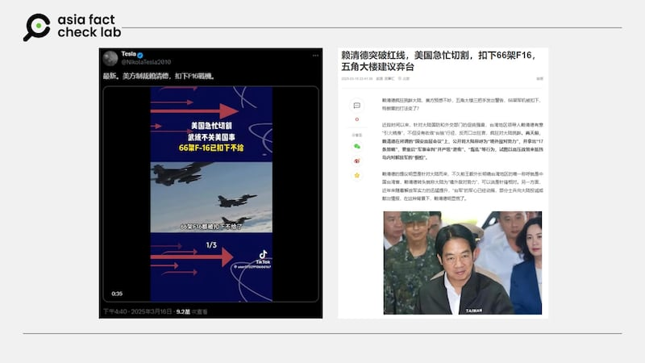

# 事實查覈｜美國製裁賴清德 扣下售臺的66架F - 16戰機？

莊敬

2025.03.20 20:59 EDT

## 查覈結果：錯誤

## 一分鐘完讀：

近日網上流傳一則消息稱，臺灣總統賴清德將中國大陸定義爲“境外敵對勢力”後，美國急忙與之切割，不僅“制裁”賴清德，還扣下售臺的66架F - 16戰機。經查，美國政府並未宣佈網傳的制裁措施。另據報道，在賴清德發表國安談話後，美方仍表態會持續支持臺灣應對來自中國大陸的施壓。

## 深度分析：

3月16日，有[藍勾賬號](https://x.com/NikolaTesla2010/status/1901191729052860442)在X上發文，稱“美方制裁賴清德，扣下F16戰機”，並轉發了一則[TikTok短視頻](https://www.tiktok.com/@user5722910686167/video/7481968888318594359?_r=1&_t=ZP-8ui0KUIkyoZ)，稱“3月13日賴清德口出狂言，把大陸定義爲境外敵對勢力”“美國急忙撇清關係，武統不關美國事，66架F - 16已扣下不給”。類似消息也出現在[網易](https://www.163.com/dy/article/JQNRRVLL0535CMRQ.html)等平臺。

網傳賴清德將中國大陸定義爲“境外敵對勢力”後，美國急忙撇清關係甚至實施制裁，扣下售臺的66架F - 16戰機。 網傳賴清德將中國大陸定義爲“境外敵對勢力”後，美國急忙撇清關係甚至實施制裁，扣下售臺的66架F - 16戰機。 (X、網易截圖)

賴清德在3月13日召開國安高層會議，並在會後的[記者會](https://www.president.gov.tw/NEWS/39105)上提出五大國安威脅應對策略，包括恢復軍事審判制度、針對申請中國大陸證件進行必要清查等。賴清德表示，中國大陸已是臺灣《反滲透法》所定義的“境外敵對勢力”，必須採取相應防範措施。

據[報道](https://udn.com/news/story/124413/8610764)，在賴清德發表國安談話後，美國國務院仍表態“美國會持續支持臺灣應對來自中國大陸的軍事、經濟、資訊和外交施壓活動”。美國維持一貫立場，並無網傳所謂“急忙切割”的情況。

亞洲事實查覈實驗室（Asia Fact Check Lab, AFCL）查詢了近日白宮的[行政命令](https://www.whitehouse.gov/presidential-actions/)、財政部海外資產辦公室（Office of Foreign Assets Control, OFAC）近日的[制裁措施](https://ofac.treasury.gov/recent-actions)，均未發現針對賴清德的制裁。以關鍵字查詢，也沒有發現任何主流媒體發佈相關報道。

有關“66架F - 16戰機”，指的是2019年8月[美國批准對臺出售](https://www.dsca.mil/press-media/major-arms-sales/taipei-economic-and-cultural-representative-office-united-states-11)66架F - 16V Block 70戰機，[原計劃](https://www.voacantonese.com/a/taiwan-says-us-f16-delivery-delayed-20230504/7078355.html)2023年第四季度交付第一批戰機，但因疫情相關的供應鏈中斷而延遲交付日期，[臺灣國防部預計](https://www.cna.com.tw/news/aipl/202410170362.aspx)2026年底能全部交付。

而[最新消息](https://www.voachinese.com/a/taiwan-us-f16v-delievery-20250314/8011250.html)是，臺灣向美國採購的66架F - 16V Block 70戰機中的第一架飛機已建造完成，國防部長顧立雄表示，臺灣將派副部長級官員赴美參加出廠儀式。

基於上述信息，AFCL判斷網傳所謂“美國急忙切割，制裁賴清德，扣下先前售臺的66架F16戰機”等說法爲無根據的不實信息。

*亞洲事實查覈實驗室（Asia Fact Check Lab）針對當今複雜媒體環境以及新興傳播生態而成立。我們本於新聞專業主義，提供專業查覈報告及與信息環境相關的傳播觀察、深度報道，幫助讀者對公共議題獲得多元而全面的認識。*

*讀者若對任何媒體及社交平臺傳播的信息有疑問，歡迎以電郵*[*afcl@rfa.org*](mailto:afcl@rfa.org)*寄給亞洲事實查覈實驗室，由我們爲您查證覈實。亞洲事實查覈實驗室更詳細的介紹請參考*[*本文*](2024-10-09_關於亞洲事實查覈實驗室｜About AFCL.md)*。*

*我們另有X、臉書、IG頻道，歡迎讀者追蹤、分享、轉發。 X這邊請進：中文*[*@asiafactcheckcn*](https://twitter.com/asiafactcheckcn)*;英語：*[*@AFCL\_eng*](https://twitter.com/AFCL_eng)*、*[*FB在這裏*](https://www.facebook.com/asiafactchecklabcn)*、*[*IG也別忘了*](https://www.instagram.com/asiafactchecklab/)*。*

[Original Source](https://www.rfa.org/mandarin/shishi-hecha/2025/03/21/fact-check-us-sanctions-on-taiwan/)