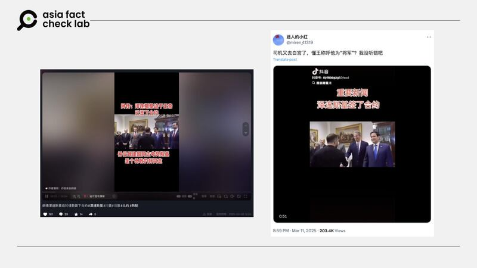

# 事實查覈｜視頻顯示澤連斯基“又去白宮、簽了協議”？

莊敬

2025.03.22 07:00 EDT

## 查覈結果：錯誤

## 一分鐘完讀：

抖音、X上的中文賬號近日傳播一則短視頻，畫面是烏克蘭總統澤連斯基與美國副總統萬斯、國務卿盧比奧等高官握手致意，以及與美國總統特朗普交談。發文者聲稱澤連斯基“又去白宮”、“迫於無奈已簽下合約（指礦產協議）”。經過比對，網傳畫面爲幾周之前、發生於2月28日的會談，並不是澤連斯基在此後再度赴白宮簽約的場景。

## 深度分析：

近日在[X](https://x.com/miren_41319/status/1899445106995782102)、[抖音](https://www.douyin.com/video/7479305241490459964)上流傳，烏克蘭總統澤連斯基（Volodymyr Zelenskyy）再度訪問白宮，迫於無奈已簽下礦產協議；發文者附上一則短視頻，畫面中澤連斯基與美國副總統萬斯（JD Vance）、國務卿盧比奧（Marco Rubio）等高層官員握手致意，接着與美國總統特朗普（Donald Trump，又譯川普）交談，之後進入一個擺放會議桌椅的空間，澤連斯基入坐後拿筆書寫桌上的本子。

網傳烏克蘭總統澤連斯基近日再度赴白宮簽署礦產協議，但該影像實爲幾周前的舊畫面。 網傳烏克蘭總統澤連斯基近日再度赴白宮簽署礦產協議，但該影像實爲幾周前的舊畫面。 (抖音、Ｘ截圖)

網傳畫面及傳聞是否屬實？亞洲事實查覈實驗室（Asia Fact Check Lab, AFCL）首先回顧了特朗普與澤連斯基最近一次公開會面，也就是2月28日在白宮會談，當時雙方還起了爭執，取消原定的礦產資源協議簽署儀式，澤連斯基提前離開白宮。

AFCL因此先比對網傳視頻與[2月28日白宮會談](https://www.youtube.com/watch?v=7pxbGjvcdyY)，發現畫面中特朗普、萬斯、盧比奧、澤連斯基的服裝相同。

再以圖反搜，找到YouTube用戶發佈的[影片](https://www.youtube.com/watch?v=2Q2DH75jyd8)中，在3分20秒處出現網傳畫面，而這段畫面的右下角顯示“1TV.GE”，經查爲“喬治亞公共頻道”v。進一步查詢，發現喬治亞公共廣播公司在[3月1日直播](https://www.youtube.com/watch?v=D-vio-WY8Pc)中，約1分5秒起出現網傳畫面。

AFCL再以“澤連斯基”、“特朗普”、“礦產協議”等英文關鍵字查詢，根據《英國廣播公司》（BBC）等國際主流媒體[報道](https://www.bbc.com/news/articles/cn527pz54neo)，在白宮爭執後，澤連斯基已向特朗普表達準備好簽署礦產協議，但雙方尚未簽署。

基於上述影像證據與相關報道，AFCL判定網傳視頻發生時間爲2月28日，並非澤連斯基在此後再度赴白宮簽約的畫面。

*亞洲事實查覈實驗室（Asia Fact Check Lab）針對當今複雜媒體環境以及新興傳播生態而成立。我們本於新聞專業主義，提供專業查覈報告及與信息環境相關的傳播觀察、深度報道，幫助讀者對公共議題獲得多元而全面的認識。讀者若對任何媒體及社交軟件傳播的信息有疑問，歡迎以電郵*[*afcl@rfa.org*](mailto:afcl@rfa.org)*寄給亞洲事實查覈實驗室，由我們爲您查證覈實。*

*亞洲事實查覈實驗室更詳細的介紹請參考*[*本文*](2024-10-09_關於亞洲事實查覈實驗室｜About AFCL.md)*。我們另有X、臉書、IG頻道，歡迎讀者追蹤、分享、轉發。X這邊請進：中文*[*@asiafactcheckcn*](https://twitter.com/asiafactcheckcn)*；英文：*[*@AFCL\_eng*](https://twitter.com/AFCL_eng)*、*[*FB在這裏*](https://www.facebook.com/asiafactchecklabcn)*、*[*IG也別忘了*](https://www.instagram.com/asiafactchecklab/)*。*

[Original Source](https://www.rfa.org/mandarin/shishi-hecha/2025/03/22/fact-check-zelenskyy-revisit-white-house/)