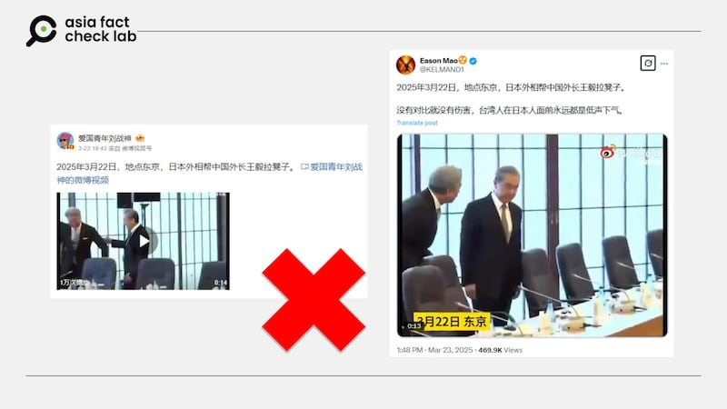
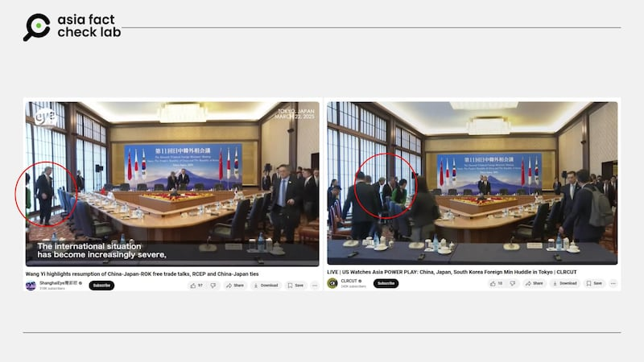

# 事實查覈｜網傳視頻顯示日本外相幫王毅拉凳子？

莊敬

2025.03.25 03:27 EDT

## 查覈結果：錯誤

## 一分鐘完讀：

近日在社媒上流傳一則短視頻，畫面是中國外交部長王毅步入一間會議室，一名著整齊西裝的男子幫王毅拉椅子，發文者聲稱拉椅子的男子是日本外相巖屋毅。

然而經查覈，網傳視頻的場景是3月22日在東京舉行的日中韓外相會議。現場其它幾個角度較完整的影像都顯示，當時王毅與巖屋毅同時入座，因此「日本外相幫中國外長拉椅子」的說法是錯誤的。

## 深度分析：

近日有微博大V（[1](https://m.weibo.cn/detail/5147445956971680),[2](https://m.weibo.cn/detail/5147134988653731)）、[X藍勾用戶](https://x.com/KELMAND1/status/1903685160698089526)傳播一則短視頻，畫面是中國外交部長王毅步入一間會議室，有一位身穿西裝的男子禮貌接待王毅，並在王毅靠近會議桌時，幫他拉椅子。部分社媒用戶寫道，「2025年3月22日，地點東京，日本外相幫中國外長拉凳子。」

--- 圖1：網傳在東京舉行的日中韓外相會議上，日本外相幫中國外長王毅拉凳子。 (微博、X截圖)

經查，網傳視頻的場景是3月22日在東京舉行的日中韓外相會議。根據[日本外務省](https://www.mofa.go.jp/mofaj/press/release/pressit_000001_01928.html)發佈的照片，當天日本外相巖屋毅穿着深色西裝，搭配深色底、白細斜紋的領帶，與網傳畫面中幫王毅拉椅子男士的領帶花色不同。此外，網傳畫面中接待男子的身高比王毅高約半個頭，但從日中韓外相合影的照片看來，巖屋毅與王毅身高差距不大。

--- 網路上較完整的片段顯示，中國外長王毅靠近座位時（紅圈處），在畫面正中央的日本外相巖屋剛正準備就座。 YouTube截圖 (YouTube截圖)

亞洲事實查覈實驗室（AFCL）另找到較完整的[影片](https://www.youtube.com/watch?v=BuYSNmhp85o)，顯示日中韓外相合影后，各自走向自己的座位，在影片13秒處可以看到，巖屋毅正準備就座，而網傳視頻中幫王毅拉椅子的男子正帶領王毅走向座位。由媒體機構CLRCUT提供的[直播影片](https://www.youtube.com/watch?v=fazyJifmum4)，在23分30秒處清楚可見巖屋毅站在座位前，會議桌的另一端有名男子正在爲王毅拉椅子。由日本每日新聞提供的[影像](https://www.youtube.com/watch?v=fdUqBfnbGvg)，也可以見到同樣的入座過程。

從網路上的影片可以確認，幫王毅拉椅子的男子並非巖屋毅，因此網傳所謂「日本外相幫中國外長拉椅子」的說法爲不實信息。

AFCL發送電郵詢問日本駐中國大使館，網傳視頻中幫王毅拉椅子的接待人員的身份，至本文截稿前尚未獲回覆。

*亞洲事實查覈實驗室（Asia Fact Check Lab）針對當今複雜媒體環境以及新興傳播生態而成立。我們本於新聞專業主義，提供專業查覈報告及與信息環境相關的傳播觀察、深度報導，幫助讀者對公共議題獲得多元而全面的認識。讀者若對任何媒體及社交平臺傳播的信息有疑問，歡迎以電郵*[*afcl@rfa.org*](mailto:afcl@rfa.org)*寄給亞洲事實查覈實驗室，由我們爲您查證覈實。*

*亞洲事實查覈實驗室更詳細的介紹請參考*[*本文*](2024-10-09_關於亞洲事實查覈實驗室｜About AFCL.md)*。我們另有X、臉書、IG頻道，歡迎讀者追蹤、分享、轉發。 X這邊請進：中文*[*@asiafactcheckcn*](https://twitter.com/asiafactcheckcn)*;英語：*[*@AFCL\_eng*](https://twitter.com/AFCL_eng)*、*[*FB在這裏*](https://www.facebook.com/asiafactchecklabcn)*、*[*IG也別忘了*](https://www.instagram.com/asiafactchecklab/)*。*

[Original Source](https://www.rfa.org/mandarin/shishi-hecha/2025/03/25/fact-check-china-japan-rok-foreign-ministers-summit/)