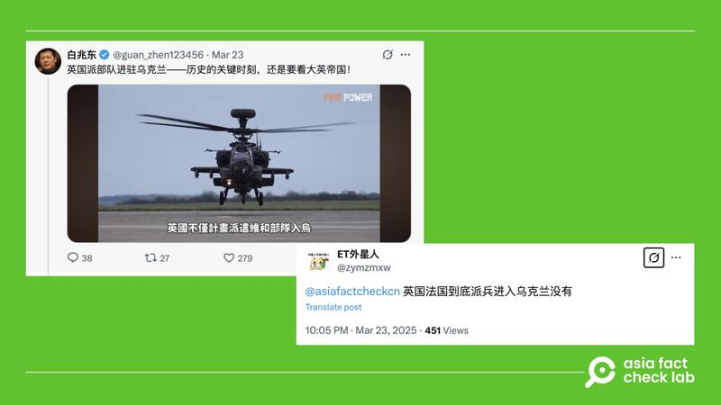

# 答讀者問｜英法兩國已駐軍烏克蘭？

艾倫

2025.03.28 22:52 EDT

## 查覈結果：缺乏證據

3月23日，一名讀者在X上標記亞洲事實查覈實驗室（Asia Fact Check Lab，AFCL），詢問英、法兩國最近是否已經出兵烏克蘭。該名讀者詢問引述一則藍勾認證帳號“白兆東”的[貼文](https://x.com/guan_zhen123456/status/1903786560908091623)，稱：“英國派部隊進駐烏克蘭——歷史的關鍵時刻，還是要看大英帝國！”

- 近期有讀者在X上標記AFCL，詢問“英、法是否已駐軍烏克蘭”。 (圖取自X)

AFCL以關鍵字搜尋，整理官方信息及具公信力的報道，說明迄今英法援烏的相關事實。

## 英、法是否正式進駐地面作戰部隊

根據美國政治雜誌“Politico”的發自3月30日的[新聞報道](https://www.politico.eu/article/uk-wont-deploy-troops-ukraine-without-us-support-says-minister-luke-pollard/)，英國國防大臣盧克·波拉德（Luke Pollard）在接受《泰晤士電臺》（Times Radio）採訪時表示，英國是否派兵監督烏克蘭與俄羅斯和平協議，仍然取決於美國的參與及支持。

此前，[英國廣播公司](https://www.bbc.com/news/articles/c4gxgxl3grgo)（BBC）在2月中就引述英國首相斯塔默（Keir Starmer）的談話報道，英國已着手準備派遣軍隊進入烏克蘭，作爲和平協議的一部分，協助保障烏克蘭的安全。[衛報](https://www.theguardian.com/uk-news/2025/mar/21/uk-military-ukraine-russia-war)（The Guardian）在3月21日也再次報道，依據仍然是斯塔默（Keir Starmer）的談話。

至於法國，二月時曾有[新聞報道](https://www.france24.com/en/france/20250220-macron-says-france-wont-send-troops-ukraine-tomorrow-security-guarantees-trump-putin)指出法國總統馬克龍“不會派兵”至烏克蘭，不過馬克龍也在近期的“巴黎援烏峯會”後說，法國和英國將推動，在俄烏停火後，向烏克蘭派遣一支“保障部隊”。他補充，這並非與會國的一致意見，但不需要一致意見就能實現這一目標。

AFCL已去信詢問英、法國防部，至截稿前未獲回應。

## 英法對烏的軍事援助

由英、法主導的“志願者聯盟”（coalition of the willing）在3月2日創立，旨在烏克蘭協助維護停火，以促進更長久穩定的公正和平。參與聯盟的國家約31國，包含北約、歐盟成員國，以及非歐盟國家如加拿大、挪威等，參與國選擇派兵赴烏，或者提供後勤及其他支援。

根據英國[官方信息](https://www.gov.uk/government/publications/uk-support-to-ukraine-factsheet/uk-support-to-ukraine-factsheet?utm_source=chatgpt.com)，自衝突爆發以來，英國已經向烏克蘭承諾提供78億英鎊的軍事支持。[2025年](https://www.gov.uk/government/news/45-billion-military-boost-to-ukraine-front-line-to-support-uk-growth-and-jobs?utm_source=chatgpt.com)英國宣佈45億英鎊的援助，其中30億用於提供致命武器，15億英鎊來自G7“特別收入加速計劃”（Extraordinary Revenue Acceleration Scheme）提供的22.6億英鎊 貸款，該計劃透過凍結俄羅斯主權資產資助。

此外，英國也已提供烏克蘭約400種[軍事裝備](https://www.gov.uk/government/news/uk-strengthens-national-security-and-bolsters-ukraines-war-chest-with-226-billion-military-loan?utm_source=chatgpt.com)，例如650枚輕型多用途導彈（Lightweight Multirole Missile，LMM） 以加強防空能力，以及Stormer防空車輛和數千枚防空導彈，如Starstreak和AMRAAM（先進中程空對空導彈）。

除了軍事裝備，英國也提供烏克蘭士兵[醫療服務](https://www.gov.uk/government/news/uk-steps-up-life-saving-medical-support-for-ukraines-armed-forces?utm_source=chatgpt.com)，例如 “修復者計劃”（Project Renovator），幫助受傷士兵恢復健康。

法國在援烏方面，以軍事裝備及資金援助爲主。今年3月，法國總統馬克龍[宣佈](https://www.reuters.com/world/europe/france-provide-2-bln-euros-extra-military-aid-ukraine-macron-says-2025-03-26/?utm_source=chatgpt.com)提供額外20億歐元的軍事援助，其中包含反坦克飛彈、地對空飛彈、裝甲車輛、無人機、幻影(Mirage)戰鬥機等武器。

另外，法國也曾捐贈兩座移動式DNA分析實驗室給烏克蘭，以協助識別戰爭中的遇難者。根據法國駐英國大使館網站（[1](https://uk.ambafrance.org/France-donates-mobile-DNA-laboratory-to-Ukraine?utm_source=chatgpt.com)，[2](https://osce.delegfrance.org/Ukraine-France-donates-a-second-mobile-DNA-analysis-laboratory-to-Ukraine-9-May?utm_source=chatgpt.com)），第一座實驗室於2022年7月交付給烏克蘭總檢察長辦公室，第二座則於2023年5月提供給烏克蘭司法部。

以上是迄今從公開信息中能夠確認的，英、法兩國援助烏克蘭的情況。其中並不包括地面部隊進駐烏克蘭，因此網傳”英國派部隊進駐烏克蘭”，是沒有證據的信息。

*亞洲事實查覈實驗室（Asia Fact Check Lab）針對當今複雜媒體環境以及新興傳播生態而成立。我們本於新聞專業主義，提供專業查覈報告及與信息環境相關的傳播觀察、深度報導，幫助讀者對公共議題獲得多元而全面的認識。讀者若對任何媒體及社交平臺傳播的信息有疑問，歡迎以電郵*[*afcl@rfa.org*](mailto:afcl@rfa.org)*寄給亞洲事實查覈實驗室，由我們爲您查證覈實。亞洲事實查覈實驗室更詳細的介紹請參考*[*本文*](2024-10-09_關於亞洲事實查覈實驗室｜About AFCL.md)*。*

*我們另有X、臉書、IG頻道，歡迎讀者追蹤、分享、轉發。 X這邊請進：中文*[*@asiafactcheckcn*](https://twitter.com/asiafactcheckcn)*;英語：*[*@AFCL\_eng*](https://twitter.com/AFCL_eng)*、*[*FB在這裏*](https://www.facebook.com/asiafactchecklabcn)*、*[*IG也別忘了*](https://www.instagram.com/asiafactchecklab/)*。*

[Original Source](https://www.rfa.org/mandarin/shishi-hecha/2025/03/29/fact-check-british-french-troops-ukraine/)