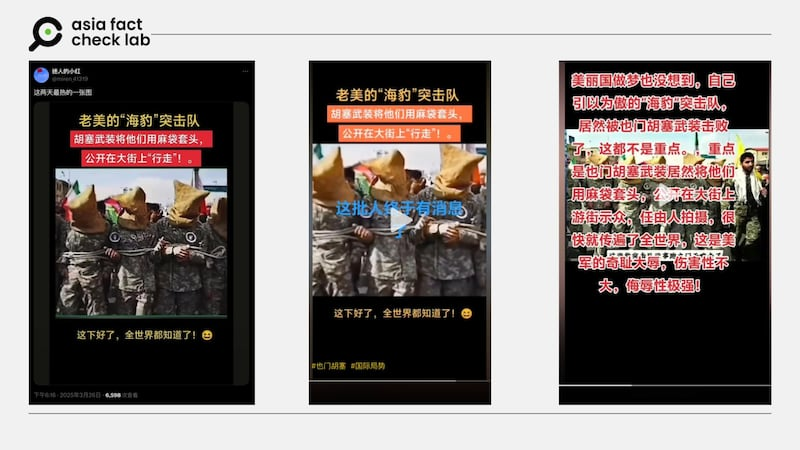
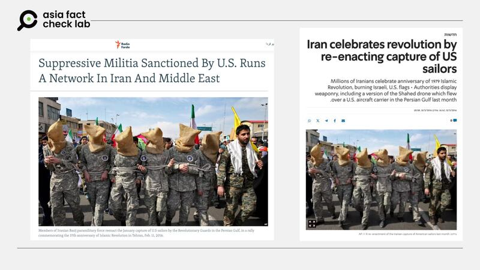

# 事實查覈｜美軍海豹部隊遭胡塞武裝俘虜，麻袋套頭遊街？

董喆

2025.03.30 17:41 EDT

## 查覈結果：移花接木

## 一分鐘完讀：

近期抖音與X上有貼文稱，美軍特種作戰單位「海豹部隊」成員被葉門胡塞武裝俘虜，還遭麻袋套頭遊街。但經查覈，這是伊朗在2016年一場紀念”1979伊斯蘭革命”慶祝遊行的照片，畫面中的”美軍俘虜”是由伊朗人所裝扮，並非真實美軍人員。因此網傳訊息是移花接木的假資訊。

## 深度分析：

近期美軍加大力度打擊葉門胡塞武裝，以削弱他們對紅海航道的威脅，不過社羣上卻出現與此相關的錯假資訊。

X帳號[迷人的小紅](https://archive.ph/X5aMg)貼出一張截圖，稱”老美的‘海豹突襲隊‘被胡塞武裝以麻袋套頭，公開在大街上‘行走‘”。同樣的說法與照片亦在抖音（[1](https://v.douyin.com/EHKseJy4FUc/)、[2](https://v.douyin.com/ZgI_F3k3GT8/)、[3](https://v.douyin.com/0gz1dTEo-tc/)）上廣傳，這些帳號貼文形容美軍特戰部隊成爲全球笑柄。

- 社羣上有消息稱，美軍的海豹部隊被葉門胡塞武裝俘虜，並遭麻袋套頭遊街。 (取自X、抖音)

亞洲事實查覈實驗室以圖反搜，發現網傳照片攝於2016年，根據[《以色列今日報》](https://www.israelhayom.co.il/article/356255)、[法爾達電臺](https://en.radiofarda.com/a/basij-role-in-iran-and-middle-east/29557410.html)報道，2016年2月12日伊朗舉行全國性活動，慶祝1979年伊斯蘭革命週年紀念。

- 2016年2月12日伊朗慶祝1979年伊斯蘭革命週年紀念，遊行參與者模仿美軍士兵跪地投降的畫面。 (媒體刊出的美聯社照片)

但就在這場遊行的一個月前，兩艘美軍CB90攻擊快艇，因技術故障在伊朗波斯灣法爾斯島附近漂入伊朗領海，被伊朗伊斯蘭革命衛隊海軍扣押。時任​美國國務卿約翰·克里多次與伊朗外長穆罕默德·賈瓦德·扎裏夫交涉，10名美國海軍在被扣押約15小時後獲釋，無人受傷。

遊行取材這起事件，並由參與者模仿美軍海軍士兵跪地投降之後被扣押的場景。美聯社當時拍攝並發表了這張照片。

*亞洲事實查覈實驗室（Asia Fact Check Lab）針對當今複雜媒體環境以及新興傳播生態而成立。我們本於新聞專業主義，提供專業查覈報告及與信息環境相關的傳播觀察、深度報導，幫助讀者對公共議題獲得多元而全面的認識。讀者若對任何媒體及社交平臺傳播的信息有疑問，歡迎以電郵*[*afcl@rfa.org*](mailto:afcl@rfa.org)*寄給亞洲事實查覈實驗室，由我們爲您查證覈實。*

*亞洲事實查覈實驗室更詳細的介紹請參考*[*本文*](2024-10-09_關於亞洲事實查覈實驗室｜About AFCL.md)*。我們另有X、臉書、IG頻道，歡迎讀者追蹤、分享、轉發。 X這邊請進：中文*[*@asiafactcheckcn*](https://twitter.com/asiafactcheckcn)*;英語：*[*@AFCL\_eng*](https://twitter.com/AFCL_eng)*、*[*FB在這裏*](https://www.facebook.com/asiafactchecklabcn)*、*[*IG也別忘了*](https://www.instagram.com/asiafactchecklab/)*。*

[Original Source](https://www.rfa.org/mandarin/shishi-hecha/2025/03/30/fact-check-seals-houthi/)