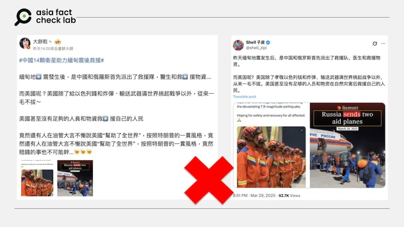

# 事實查覈｜中俄救援緬甸大地震 美國卻「一毛不拔」？

莊敬

2025.03.31 22:39 EDT

## 查覈結果：錯誤

## 一分鐘完讀：

緬甸28日發生強震，有中文社媒帳號發文稱中國、俄羅斯率先救援，美國卻「一毛不拔」，甚至沒有足夠的人員和物資救援自己的人民。但經查這樣的說法並非事實，在緬甸強震後，美國總統特朗普隨即表態將協助因應，美國政府並於30日宣佈提供200萬美元援助並部署應急小組。

## 深度分析：

3月28日緬甸發生規模7.7強震，造成嚴重死傷，鄰近的中國和泰國也受到地震影響，曼谷一棟未完工的高層建築倒塌。根據[報道](https://www.dw.com/zh-hant/%E7%B7%AC%E7%94%B8%E5%BC%B7%E9%9C%87%E8%87%B4%E9%80%BE%E5%8D%83%E4%BA%BA%E6%AD%BB%E4%BA%A1%E8%BB%8D%E6%96%B9%E7%BD%95%E6%B1%82%E6%8F%B4-%E5%A4%9A%E6%96%B9%E6%80%A5%E9%9F%BF%E6%87%89/a-72082349)，緬甸軍政府向國際求援，印度、中國、俄羅斯、新加坡、馬來西亞等國向緬甸運送了乘載救援物資和人員的飛機，美國總統特朗普（Donald Trump，又譯川普）也[表態](https://apnews.com/article/trump-earthquake-usaid-disaster-asia-myanmar-001e305f0233611c0702629803e6239b)會提供援助。

亞洲事實查覈實驗室（Asia Fact Check Lab，AFCL）注意到，近日在[微博](https://m.weibo.cn/detail/5149902712867713)、[X](https://x.com/shell_zipi/status/1905966086991786331)上有帳號發文，讚揚中國、俄羅斯首先救援，質疑「而美國呢？」，稱「美國除了給以色列錢和炸彈、輸送武器滿世界挑起戰爭以外，從來一毛不拔，美國甚至沒有足夠的人員和物資救援自己的人民。」

- 緬甸強震後，部分社媒用戶發文稱中國、俄羅斯率先救援，美國卻「一毛不拔」，但這說法並非事實。 (微博、X截圖)

但網傳說法並不正確。因爲在緬甸強震後，特朗普隨即承諾協助因應，美國國務院發言人布魯斯（Tammy Bruce）在3月28日的[記者會](https://www.state.gov/briefings/department-press-briefing-march-28-2025/)上表示，將根據災區的情況決定如何因應，美國國際開發署（USAID）有一支災難專家團隊，可在災害發生時做出應變」。布魯斯說，儘管對外援助資金遭刪減，「並不影響我們執行這些職責的能力」。

美國駐緬甸大使館[30日宣佈](https://mm.usembassy.gov/declaration-of-2-million-for-humanitarian-needs-in-the-aftermath-of-the-myanmar-earthquake/)，美國將爲緬甸提供200萬美元的援助，USAID的緊急應變小組正前往緬甸，以瞭解人民最迫切的需求。雖然有論者對於美國的援外能力[存疑](https://timesofindia.indiatimes.com/world/us/trumps-usaid-cuts-hinder-us-response-to-myanmar-disaster/articleshow/119781619.cms)，但美國對緬甸強震救援並非毫無行動。

*亞洲事實查覈實驗室（Asia Fact Check Lab）針對當今複雜媒體環境以及新興傳播生態而成立。我們本於新聞專業主義，提供專業查覈報告及與信息環境相關的傳播觀察、深度報導，幫助讀者對公共議題獲得多元而全面的認識。讀者若對任何媒體及社交平臺傳播的信息有疑問，歡迎以電郵*[*afcl@rfa.org*](mailto:afcl@rfa.org)*寄給亞洲事實查覈實驗室，由我們爲您查證覈實。*

*亞洲事實查覈實驗室更詳細的介紹請參考*[*本文*](2024-10-09_關於亞洲事實查覈實驗室｜About AFCL.md)*。我們另有X、臉書、IG頻道，歡迎讀者追蹤、分享、轉發。 X這邊請進：中文*[*@asiafactcheckcn*](https://twitter.com/asiafactcheckcn)*;英語：*[*@AFCL\_eng*](https://twitter.com/AFCL_eng)*、*[*FB在這裏*](https://www.facebook.com/asiafactchecklabcn)*、*[*IG也別忘了*](https://www.instagram.com/asiafactchecklab/)*。*

[Original Source](https://www.rfa.org/mandarin/shishi-hecha/2025/04/01/fact-check-myanmar-earthquake-usa-relief/)