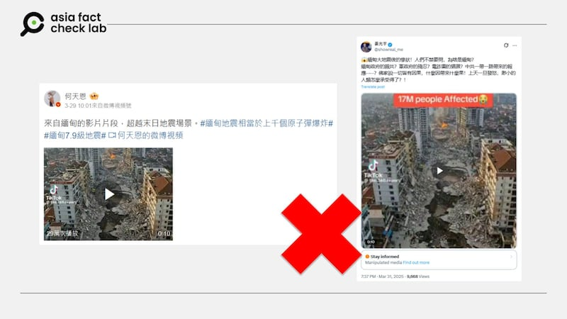

# 事實查覈｜網傳視頻顯示，緬甸震后街道出現天坑、起火？

莊敬

2025.04.01 23:51 EDT

## 查覈結果：錯誤

## 一分鐘完讀：

緬甸28日發生強震後，社媒上盛傳一段宣稱是緬甸地震慘狀的短視頻，畫面中的街道出現巨大坑洞、建築被摧毀、遠方路面起火冒煙。但視頻中的火勢、面對重大意外卻靜止不動的行人，看起來並不自然。經工具檢測與專家分析，網傳視頻極可能爲人工智能（AI）生成。

## 深度分析：

3月28日緬甸發生規模7.7地震後，社媒上流傳許多與緬甸強震相關的信息與影像。亞洲事實查覈實驗室（Asia Fact Check Lab, AFCL）注意到，近日有[微博大V](https://m.weibo.cn/detail/5149473820379363)、[X藍勾帳號](https://x.com/showreal_me/status/1906672150431289646)發佈一段10秒短視頻，宣稱是緬甸「地震慘狀」、「超越末日地震場景」，畫面從高空拍攝某地的街道，可以看到街上出現巨大坑洞、兩旁建築被摧毀、建材掉落一地、街道尾端起火冒煙。

- 近日社媒上流傳一段宣稱是緬甸地震慘狀的影片。 (微博、X截圖)

這則視頻並無提供拍攝地點等詳情，但視頻上標註TikTok帳號[「@the.360.report」](https://www.tiktok.com/@the.360.report)。以Google搜尋可以看到此帳號曾經發布緬甸地震視頻的紀錄，但點入[鏈結](https://www.tiktok.com/@the.360.report/video/7486876576689196318)顯示無法觀看影片。這個帳號的其他作品多與重大意外相關，例如紐約街上出現天坑，而他所發佈的視頻有部分標註爲AI產生。

對於本文查覈的緬甸地震短視頻，有多位社媒用戶在相關帖子下留言，質疑視頻爲AI生成。 AFCL以AI辨識工具「Hive Moderation」檢測該視頻，結果顯示由AI生成的可能性爲95%。

- AI檢視工具顯示網傳緬甸地震影像可能爲AI生成。 (Hive Moderation截圖)

臺灣資安專家劉彥伯告訴AFCL，這則視頻有幾個明顯不合理之處：第一，火焰蔓延的天空，煙霧過度集中與規律；第二，路上行人沒有移動；第三，右側地面堆積相當多廢棄物，但比對右側建築物的毀損狀況，很明顯不符，這種狀況經常發生在生成式內容；第四，左側建築物上紅色招牌的文字間距不平均，這也是生成式內容常出現的問題。

AFCL另以圖反搜，未找到可信的國際主流媒體引用這段視頻，但發現已有其它查覈組織針對此視頻發佈[報告](https://www.aap.com.au/factcheck/ai-generated-videos-go-viral-after-deadly-myanmar-earthquake/)，判定爲AI生成。

*亞洲事實查覈實驗室（Asia Fact Check Lab）針對當今複雜媒體環境以及新興傳播生態而成立。我們本於新聞專業主義，提供專業查覈報告及與信息環境相關的傳播觀察、深度報導，幫助讀者對公共議題獲得多元而全面的認識。讀者若對任何媒體及社交平臺傳播的信息有疑問，歡迎以電郵*[*afcl@rfa.org*](mailto:afcl@rfa.org)*寄給亞洲事實查覈實驗室，由我們爲您查證覈實。*

*亞洲事實查覈實驗室更詳細的介紹請參考*[*本文*](2024-10-09_關於亞洲事實查覈實驗室｜About AFCL.md)*。我們另有X、臉書、IG頻道，歡迎讀者追蹤、分享、轉發。 X這邊請進：中文*[*@asiafactcheckcn*](https://twitter.com/asiafactcheckcn)*;英語：*[*@AFCL\_eng*](https://twitter.com/AFCL_eng)*、*[*FB在這裏*](https://www.facebook.com/asiafactchecklabcn)*、*[*IG也別忘了*](https://www.instagram.com/asiafactchecklab/)*。*

[Original Source](https://www.rfa.org/mandarin/shishi-hecha/2025/04/02/fact-check-myanmar-earthquake-ai-video/)