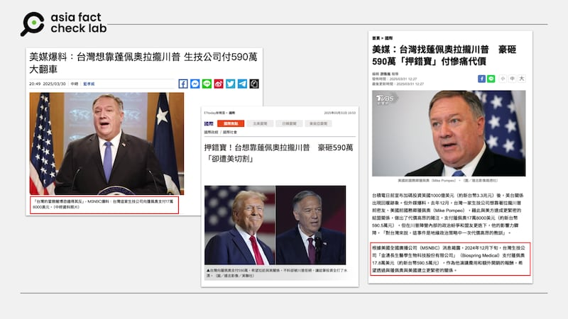
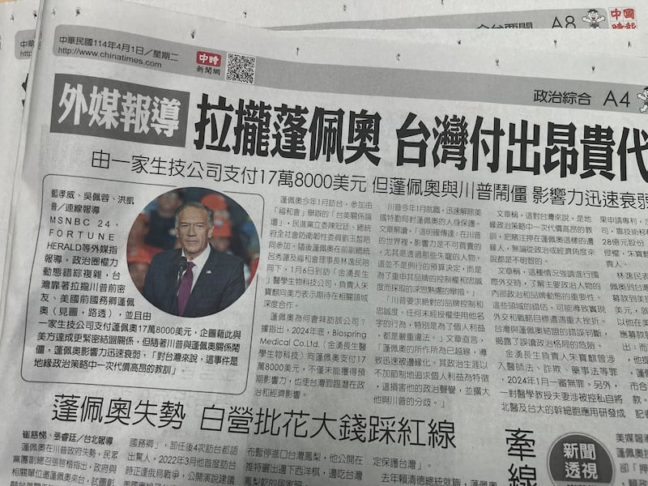
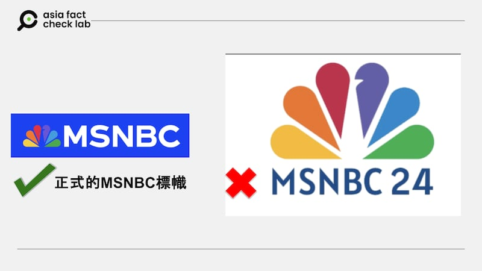
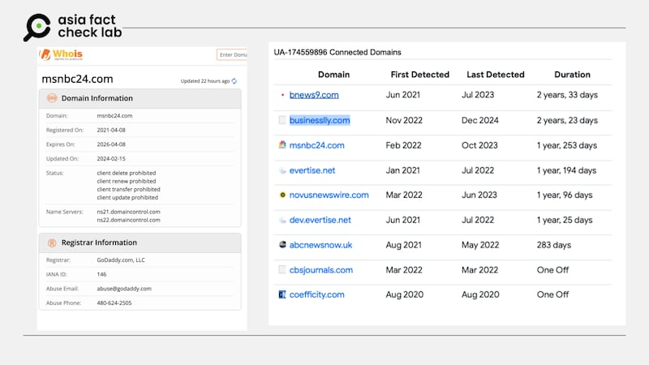
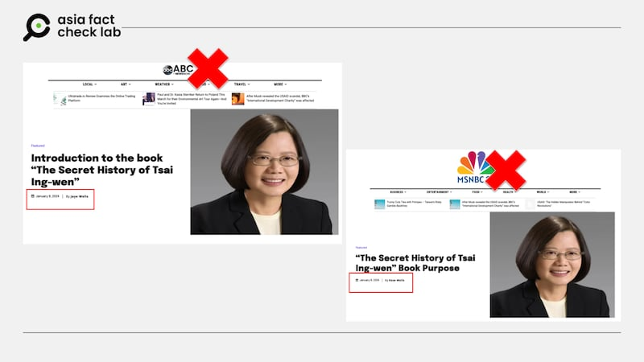
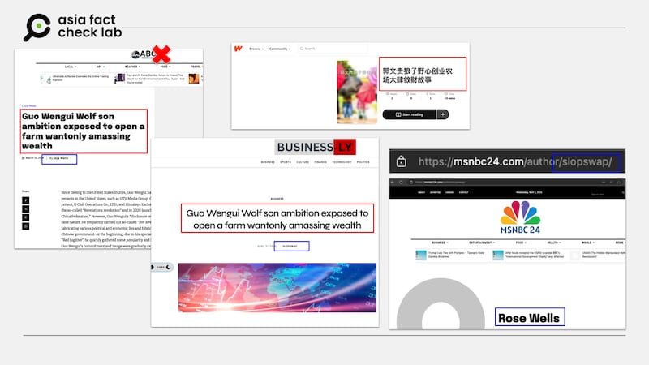

# AFCL調查｜冒牌美媒網站的「新聞」，如何攻佔臺灣主流媒體？

董喆、莊敬

2025.04.07 24:00 EDT

3月30日，臺灣中時電子報發出一則題爲「[美媒爆料：臺灣想靠蓬佩奧拉攏川普 生技公司付590萬大翻車](https://archive.ph/357UU)」的報道，最初的版本宣稱根據「美國全國廣播公司（MSNBC）」所報道。但亞洲事實查覈實驗室（以下簡稱AFCL）調查發現，這篇報道並不來自MSNBC，而是來自「[MSNBC24](https://msnbc24.com/)」這個冒名網站。種種證據顯示，「[MSNBC24](https://msnbc24.com/)」不僅網站本身粗糙不堪，擁有者還有製造假新聞，疑似操作認知戰的紀錄。

儘管如此，這則新聞仍然攻佔了紙本報紙版面、流傳網媒和社媒平臺，還成爲臺灣主流媒體TVBS談話節目「少康戰情室」的材料。

## 在本文刊出前，AFCL重新檢視MSNBC24網站，無法再查到原報道，很可能已經被移除。

## 原文出自MSNBC？

中時電子報3月30日刊出的報道幾乎全文引述自一篇英文報道，內容稱臺灣執政的民進黨當局原本想靠前美國前國務卿蓬佩奧（Mike Pompeo）拉攏川普，由一家生技公司支付蓬佩奧17萬8000美元，企圖與美方結盟，卻因美國總統特朗普與蓬佩奧關係僵化而「押錯寶」，白白付出高昂代價。臺灣媒體[TVBS](https://archive.ph/feUu5)與[ETtoday新聞雲](https://archive.ph/ZqJ3X)隨後也都跟進發布了這篇報道。

報道的原文出自何處？最初刊登的中時電子報和跟進的媒體都表示來自「美國全國廣播公司（MSNBC）」3月27日的報道。

- 多家臺媒報道臺灣斥資想靠蓬佩奧拉攏特朗普的新聞，並稱消息來源是MSNBC。 (網站截圖)

AFCL在3月31日留意到這則報道，但在MSNBC網站並沒有找到，也沒有任何可信的美國媒體報道此事。AFCL因此同步致信給中時電子報、TVBS以及ETtoday新聞雲，查證此一報道的確切引用來源。

AFCL稍後在[MSNBC24](https://archive.ph/L38YM)和[Fortune Herald](https://archive.ph/LEK3x)兩個網站上，發現了這篇報道。在我們發現後，也收到了ETtoday新聞雲回信表示，報道是根據Fortune Herald發佈的文章所撰寫，並坦言，「收到您的來信，查詢來源時，未找到MSNBC的相關新聞，但由於原文有引述MSNBC，因此將MSNBC寫入了文內。 」

TVBS沒有回覆查詢，但之後已將網路報道的消息來源改爲MSNBC24及Fortune Herald兩家外媒。

中時電子報也沒有回覆查詢，但AFCL將中時報道中據稱是引述自MSNBC的內容，與兩則新聞報道內容逐一比對，發現與MSNBC24高度一致，部分段落幾乎爲逐字翻譯。（引述及報道內容與比對附於文末。）

在隔日發行的紙本中國時報中，仍以第四版頭條發表這則報道，但消息來源也已經改爲MSNBC24和Fortune Herald。

- 圖說：4月1日中國時報紙本A4版再次報道了這則新聞，當中的消息來源已改爲MSNBC24及Fortune Herald等外媒。 (AFCL攝)

至於Fortune Herald的文章和MSNBC24的關係孰先孰後？ AFCL試圖聯繫Fortune Herald，至截稿前未獲回應，因此無從證實Fortune Herald的消息來源是否爲MSNBC，或者相反，又或者是同時。

## 「MSNBC24」是什麼樣的網站？

「MSNBC24」的名稱和美國全國廣播公司（MSNBC）相近，使用的商標圖案几乎相同。但進一步以網頁查詢工具Whois查詢，發現MSNBC24網站註冊於2021年，對照MSNBC成立於1996年，兩個網站成立時間相差很遠。

## AFCL詢問美國全國廣播公司（MSNBC）是否擁有MSNBC24此一網站，MSNBC發言人表示，「我們確認MSNBC與這一網站沒有關連」。

- 圖說：左邊爲MSNBC的正式商標，右邊爲冒名的MSNBC24網站標幟。 (取自MSNBC及MSNBC24官網後製作)

AFCL於目3月27日前後檢查了MSNBC24網站，發現網站內容粗糙，所有文章的作者皆出自於同一名記者「Rose Wells」，且大多數的新聞配圖都爲同一張風景照。網站末尾雖然也有隱私權政策、關於我們、聯繫方式等選項，但連結全都失效，點擊後一律連回主頁開頭。根據Google Analytics（簡稱GA）代碼查詢，AFCL發現一共有9個網頁曾經與MSNBC24網站共享GA代碼「UA-174559896」。

GA代碼由Google提供，網站擁有者將它嵌入網頁後就能收集訪客的瀏覽行爲、來源、停留時間等數據。每組GA代碼對應一個追蹤帳號。如果不同網站使用相同的GA代碼，代表它們的流量數據會被匯入到同一個帳號中。這通常意味着這九個網站是由同一個人或組織所管理。

- MSNBC24網站於2021年註冊，並且與多個網站共享GA代碼。 (AFCL製圖)

在這9個網站中，「abcnewsnow.uk」的名稱疑似仿抄美國廣播公司（ABC News），與MSNBC24擁有幾乎相同的模板。

值得留意的是，兩個網站都在2024年1月8日發表了「蔡英文祕史」的新聞，撰稿記者分別署名「Jaye Wells」和「Rose Wells」。兩篇報道內容雖有出入，但用的是同一張配圖，且文中認定所謂「蔡英文祕史」是一本可信的傳記。

「蔡英文祕史」曾經在部分中文網路盛傳。2024年1月，追蹤、研究中國對臺認知作戰的民主實驗室，曾在調查後指出，「蔡英文祕史」很可能是由AI寫成，還由許多疑似AI生成的短視頻散佈。臺灣國安單位則是[認定](https://www.cna.com.tw/news/aipl/202401100121.aspx)「蔡英文祕史」是有目的介入選舉的假訊息。

- 「abcnewsnow.uk」仿造美國廣播公司（ABC News），與MSNBC24擁有幾乎相同的模板，且都發表了蔡英文祕史的新聞。 (取自相關網站)

另外，「abcnewsnow.uk」也曾和九個網站中的「businesslly.com」共同發佈一則與中國流亡商人郭文貴相關的新聞，標題爲：「Guo Wengui Wolf son ambition exposed to open a farm wantonly amassing wealth」。

AFCL搜尋後發現，這則郭文貴的負面新聞其實來自線上寫作與閱讀平臺「Wattpad」，一名用戶以簡體中文上傳了「郭文貴狼子野心創業農場大肆斂財故事」，「abcnewsnow.uk」與「businesslly.com」的文章標題，近乎逐字直譯。再者，兩篇郭文貴相關報道文章的作者爲「Jaje Welles」以及「slopswap」，表面上並無關聯，但近一步點進MSNBC24唯一作者「Rose Wells」的頁面，其URL後綴正是「slopswap」。

- 多個證據指出，「abcnewsnow.uk」、「businesslly.com」與MSNBC24皆有疑似同一個作者發文。 (取自相關網站)

至於Fortune Herald則是一登記在英國的公司，根據網站標示的公司編號進行查詢，其狀態顯示爲「[清算中（Liquidation）](https://find-and-update.company-information.service.gov.uk/company/10587319)」，撰寫蓬佩奧報道的作者Avery Nelson，其報道涵蓋內容廣泛，包含牙齒保健、牀墊選擇指南、野鳥保育知識等。

AFCL實際致電報道提及的金湧長生醫學生物公司查證，該公司表示不方便回應。聯繫蓬佩奧成立的「擁護美國價值觀政治行動委員會」（簡稱CAVPAC），至截稿前未取得回覆。

## MSNBC24這一課：如何辨識可疑新聞網站？

臺媒轉載了這些「外媒」的報道後，臺灣在野黨民代紛紛譴責民進黨政府錯判情勢。

但經過上述調查，AFCL透過網域、IP以及GA代碼資料綜合判斷，MSNBC24的持有人不止一次仿冒新聞網站傳播不實資訊，且以不同化名在不同網站上發佈可疑的內容。這次的「臺灣靠蓬佩奧拉攏川普大翻車」的報道情況也類似，先不論情節是否屬實，但發佈的網站爲不具公信力，甚至是僞冒平臺。作者公信力成疑，甚至身份都無法確定。

當「獨家披露」遇上可疑的媒體平臺，讀者或是新聞工作者該如何識別？

馬里蘭大學新聞學院博士後研究員李惟平檢視MSNBC24網站時，發現有部分反詐騙偵測網站仍將這個網站列爲可信，「這顯示真的是魔高一尺，道高一丈」。發佈這則蓬佩奧新聞的唯二「外媒記者」，路線包山包海，李惟平提醒大媒體記者通常不會一人兼顧多種路線，他認爲讀者應不斷自問記者是如何取得新聞，「即便是爲了保護新聞來源，可信的報導裏也應該會提出更多事實的線索或背景資料」。

「檢視『關於我們』以及記者的基本資料應是基本功課了」李惟平說道。

當Slime media大興之際，李惟平認爲對編譯記者而言，更須小心求證，「不能看到一些『揭密新聞』，就貿然輕信，見獵心喜」。

李惟平提醒，美國現在有許多稱作「Slime media」的網站，它們利用美國地方新聞枯竭伺機而起，僞裝成有品牌的媒體散播假新聞。他點出MSNBC24的命名方式顯示，建造此網站者應該頗熟悉美國新聞的生態，因爲有些附屬於主流媒體的地方新聞都會用編號命名。

根據英國《衛報》2024年度的[新聞報道](https://www.theguardian.com/us-news/article/2024/jun/20/fake-news-websites-us-election)，美國這類型的假新聞網站正在大量湧現，這些網站通常由政治團體資助，目的要影響公衆輿論。這些網站利用城市名或地區名設立。

報道引述美國新聞評等組織NewsGuard[報告](https://www.newsguardrealitycheck.com/p/sad-milestone-fake-local-news-sites)，這類虛假地方新聞網站的數量已達到1265個，正式超過美國現存的1213家日報網站。​這些網站的激增引發了人們對其在選舉期間可能影響政治話語權和削弱選民對媒體及民主信任的擔憂。

（**感謝外部專家黃維玲對本報道的貢獻**）

## 附錄：中時引述內容與MSNBC24全文比對

中時：

「對臺灣來說，這事件是地緣政治策略中一次代價高昂的教訓，凸顯了誤判有影響力的政治圈內複雜的權力動態的風險。把賭注押在蓬佩奧這樣的邊緣人物身上，無論從政治角度或經濟角度來說都是不明智的。」

MSNBC24：

“For Taiwan, this episode is a costly lesson in geopolitical strategy, highlighting the risks of misjudging the complex power dynamics within influential political circles. Betting on a sidelined figure like Pompeo was both politically and financially unwise.”

中時：

「這一舉動明確傳達了這樣一個訊息：在川普的世界裏，影響力是不可買賣的，尤其是透過那些失寵的人物。這並不是例行的預算決定，而是爲了重申其品牌的控制權和忠誠度而採取的深思熟慮的舉措。」

MSNBC24：

“Trump’s swift and public removal of Pompeo’s taxpayer-funded security detail sent a clear message: influence in Trump’s world is not for sale, especially not through figures who have fallen out of favor. This was not a routine budgetary decision but a calculated move to reassert control and loyalty within his brand.”

中時：

「川普要求絕對的品牌控制和忠誠度。任何未經授權使用他的名字的行爲，特別是爲了個人利益，都是嚴重的違法行爲。」

MSNBC24：

“Trump demands absolute brand control and loyalty. Any unauthorized use of his name, particularly for personal gain, is a serious transgression.”

中時：

「蓬佩奧的所作所爲已越線，導致他迅速被邊緣化。蓬佩奧的政治生涯以不加節制地追求個人利益爲特徵，這損害了他的政治聲譽，並擴大了他與川普之間的分歧。」

MSNBC24：

“Pompeo’s political career has been marked by an unbridled pursuit of personal gain, which has tarnished his political reputation and widened the chasm between him and Trump.”

中時：

「這種情況強調了在進行國際外交時，瞭解主要政治人物的內部政治和品牌動態的重要性。這些領域的錯誤估計，可能會導致實現外交和戰略目標遭遇重大挫折。」

MSNBC24：

“This situation underscores the importance of understanding the internal politics and brand dynamics of key political figures when engaging in international diplomacy. Miscalculations in these areas can lead to significant setbacks in achieving diplomatic and strategic objectives.”

中時：

「臺灣與蓬佩奧結盟的錯誤判斷，揭露了誤讀政治格局的危險。」

MSNBC24：

“Taiwan’s misjudgment in aligning with Pompeo reveals the perils of misreading the political landscape.”

*亞洲事實查覈實驗室（Asia Fact Check Lab）針對當今複雜媒體環境以及新興傳播生態而成立。我們本於新聞專業主義，提供專業查覈報告及與信息環境相關的傳播觀察、深度報導，幫助讀者對公共議題獲得多元而全面的認識。讀者若對任何媒體及社交平臺傳播的信息有疑問，歡迎以電郵*[*afcl@rfa.org*](mailto:afcl@rfa.org)*寄給亞洲事實查覈實驗室，由我們爲您查證覈實。*

*亞洲事實查覈實驗室更詳細的介紹請參考*[*本文*](2024-10-09_關於亞洲事實查覈實驗室｜About AFCL.md)*。我們另有X、臉書、IG頻道，歡迎讀者追蹤、分享、轉發。 X這邊請進：中文*[*@asiafactcheckcn*](https://twitter.com/asiafactcheckcn)*;英語：*[*@AFCL\_eng*](https://twitter.com/AFCL_eng)*、*[*FB在這裏*](https://www.facebook.com/asiafactchecklabcn)*、*[*IG也別忘了*](https://www.instagram.com/asiafactchecklab/)*。*

[Original Source](https://www.rfa.org/mandarin/shishi-hecha/2025/04/07/fact-check-investigative-report-impersonate-msnbc/)