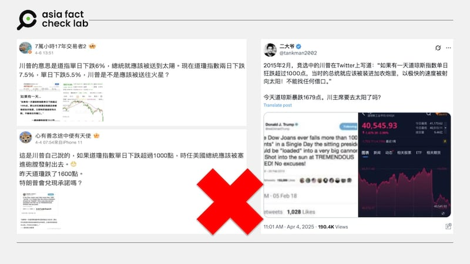

# 事實查覈｜特朗普曾說「道指跌千點總統就該塞大炮射飛」？

莊敬

2025.04.08 01:13 EDT

## 查覈結果：錯誤

## 一分鐘完讀：

近日社媒上多箇中文帳號流傳，美國總統特朗普曾在2015年推文，稱如果道瓊工業指數一天內下跌超過千點，總統就該被塞進大炮射飛。經查，這是舊謠言重傳，已有多家組織查覈，確認這則推文是他人所寫，並不是出於特朗普之口。

## 深度分析：

美國總統特朗普（Donald Trump，又譯川普）在4月初祭出「對等關稅」措施後，美股連日下跌。亞洲事實查覈實驗室（Asia Fact Check Lab, AFCL）注意到，近日有[X藍勾用戶](https://x.com/tankman2002/status/1907991835609641132)、[微博大V](https://m.weibo.cn/detail/5151616082381631)發文，稱特朗普曾在2015年發推文稱：如果道指單日狂跌超過千點，當時的總統就應該被塞進大炮裏，以最快的速度射向太陽。

這些社媒用戶附上推文截圖，並嘲諷「川主席要去太陽了嗎？」、「特朗普會兌現承諾嗎？」不過，這則推文將道瓊工業指數（Dow Jones）寫成了「Dow Joans」。

- 近日社媒上流傳，美國總統特朗普曾在2015年推文稱，道指跌千點總統就該塞大炮射飛。 (微博、Ｘ截圖)

經查，這是舊謠言重傳，而且在過去幾年數度傳播，也有多家組織查覈、闢謠。

根據[《英國廣播電臺》（BBC）](https://www.bbc.com/news/blogs-trending-42959655)、[查覈網站《Snopes》](https://www.snopes.com/fact-check/trump-dow-jones-tweet/)2018年發佈的文章，部落客[亞瑟（Shaun Usher）](https://web.archive.org/web/20180206001226/https://twitter.com/ShaunUsher/status/960628825318219776)在2018年2月發佈一張看似特朗普推文的截圖，以特朗普的風格撰寫內容，發佈時間是2015年2月，很快地引起人們注意、轉發。

當時美股遭遇六年多以來最大跌幅，道瓊工業指數下跌逾千點。根據報道，亞瑟本意是爲嘲諷特朗普，但在推文被迅速傳播後，亞瑟似乎感到後悔，並在推特上發文[確認](https://There's *always* a tweet "https://There's *always* a tweet")他就是該則推文的作者。

2020年3月，受新冠肺炎衝擊，美股重跌，這則推文又開始瘋傳，當時[《美聯社》](https://apnews.com/article/8606880839)、[《路透社》](https://www.reuters.com/article/world/false-claim-in-2015-trump-tweeted-that-if-dow-joans-plunges-us-president-sh-idUSKBN20P338/)都發布查覈報告，表示這是他人假造的推文，並非特朗普所發佈。

2025年4月，特朗普第二任內宣佈對各國課徵「對等關稅」引發美股崩跌，這起舊謠言再度出現，雖然在網上搜尋即可找到許多相關查覈報告，但仍有部分中文社媒用戶信以爲真，並傳播不實信息。

*亞洲事實查覈實驗室（Asia Fact Check Lab）針對當今複雜媒體環境以及新興傳播生態而成立。我們本於新聞專業主義，提供專業查覈報告及與信息環境相關的傳播觀察、深度報導，幫助讀者對公共議題獲得多元而全面的認識。讀者若對任何媒體及社交平臺傳播的信息有疑問，歡迎以電郵afcl@rfa.org寄給亞洲事實查覈實驗室，由我們為您查證核實。*

*亞洲事實查覈實驗室更詳細的介紹請參考*[*本文*](2024-10-09_關於亞洲事實查覈實驗室｜About AFCL.md)*。我們另有X、臉書、IG頻道，歡迎讀者追蹤、分享、轉發。 X這邊請進：中文*[*@asiafactcheckcn*](https://twitter.com/asiafactcheckcn)*;英語：*[*@AFCL\_eng*](https://twitter.com/AFCL_eng)*、*[*FB在這裡*](https://www.facebook.com/asiafactchecklabcn)*、*[*IG也別忘了*](https://www.instagram.com/asiafactchecklab/)*。*

[Original Source](https://www.rfa.org/mandarin/shishi-hecha/2025/04/08/fact-check-trump-dow-jones/)