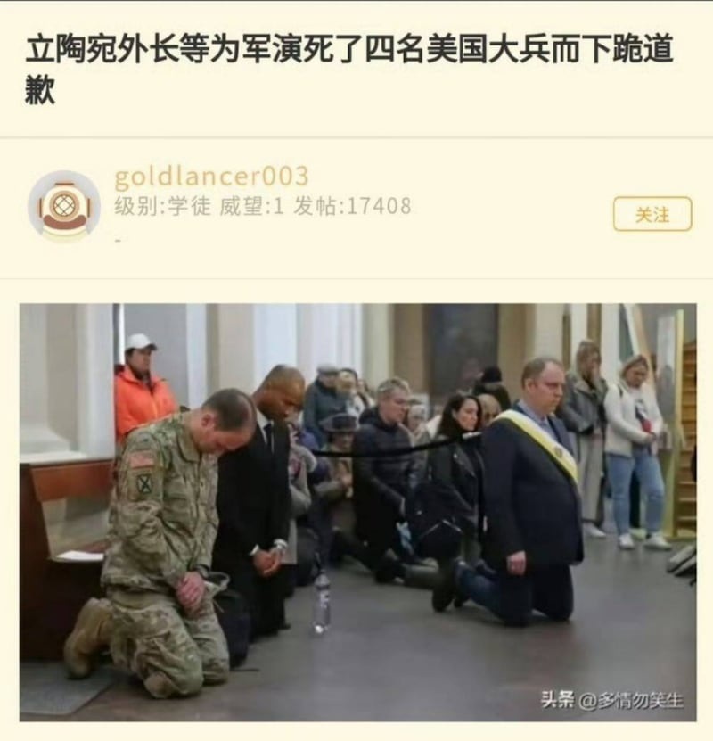

# 事實查覈｜網傳照片裏，立陶宛外長爲美軍演訓事故下跪道歉？

莊敬

2025.04.09 22:08 EDT

## 查覈結果：錯誤

## 一分鐘完讀：

近日社媒盛傳，立陶宛外交部長爲四位美軍在演訓不幸身亡的事故下跪道歉，並附上一張多人跪着、表情哀傷的照片爲證。經查，照片場景是爲失蹤美軍舉行的祈禱儀式，立陶宛外交部長佈德里斯確實參加了儀式，但網傳照片中並不包括佈德里斯。

立陶宛外交部表示，向天主行下跪禮是宗教習俗，網傳「下跪道歉」的說法是「扭曲事實」。

## 深度分析：

3月底，四名美國陸軍士兵在立陶宛訓練期間[失蹤](https://www.europeafrica.army.mil/ArticleViewPressRelease/Article/4135345/press-release-us-soldiers-reported-missing-in-lithuania/)，相關單位隨即出動搜索，幾日後陸續尋獲遺體，[確認](https://www.europeafrica.army.mil/ArticleViewPressRelease/Article/4140714/press-release-fourth-us-soldier-found-deceased/)四人喪命，他們駕駛的M88A2裝甲救援車被發現[淹沒在立陶宛的沼澤中](https://www.bbc.com/news/articles/clywzp35rn4o)。

亞洲事實查覈實驗室（Asia Fact Check Lab, AFCL）注意到，近日有[微博大V](https://m.weibo.cn/detail/5151048244661257#&gid=1&pid=1)、[X用戶](https://x.com/nmamtbh/status/1907628382248161336)傳播「立陶宛外長等爲軍演死了四名美國大兵而下跪道歉」的消息，相關內容也出現在[抖音](https://v.douyin.com/ZSE38uiKb6Y/)等[其它平臺](http://23.237.148.61/thread/6567915)。這些社媒用戶附上一張照片爲證，照片中有幾位身穿軍服和西裝的人士跪在地上、表情哀傷。

- 網傳立陶宛外交部長爲四名美軍士兵在演訓中身亡的事故下跪道歉。 (微博、X截圖)

以圖反搜後發現，有[媒體平臺的社媒帳號](https://x.com/nexta_tv/status/1906349119636910136?t=3DRDQ7rNxFLspoA1hugohg&s=19)在3月30日發佈這張照片，其說明寫道，爲了在立陶宛和白俄羅斯邊境附近演習失蹤的四名美國士兵祈禱，救援行動仍在進行中。另找到《壹蘋新聞網》4月1日的報道中刊登了[其它角度的相似照片](https://tw.nextapple.com/international/20250401/DC8433F409D6697CDC810D19869E392A)，圖說是「美軍等聯軍爲殉難同胞祈禱」，照片來源爲《美聯社》。

根據立陶宛外交部長佈德里斯（Kestutis Budrys）3月30日在社媒上[發文](https://x.com/BudrysKestutis/status/1906304818194399390)，他當天參加了在維爾紐斯大教堂舉行的彌撒聖祭（Holy Mass），爲四名失蹤的美國士兵、他們的家人，以及勇敢的救援人員祈禱。

但經比對，網傳照片中的人並沒有[佈德里斯](https://www.urm.lt/en)。

AFCL去信詢問立陶宛外交部，是否如中文社媒用戶所說，佈德里斯爲美軍事故下跪道歉。立陶宛外交部回覆時，首先感謝AFCL揭露有關事件的「扭曲陳述」（distorted narrative）。

立陶宛外交部並說明，3月30日在維爾紐斯大教堂爲當時仍下落不名的美軍士兵舉行了彌撒，外長佈德里斯參加了祈禱儀式；在立陶宛天主教會的傳統中，向主行跪是習俗，也是儀式的一部分。

*亞洲事實查覈實驗室（Asia Fact Check Lab）針對當今複雜媒體環境以及新興傳播生態而成立。我們本於新聞專業主義，提供專業查覈報告及與信息環境相關的傳播觀察、深度報導，幫助讀者對公共議題獲得多元而全面的認識。讀者若對任何媒體及社交平臺傳播的信息有疑問，歡迎以電郵*[*afcl@rfa.org*](mailto:afcl@rfa.org)*寄給亞洲事實查覈實驗室，由我們爲您查證覈實。*

*亞洲事實查覈實驗室更詳細的介紹請參考*[*本文*](2024-10-09_關於亞洲事實查覈實驗室｜About AFCL.md)*。我們另有X、臉書、IG頻道，歡迎讀者追蹤、分享、轉發。 X這邊請進：中文*[*@asiafactcheckcn*](https://twitter.com/asiafactcheckcn)*;英語：*[*@AFCL\_eng*](https://twitter.com/AFCL_eng)*、*[*FB在這裏*](https://www.facebook.com/asiafactchecklabcn)*、*[*IG也別忘了*](https://www.instagram.com/asiafactchecklab/)*。*

[Original Source](https://www.rfa.org/mandarin/shishi-hecha/2025/04/10/fact-check-usarmy-lithuania/)