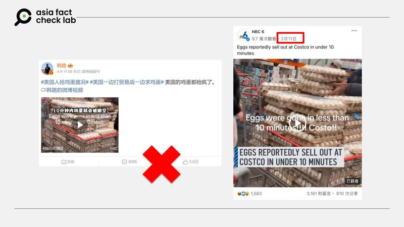
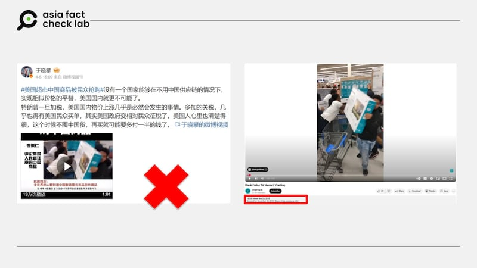

# 事實查覈｜網傳影像是美國「對等關稅」所引發的「囤貨潮」？

作者：莊敬

2025.04.10 21:53 EDT

## 查覈結果：錯誤

## 一分鐘完讀：

美國總統特朗普四月初宣佈「對等關稅措施」後，網路盛傳美國消費者瘋狂囤貨的消息。有社媒用戶傳播「10分鐘內雞蛋就會被搬空」的視頻，也有人轉發美國民衆搶購中國製電視機的畫面。

經查，這些民衆搶購商品的影像並非近期對等關稅措施造成，部分社媒用戶挪用無關事件的影像而未加標註，造成錯誤內容。

## 深度分析：

美國總統特朗普（Donald Trump，又譯川普）4月初宣佈對多國徵收「對等關稅」，幾日後[決定](https://cn.nytimes.com/business/20250410/trump-tariffs-stocks-china/zh-hant/)對部分國家暫停關稅90天，但提高對中國進口產品的關稅。這段期間股市劇烈震盪，經濟不確定性升高，似乎也影響消費者心態。[《華爾街日報》](https://www.wsj.com/economy/consumers/americans-rush-to-buy-tvs-soy-sauce-lululemon-workout-gear-fd6126ac)報道，民衆憂心物價上漲而趕緊購買衣物、電視等用品，[《紐約時報》](https://www.nytimes.com/2025/04/06/us/trump-tariffs-shopping-consumer-panic-buying.html)則指出許多消費者仍在觀望。

亞洲事實查覈實驗室（Asia Fact Check Lab, AFCL）注意到，社媒上流傳許多有關特朗普祭出新的關稅措施後，美國消費者瘋狂搶購、囤貨的消息與影像，而其中有部分網民挪用了與近期「對等關稅」政策無關的過往事件畫面，傳播誤導信息。

例如，[微博大V](https://m.weibo.cn/detail/5153477139371953)在4月9日發文稱「美國一邊打貿易戰一邊求雞蛋，美國的雞蛋都搶瘋了」，並搭配一則一分多鐘的視頻，影片封面上寫着「10分鐘內雞蛋就會被搬空」。

- 近日網傳美國民衆因貿易戰搶購雞蛋（圖左），但所附視頻今年2月已出現（圖右），當時民衆是因爲禽流感疫情導致雞蛋供應緊張而搶購。 (微博、臉書截圖)

AFCL以圖反搜後找到美國媒體「NBC6」今年2月發佈的[短視頻](https://www.facebook.com/watch/?v=1138047054214987)，根據其說明，視頻來源是TikTok用戶，當時民衆之所以搶購雞蛋，是因爲禽流感疫情導致雞蛋供應緊張、蛋價上漲，並非關稅、貿易戰造成。

經比對，上述微博大V發佈視頻中的13秒至27秒畫面，與「NBC6」視頻一致；至於該微博大V發佈視頻中的其他段搶購雞蛋畫面，有一部分曾出現在其它社媒用戶今年2月發佈的[影像](https://v.douyin.com/pOCMdm-I_tA/)中。

另一個案例，是有[微博大V](https://m.weibo.cn/detail/5152087990077867)在4月5日發文，稱美國超市中國商品被民衆搶購，並附上一則視頻寫着「美國加關稅 美國人民瘋狂搶購中國商品」，畫面是民衆搶搬中國海信牌電視。 AFCL注意到，亦有部分[中國媒體](https://www.scol.com.cn/zlts_ss/202504/82940490.html)發佈了這段搶購中制電視的畫面，但有標註是「資料畫面」。

- 近日網傳因美國總統特朗普加稅導致民衆搶購中國商品（圖左），其所附視頻顯示美國民衆搶購中國製電視的畫面，實爲2018年黑色星期五購物活動（圖右）。 (微博、YouTube截圖)

AFCL在2023年已發佈[查覈報告](https://www.rfa.org/cantonese/news/factcheck/madeinchina-08142023084015.html?encoding=simplified)指出，[YouTube頻道「ViralHog」](https://www.youtube.com/watch?v=b8wW8H6VH-U)在2018年11月發佈有關視頻，是美國一家商店的「黑色星期五」購物活動。中國外交官張和清曾在2023年挪用這段視頻，宣稱是時任美國總統拜登對中國商品限制進口，美國民衆連夜瘋搶中國海信牌電視。

根據網路影像證據，上述微博大V發佈的美國民衆搶購雞蛋，以及搶購中國製電視的情景，發生在2025年4月特朗普宣佈「對等關稅」措施之前。部分社媒用戶挪用與當前事件無關的影像，又沒有說明其爲，產生了錯誤信息。

*亞洲事實查覈實驗室（Asia Fact Check Lab）針對當今複雜媒體環境以及新興傳播生態而成立。我們本於新聞專業主義，提供專業查覈報告及與信息環境相關的傳播觀察、深度報導，幫助讀者對公共議題獲得多元而全面的認識。讀者若對任何媒體及社交平臺傳播的信息有疑問，歡迎以電郵*[*afcl@rfa.org*](mailto:afcl@rfa.org)*寄給亞洲事實查覈實驗室，由我們爲您查證覈實。*

*亞洲事實查覈實驗室更詳細的介紹請參考*[*本文*](2024-10-09_關於亞洲事實查覈實驗室｜About AFCL.md)*。我們另有X、臉書、IG頻道，歡迎讀者追蹤、分享、轉發。 X這邊請進：中文*[*@asiafactcheckcn*](https://twitter.com/asiafactcheckcn)*;英語：*[*@AFCL\_eng*](https://twitter.com/AFCL_eng)*、*[*FB在這裏*](https://www.facebook.com/asiafactchecklabcn)*、*[*IG也別忘了*](https://www.instagram.com/asiafactchecklab/)*。*

[Original Source](https://www.rfa.org/mandarin/shishi-hecha/2025/04/11/fact-check-reciprocal-tariff/)