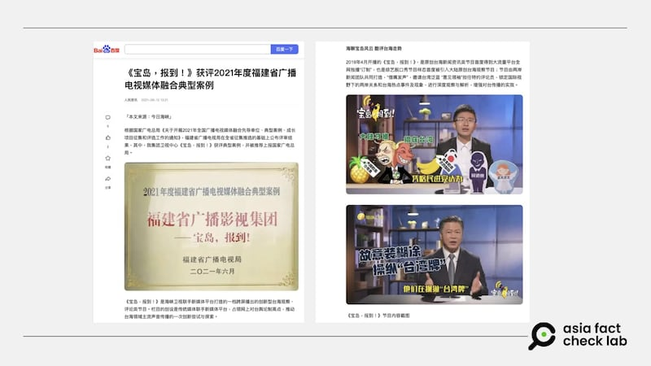
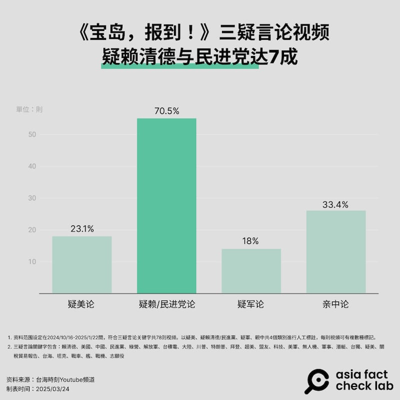
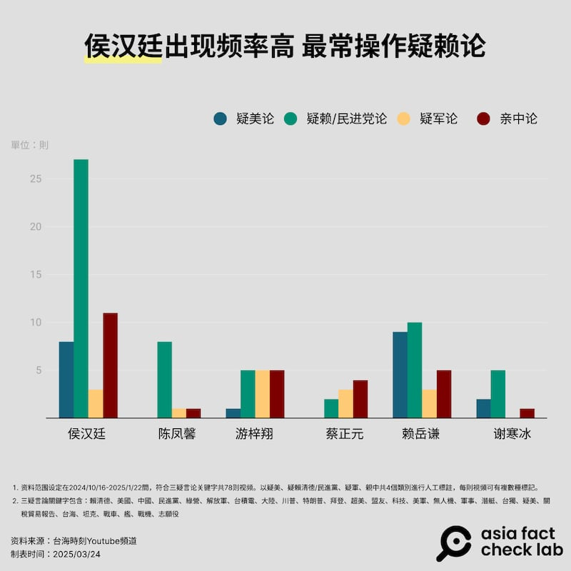
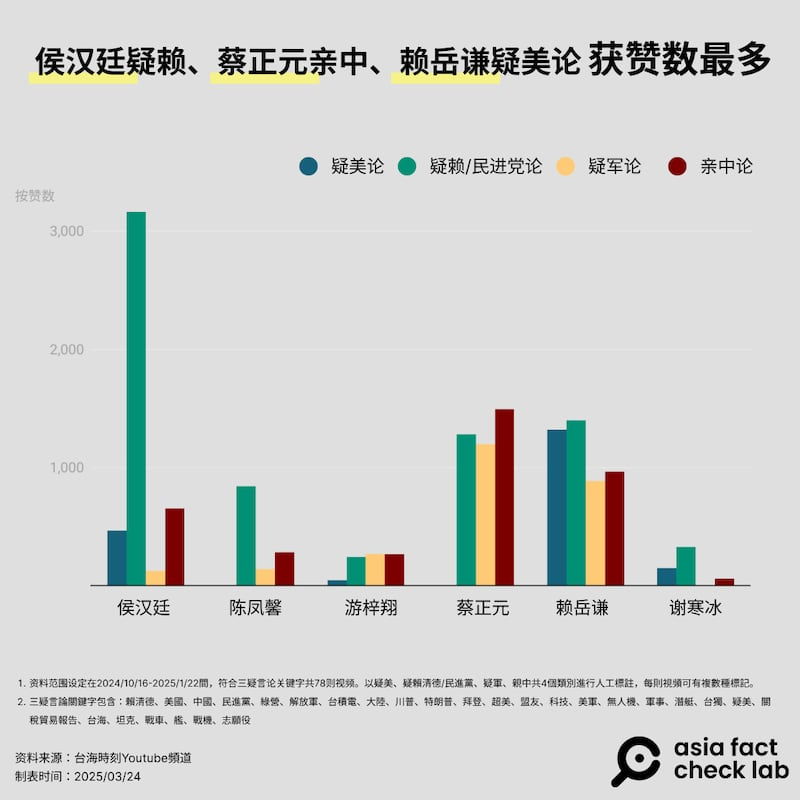
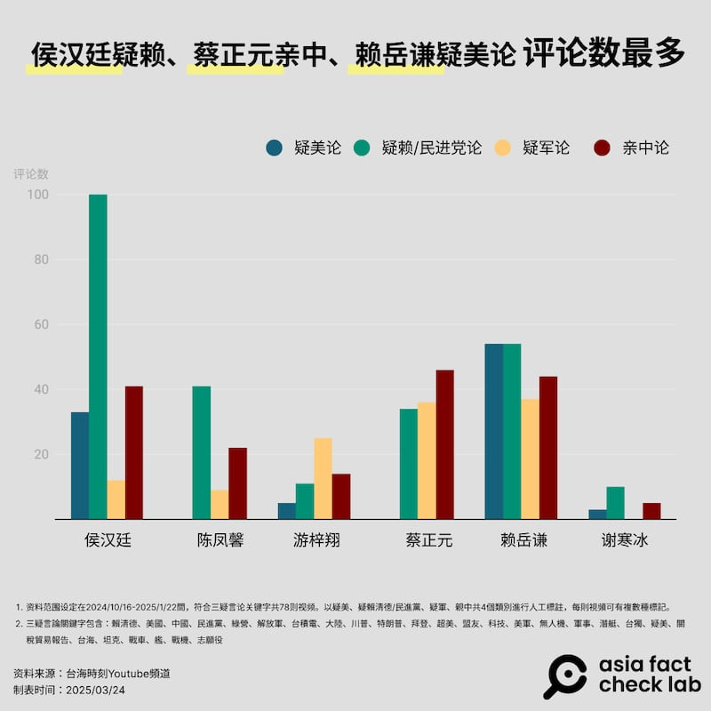
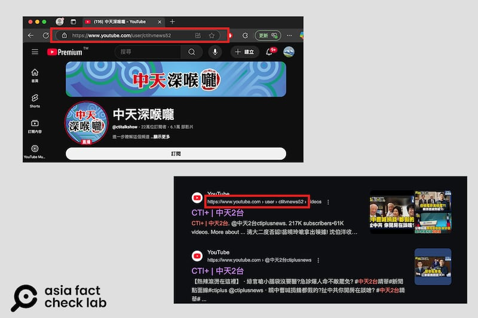

# 深度報道｜中共外宣在臺灣之七：福建網絡對臺統戰節目，Made In Taiwan？

作者：莊敬、董喆、艾倫

2025.04.15 24:42 EDT

**2025年4月24日更新：**補充7月12日「臺海時刻」《寶島，報到！》直播時來賓賴嶽謙與場外的對話，證實了中天與《今日海峽》的合作。

## 前言：

*亞洲事實查覈實驗室（Asia Fact Check Lab，AFCL）2024年底陸續發表《中共外宣在臺灣》*[*系列報道*](https://www.facebook.com/photo.php?fbid=122188232678127285&id=61553818563040&set=a.122099472890127285)*。在追蹤採訪的過程中，一個被我們稱爲"*[*福建網絡*](2024-12-31_深度報道｜中共外宣在臺灣之五：對臺統戰的操盤手“福建網絡”.md)*“的對臺統戰、宣傳集團逐步浮現。這個以福建爲基地的集團包括“福建日報報業集團*”*及“福建廣播影視集團”，前者產製平面、網路報道，後者主打影音產品。*

*本系列前六篇報道中，我們調查、發掘了“福建日報報業集團”的宣傳內容如何從各種管道滲入臺灣的傳統平面媒體與網路媒體。這一波我們將聚焦“福建省廣播影視集團”轄下電視臺等單位，如何藉着臺灣媒體合制節目、“業務配合”（有償新聞）等方式，讓統戰訊息一點一滴流進臺灣的電視臺與影音頻道，再投放到觀衆眼前。*

## 借臺灣的“嘴”，發誰的聲？

“人家是花錢買和平，臺灣是花錢買戰爭……兩岸關係搞好，和平相處，需要給美國勒索嗎？需要犧牲臺灣的經濟發展嗎？”在螢光幕上滔滔不絕的是新黨籍臺北市議員侯漢廷，這一集20多分鐘的節目，標題是”賺了美國的錢要吐出來！臺當局調高預算跪舔美國“。侯漢廷批評臺灣總統賴清德爲“舔美”，將國防預算提升至國內生產總值的3%。

這是《寶島，報到！ 》的一集節目，2025年2月21日上傳播出。 《寶島，報到！ 》則是YouTube上"[臺海時刻官方頻道](https://www.youtube.com/watch?v=0TakZqcSFQU)“的一個欄目。相同內容也被剪成一部約一分鐘的短影音，收錄在”[今日海峽](https://www.facebook.com/share/v/1A2sNoMkrN/)“的臉書粉絲專頁上，這個專頁有390萬位追蹤者。

“臺海時刻官方頻道”和”今日海峽“都是《海峽衛視》的帳號，隸屬“福建省廣播影視集團”。除了《寶島，報到！ 》，“臺海時刻官方頻道”還有多個欄目，臺灣多位政治評論人都是連線常客，例如《臺海政情室》的民進黨前立委郭正亮、新黨前發言人王炳忠。 ；《軍情觀察》的前海軍艦長呂禮詩、媒體人唐湘龍。

依照中國網路[公開資料](https://archive.ph/CanmV)的描述，2019年4月開播的《寶島，報到！ 》是一套臺海新聞資訊類原創節目，“借嘴發聲”，邀請臺灣泛藍“意見領袖”擔任特約評論員，增強對臺傳播的實效。根據福建省廣播電視局節目[新聞稿](https://web.archive.org/web/20250320102552/https://gdj.fujian.gov.cn/zt/mtrhfz/202210/t20221013_6016073.htm)，這個節目曾獲評爲“2021年度福建省廣播電視媒體融合典型案例”，被推薦上報中國國家廣電總局表揚。

- 在中國網路上的公開資料介紹，《寶島，報到》由兩岸新聞團隊共同打造。 (百度截圖)

## “合制”節目，借臺灣的嘴，發中國的聲

AFCL自2024年11月至2025年1月密集監看《寶島，報到！ 》的節目，經常登場的評論員包括侯漢廷、遊梓翔、蔡正元等，他們談論主題隨着新聞時事發展而不同，但內容大多圍繞着被稱爲“三疑” — “疑美（國）“， “疑賴（清德政府）“、”疑（臺）軍“的言論，相對地高調宣揚中國的政策，有時甚至大讚中國製產品。

牽涉到臺灣政治時，這些臺灣評論人完全依照[中國規定的詞彙](https://baijiahao.baidu.com/s?id=1787143045557053970&wfr=spider&for=pc)，例如稱臺灣外交部長爲“外事部門負責人”，國安局爲“安全部門”。

侯漢廷甚至還曾在一集[節目](https://www.youtube.com/watch?v=YsePDNdCHtk)中說道這一段話：“如果兩國做夥伴，求同存異，中美關係就能夠取得長足發展。如果把對方當對手，惡性競爭，中美關係就會遭遇波折甚至倒退。中美合則兩利，鬥則俱傷。"

AFCL查對這句話後發現，這是來自中共總書記習近平的[一段講話](http://cpc.people.com.cn/BIG5/n1/2024/1118/c64094-40363492.html)，一字不漏。

AFCL進一步對《寶島，報到！ 》的“三疑”言論進行量化分析。我們抓取了2024年10月16日至2025年1月22日臺海時刻YouTube頻道的《寶島，報到！ 》播放清單中，標題內含“三疑”言論關鍵字（註）的共78則視頻，再以“疑美”、“疑賴清德/民進黨”、“疑軍”、“親中”共4個類別進行人工標註，每則視頻可有複數標記。

希望藉此歸納出“借嘴發聲”的中共官媒，“用了誰的嘴”、“談了哪些議題”、“獲得怎樣的迴響”。

- - (AFCL製圖)

資料比對結果顯示，《寶島，報到！ 》在2024年10月至2025年1月這段時間內，最常發表“三疑”言論的臺灣名嘴爲：侯漢廷、遊梓翔、蔡正元、謝寒冰、賴嶽謙以及陳鳳馨。

在“三疑”之中，名嘴集中火力質疑賴清德與民進黨執政能力，7成言論都屬於“疑賴/民進黨”。標題一共出現16次“賴清德”、7次“民進黨”以及5次“臺獨”。最常見的論述爲綠營阻擋兩岸交流，以及謀獨引戰。

- - (AFCL製圖)

綜合比對78則視頻的獲贊數以及留言數，臺灣名嘴的表現有顯著差異，侯漢廷可說是《寶島，報到！ 》最常放送“疑賴論”的評論員，光是他一人就有27則視頻與“疑賴論”有關，總計的按贊數超過3000次，評論數也是6位名嘴在4種議題類別中唯一達到100則。

- - (AFCL製圖)

- - (AFCL製圖)

另一名嘴蔡正元，雖然出現次數不多，但在“親中論”和“疑軍論”兩大議題中，他都獲得了破千的贊數。賴嶽謙出現的次數排名第二，其在“疑美”與“疑賴”方面的談話亦收穫不少贊數與評論。

## 這些視頻，是在臺灣錄的嗎？

中國網路上的公開資料中寫道《寶島，報到！ 》是“由兩岸新聞團隊共同打造”。但是哪個“臺灣團隊”與《海峽衛視》共同打造節目？雙方又是如何合作？ AFCL也注意到，《寶島，報到！ 》不是連線進行，而是在攝影棚內實體錄製並直播。但攝影棚在哪裏呢？

臺灣《鏡週刊》的一則[新聞報道](https://www.mirrormedia.mg/story/20231023inv020)提供了一些線索：“海峽衛視製播的《寶島報到》節目，每週一、四在國內某間電視臺進行錄製，並由該臺工作人員協助剪輯供其他節目運用，相關短影音再上傳YouTube及抖音平臺，整個後製過程都由臺辦支援“。

AFCL在監看時也注意一個細節：侯漢廷於某集[節目](https://www.youtube.com/watch?v=sFO0sTCKCtI)開場感謝正在看直播的觀衆，並表示他錄節目前在議會審預算，搭計程車趕過來。這表示侯漢廷錄節目的地點在臺灣。

2023年7月12日，臺海時刻臉書粉絲團一如往常進行《寶島，報到！》[的直播](https://www.facebook.com/straitsplus/videos/1433197587521682)，在直播開頭的閒聊時間，當日的主持來賓賴嶽謙與場外的一番互動，更坐實了中天與《今日海峽》的合作關係，相關對話如下：

*工作人員：「每個禮拜一跟禮拜三，會找三集到四集出來。」*

*賴嶽謙：「中天新聞二臺。」*

*工作人員：「我們也會放在我們中天亞洲臺，都會播。」*

*賴嶽謙：「哦，一魚多喫哦，價格要升高，看你多喫幾個要乘以幾倍。」*

接着工作人員指示賴嶽謙講開場白：「大家好我是報告人」。

賴接着提問：「不要再寶島報到我來報告？」工作人員答：「那是之後的。」

這番對話後，場外傳出「切封面」的指示，隨即直播畫面出現當集的封面：「要臺灣研發『生物戰劑』？美國邪惡盤算被曝光」，封面的直播單位是「臺海時刻」，隨即正式進入當集內容。

由此可見，無論是中方的《寶島，報到！》的或是中天的《報告！我有話要說》，皆是由在臺的中天工作人員執行。

AFCL循線訪查，獲得臺灣媒體工作者向我們證實，《寶島，報到！ 》是由“中天亞洲臺”製作，負責聯繫來賓、剪輯等工作。其中一位中天員工坦言，《寶島，報到！ 》就在中天一樓攝影棚錄影，“不怕(你們來)查，民進黨已經來問過了。"

訪問中我們曾質疑節目的腳本是不是出自中國人士之手？但一位受訪的中天員工否定了我們的猜想。他說，製作單位會設定主題，由來賓自行準備講稿，刻意使用“大陸用語”，是因爲目標受衆爲全球華人，而不是受到中國官方指示。

“中天亞洲臺”的網站上列舉多個與中國相關的節目，其中一個節目《報告！我有話要說》引起了我們的注意，因爲它的來賓、話題、節目風格，都與《寶島，報到！ 》高度相似，而其節目存檔，都收錄在”中天二臺“YouTube頻道。

AFCL以“三疑”言論關鍵字（註）爲範圍，抓取中天《報告！我有話要說》2024年10月21日至12月21日共25則視頻，逐格比對，發現其中24則都可以從臺海時刻YouTube官方頻道的《寶島，報到！》播放清單中找到完全相同的片段，多數僅減去停頓或是語助詞，重複率高達96%。

AFCL觀察，《寶島，報到！》24則與《報告！我有話要說》完全相符的視頻皆爲“直播存檔”，《報告！我有話要說》則是一般視頻。《報告！我有話要說》上線的時間大約是《寶島，報到！》直播結束後2至3天，內容是將原本的整集直播內容剪輯爲多集的節目，再加上另外錄製的專屬片頭：“大家好，我是報告人某某某“。

因此，AFCL推斷這些節目雖然在臺錄製節目，但首先在中國官媒掌握的頻道曝光。

另外，從節目來賓在直播時的“脫稿演出”，也可推敲《寶島，報到！》與《報告！我有話要說》的合制關係。

例如，世界棒球12強賽臺灣取得四強門票之際，時任民進黨政策會執行長王義川質疑爲何不說“臺灣隊”？侯漢廷在11月18日《寶島，報到！》直播2分05秒處提到此事，他批評“不愛中華民國的人都該去跳海，怎麼不去安樂死“。隨後他補充，“直播不受NCC管轄，沒關係，因爲我們最後做成節目的時候，這些應該都會被剪掉“。

侯漢廷的發言證明兩件事：

一是網路直播不屬NCC的管轄，成爲名嘴和電視臺的金鐘罩；

二是他知道《寶島，報到！》是直播，且最終會被剪輯爲節目。

AFCL曾在去年底《中共外宣在臺灣》系列報道中[初步揭露](https://www.rfa.org/mandarin/shishi-hecha/2024/12/31/fact-check-ccp-propaganda-taiwan-serial5/?fbclid=IwY2xjawJKJJJleHRuA2FlbQIxMAABHcqLKgyHA_wfKtrylr7Ls1InqD1ZwlG11Esh9wqy-CMkQbwCf-JzPA06wA_aem__HDbyEHv7IR3PbZ3SOCMnA)，中天二臺與福建廣播影視集團疑似有合作關聯，旺中集團當時不願正面說明。**AFCL曾於2024年12月30日發信請中天亞洲臺回應，至截稿爲止，並沒有得到回覆。**

但2024年12月31日刊出報道後，這兩個節目的關聯有了一些變動：

《報告！我有話要說》在相近的時間停止更新，最後一期節目停留在12月28日。

而《寶島，報到！ 》則是在新的一年，換了風格，一改過去的直播形式。最後一次直播節目停留在2025年1月2日，此後的節目都是“精編版”。

另一細節是，AFCL於2025年2月21日完成視頻比對，當時頻道名稱仍是中天二臺，3月13日再次覈對時，該頻道已改名爲“中天深喉嚨”。頻道雖已改名，但網址仍是一樣的。

- 中天二臺已改名爲「中天深喉嚨」，頻道雖已改名，但網址仍然相同。 (YouTube截圖)

雖然外界並不清楚“中天亞洲臺”與《海峽衛視》的合作是否涉及任何實質利益。但綜合受訪者的說法以及比對節目內容，至少可以確定兩臺之間內容共享，以及提供錄製場地、人力等資源的“合作行爲”，共同打造出《寶島，報到！ 》這檔聚焦政治議題的節目。**我們日前發信給中天電視，詢問相關說明，但至截稿爲止，尚未得到答覆。**

《寶島，報到！ 》內容涉及政治，那下一個問題就是這恐怕違反了《臺灣地區與大陸地區人民關係條例》（以下簡稱“兩岸條例”） 第33-1條規定：臺灣地區人民、法人、團體或其他機構，非經各該主管機關許可，不得與大陸地區人民、法人、團體或其他機構，爲涉及政治性內容之合作行爲。

陸委會主委邱垂正接受AFCL採訪時表示，臺灣政府或是民間機關、機構，要與中國官媒合作，要經由政府許可，合作案可以送審，但若未經許可與中國官媒合作，就有可能違反兩岸條例第33-1條的規定。

但《寶島，報到！ 》的臺灣合作方，是不是向臺灣政府提出申請？如果沒有，可能受到什麼樣的處分？ AFCL於2025年4月初再次詢問陸委會。陸委會提供的書面答覆指出，“兩岸合制節目倘涉及與陸方黨政軍機構爲合作行爲或屬政治性內容，應依兩岸條例第33條之1規定，經目的事業主管機關許可，如有具體違法事證，主管機關會依法處理。"

但陸委會強調自己不是“主管機關”，至於由哪個機關管理，“仍須視個案之合作模式實際狀況進行綜合判斷，評估可能涉及之機關(如文化部、通傳會、數位發展部等)權責“。

臺灣大學新聞研究所教授洪貞玲接受AFCL訪問時，指出兩岸媒體合制涉及政治內容的節目，應該符合兩岸條例第33-1條規範對象，但如何解釋雙方“合作行爲”是個問題，例如中國涉入的程度，又是否掌握資金往來等證據，以及是否向主管機關報備。再接下來的問題是，“法律效果是什麼”？

“罰則很低。“洪貞玲表示，即使有人檢舉了某個兩岸合制涉及政治內容的節目，也符合構成要件，”罰他個幾萬，會怎麼樣？他可能還是會繼續做，因爲從中獲得的利益絕對不止。"

“當法律效果沒有辦法達到嚇阻作用時，某種程度其實讓人民有很多鋌而走險的誘因。“洪貞玲說。

## 中天亞洲臺揭祕

“中天亞洲臺”屬於旺旺中時集團，網站介紹其收視戶涵蓋大亞洲地區，華人密集的區域，遍佈中港澳、菲律賓、新加坡、新西蘭等超過48個國家，頻道專注兩岸三地發展，旨在服務全球華人。

中天電視曾於2020年8月向NCC送件，申請“中天亞洲臺”在臺灣落地。但當時[NCC審議後認爲](https://www.ncc.gov.tw/chinese/news_detail.aspx?site_content_sn=8&sn_f=47265)，“中天亞洲臺”頻道定位爲綜合臺，但新聞性節目逾五成，且部分節目與中國合制，恐有違反《兩岸人民關係條例》規定之虞，在2022年決議否決申設案。

2022年3月9日，NCC副主委翁柏宗在[記者會](https://www.youtube.com/watch?v=FunVxWk_i9M)轉述了權責機關文化部的意見。文化部認爲由於中國的電視臺等廣電媒體屬黨政機構，“中天亞洲臺”與中國的電視臺合作，可能是《兩岸人民關係條例》第33-1條所規範的對象。翁柏宗並說，很多電視臺也有外購中國的戲劇或綜藝節目播出，這是由文化部[依許可辦法](https://www.moc.gov.tw/News_Content.aspx?n=180&s=3949#:~:text=%E7%B6%93%E8%A8%B1%E5%8F%AF%E5%9C%A8%E8%87%BA%E7%81%A3%E5%9C%B0%E5%8D%80%E8%A7%80%E6%91%A9%E4%B9%8B%E5%A4%A7%E9%99%B8%E5%9C%B0%E5%8D%80%E9%9B%BB%E5%BD%B1,%E7%AF%80%E7%9B%AE%E9%81%8B%E5%87%BA%E8%87%BA%E7%81%A3%E5%9C%B0%E5%8D%80%E3%80%82)把關，與兩岸電視臺合制節目不同，而且“中天亞洲臺”營運計畫僅告知合作對象，未具體言明雙方合作事項等細節。

對於NCC的決議，中天透過[聲明](https://www.chinatimes.com/newspapers/20220310000387-263101?chdtv)批NCC擴大解釋《兩岸人民關係條例》，帶着有色眼光審查此案，中天爲爭取新聞自由及言論自由，將依法持續爭取在電視頻道發聲。

不過，一名參與審議“中天亞洲臺”申設案的前NCC委員告訴AFCL，當時對於部分節目與中國合制，以及某知名節目含有中國政治宣傳內容，表達疑慮，也請中天說明，但中天“說不出個所以然”。他也疑惑，名爲“亞洲”臺，爲何與中國合制、相關的內容這麼多？

## 擋得住頻道，擋不住網路

從“中天亞洲臺”一案可知，兩岸電視臺合制節目可能“踩紅線”，然而只能守住有線電視頻道，無法擋住有疑慮的節目在網上播放。時至今日，在“中天亞洲臺”網站，仍可看到當時在營運計畫上，載明與中國東方衛視合作的談話性節目“雙城記”，以及紀實性節目“魅力東方”等。另外還有不在當時營運計畫上的節目“報告！我有話要說“。

臺灣電視臺產製的節目，無論在有線或無線頻道播送，都受到現行法律的規管，特別是定期換髮執照，對於保持內容品質、防止極端意見，甚至維護兒少身心健康，都是極重要的約束力量。但網路時代興起，傳統電視臺不只將頻道內容搬上網路，也開始製作網路原生節目。

而“一上網路，尺度大開“的問題愈發嚴重，也爲中共外宣進入臺灣打開了破口，“中天亞洲臺”所隸屬的" 中天電視“，向臺灣社會展示了最典型的案例。這也是專題下一篇報道的主題。

*注：AFCL歸納的“三疑”言論關鍵字包括：賴清德、美國、中國、民進黨、綠營、解放軍、臺積電、大陸、川普、特朗普、拜登、超美、盟友、科技、美軍、無人機、軍事、潛艇、臺獨、疑美、關稅貿易報告、臺海、坦克、戰車、艦、戰機、志願役。*

## “中共外宣在臺灣”系列前六篇報道如下：

之一：[臺檢以《反滲透法》訴大選假民調當事人，一審因何失利？](2024-12-12_深度報道｜中共外宣在臺灣之一： 臺檢以《反滲透法》訴大選假民調當事人，一審因何失利？.md)

之二：[林靖東和林獻元背後的大外宣架構](2024-12-12_深度報道｜中共外宣在臺灣之二：林靖東和林獻元背後的大外宣架構.md)

之三：[老牌本土報紙如何被澆灌出親中敘事？](2024-12-20_深度報道｜中共外宣在臺灣之三：老牌本土報紙如何被澆灌出親中敘事？.md)

之四：[海峽兩岸的兩家《導報》](2024-12-25_深度報道｜中共外宣在臺灣之四：海峽兩岸的兩家《導報》.md)

之五：[對臺統戰的操盤手“福建網絡”](2024-12-31_深度報道｜中共外宣在臺灣之五：對臺統戰的操盤手“福建網絡”.md)

之六：[管不管網路？那是個問題](2025-01-03_深度報道｜中共外宣在臺灣之六：管不管網路？那是個問題.md)

[Original Source](https://www.rfa.org/mandarin/shishi-hecha/2025/04/15/fact-check-ccp-propaganda-fujian-media-group/)