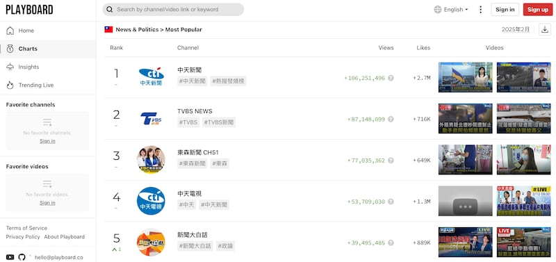
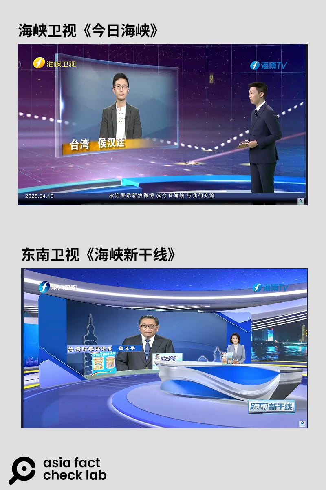
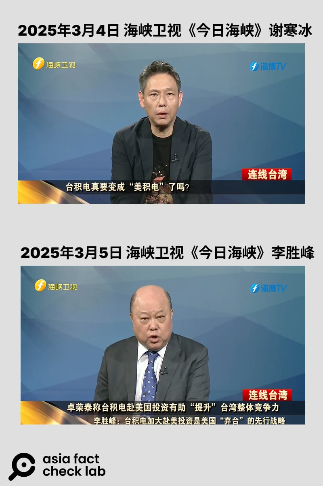
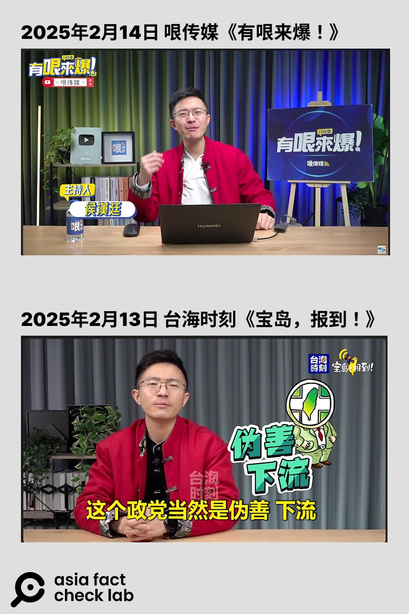

# 深度報道｜中共外宣在臺灣之八：主流媒體的親中之路，以及網路上“大解放”

作者：莊敬、董喆、艾倫

2025.04.16 21:48 EDT

2020年12月12日清晨零點，中天新聞臺從有線電視52頻道下架，但它隨即轉向新戰場。在頻道直播的最後時刻，主持人不停提醒觀衆“按贊、分享、打開小鈴鐺“，開啓了在YouTube上“24小時不斷電直播“時代。

半年後，《數位時代》[報道](https://www.bnext.com.tw/article/62611/tv-transformation-cti-news-youtube)截至2021年5月，中天電視YouTube頻道訂閱人數達249萬，是所有新聞臺YouTube頻道中訂閱數之最，累積的觀衆贊助金額也是全臺最高。報道總結了中天爲新戰場做出的三大轉變：主播變網紅、新聞娛樂化、經營會員經濟。

時至今日，中天表現依舊亮眼。根據YouTube流量統計網站“PlayBoard”2025年2月的數據，在臺灣的新聞類頻道之中，中天新聞的總觀看數最高，其次依序爲TVBS新聞、東森新聞、中天電視，以及TVBS的政論節目“新聞大白話“。

- 根據YouTube流量統計網站2025年2月的數據，在臺灣的新聞類頻道之中，中天新聞的總觀看數最高。 (PlayBoard網站截圖)

換照未過，中天電視不得不由頻道轉向網路，但這也提供了一個主流新聞臺轉型網媒經營的案例，包括疑似中共外宣的資訊，如何在轉型之間滲入、發送和傳播。

但在討論“網路中天“之前，需要先探討中天所屬的“旺旺中時媒體集團“如何在製播中國新聞時，爲了商業利益踩進了新聞倫理的灰色地帶。更重要的是，中天不是特例，同時代臺灣的主流平面、電視媒體集團，大部分都有“與中國妥協“的一段歷史，差別僅在於“尋租“的形式不同。

## 從“餘中時“到“蔡旺中”

中時媒體集團的核心事業《中國時報》由具國民黨中常委身份的餘紀忠於1950年創辦，之後陸續成立《工商時報》、《中時電子報》等。2002年，經營者將中天電視納入旗下，2006年買下中國電視公司，成爲同時擁有報業、有線電視、無線電視的跨媒體集團。2008年，餘紀忠家族出售集團，最終由食品商人蔡衍明買下，入主經營。

蔡衍明接手中時媒體集團後，改名旺旺中時媒體集團（簡稱旺中），他[提出](https://static.chinatimes.com/pages/customer-introduce.htm?chdtv)“唱旺臺灣、旺旺中國人”爲媒體經營目標，期勉旺旺媒體人以增進兩岸和諧、構築民間溝通橋樑自許，共同構建出全球華人世界的最大媒體平臺。

蔡衍明還未接手媒體前，言談就帶有濃厚的親中色彩，出掌媒體集團後，一來讓媒體界及傳播學者擔心形成新聞壟斷與媒體集中化，更質疑蔡衍明在中國的政商關係可能會讓中國政府控制檯灣媒體。正在外界質疑不斷時，蔡衍明接連在兩岸事務上傳出爭議言行。2009年，臺灣《天下》雜誌一篇[報道](https://www.cw.com.tw/article/5001838)，揭露蔡衍明買下旺中集團後，曾經向時任國臺辦主任王毅報告自己買下了中時。

2012年，蔡衍明接受《華盛頓郵報》[專訪](https://web.archive.org/web/20120620225230/http://www.washingtonpost.com/world/tycoon-prods-taiwan-closer-to-china/2012/01/20/gIQAhswmFQ_story.html)，發表“六四天安門事件並沒有死那麼多人“、“期待統一“等言論，引民運人士不滿，發起“拒絕中時運動“，蔡衍明則[駁斥](https://web.archive.org/web/20120505220931/http://news.chinatimes.com/focus/11050105/112012021000088.html)《華郵》報導“斷章取義“；同年，多個民間團體發起“反媒體壟斷運動“，提出“拒看與拒買旺中集團媒體“。

蔡衍明對兩岸關係的主張，明顯貫注到集團內的中天電視臺。2018年臺灣地方選舉期間，臺灣國家通訊傳播委員會（NCC）接到多起針對中天與TVBS的[檢舉](https://www.cna.com.tw/news/firstnews/201811210181.aspx)，認爲他們製播選舉新聞內容偏頗、失衡。根據NCC[統計](https://www.ncc.gov.tw/chinese/files/20111/8_45332_201118_1.pdf)，中天新聞臺在六年執照效期內，違規共25件，集中在2018年至2020年間，其中以“違反事實查證“件數最多。

## 中天來賓要先簽署“無色覺醒十大主張”

在中天多次違規紀錄中，政論節目“大政治大爆卦“被NCC[重罰100萬](https://www.cna.com.tw/news/firstnews/201904105007.aspx)，當時創下裁罰單一個案最高金額。該節目在2019年3月播出“大陸不買了，柚農陳大哥：文旦丟在水庫超過200萬噸“標題，經審議認爲違反事實查證原則，損害公共利益。

“大政治大爆卦”在2020年中天換照大限之前已停播，但節目中常出現的"[無色覺醒十大主張](https://www.chinatimes.com/newspapers/20180813000445-260118?chdtv)“令人印象深刻，也讓人看到蔡衍明如何將他對兩岸關係的觀點與主張，注入政論節目。 AFCL採訪了兩位當時在中天任職的員工，以A、B代稱。

員工A告訴我們，大約在2018年5月開始，蔡衍明要求政論節目來賓需要簽署“無色覺醒十大主張“，該主張第一條便是“認同兩岸一家親，同根同源，臺灣人就是中國人“。 A說，從那時開始，節目就越來越難約到願意上通告的來賓，因爲過去即使是與中天立場相近的國民黨民代，也會“選腳本“來避免過度偏激的言論，當蔡衍明要求來賓“表忠“，便踩到了許多來賓的底線。

現今在中天及對岸政論頗受歡迎的賴嶽謙，當時率先在節目上公開簽署十大主張，但A告訴我們，其實來賓私下籤署就可以繼續上節目。從此之後，節目敲定來賓的標準，也從原本的看收視率高低，變爲他是否願簽署”十大主張”。

另一個蔡衍明顯著干預節目內容的是撤換腳本，A回想過去在節目即將播出前，編輯臺有時便會收到來電，要求將原先預定播出的內容改爲與中國外宣相近內容，電話的另一頭便是蔡衍明。

至於中國官方有沒有直接伸手干預中天營運，員工A與B都認爲沒有，原因並不是中天內部有防火牆，而是“蔡衍明就已經是親中的存在“。

對於臺灣媒體揭露，有中國官媒記者直接在臺灣電視臺政論節目錄制現場“盯場“，這指的是中天嗎？ A與B都表示，他們已經離開政論節目圈多年，雖不知道實情，但認爲機率不高，因爲“老闆（蔡衍明）就會審了，不用盯！"

## 分衆傳播，政治掛帥

2020年，中天新聞臺申請換髮衛星廣播頻道執照執照，NCC認爲該臺有[多次違規](https://buzzorange.com/citiorange/2020/12/11/ctitv-banned-for-many-misinformation/)、內控機制失靈，以及持有人介入新聞製播等問題，[決議不予換照](https://www.ncc.gov.tw/chinese/news_detail.aspx?site_content_sn=8&cate=0&keyword=&is_history=1&pages=0&sn_f=45332)。中天新聞臺從當年12月12日退出有線電視頻道，轉向經營網路頻道。

網路上的中天電視以開啓了多個“精選頻道“，以不同主題經營分衆。2025年3月我們檢視了中天電視的主站，它有21個精選頻道，其中訂閱數超過200萬的有“中天新聞“，超過100萬的有“全球大視野“、“頭條開講“和”我愛貓大“，50到100萬的有“新聞龍捲風“、“大新聞大爆卦“、“我愛小明星大跟班“、“娛樂頻道“。盤點一輪後可以發現，除了兩個娛樂和一個寵物頻道外，政治和時事，仍然是中天電視臺的主戰場。前一篇專題報導提到的“中天亞洲臺“，它的訂閱數則接近5萬。

轉戰網路的中天電視不再受廣電相關法律管轄，也不再有換髮執照的顧慮。節目內容因而尺度大開：有主播跳螃蟹舞、直播喫火鍋，資深主播周玉琴也因[角色扮演](https://dailyview.tw/daily/2827)而人氣大漲。另一名女主播張卉林則變身[“辮子妹”](https://www.ctitv.com.tw/anchor/%e5%bc%b5%e5%8d%89%e6%9e%97)，以設定議題，市區街訪的風格逐漸發展成網路媒體品牌，不僅在中天頻道播放，也常登上隸屬同集團《中時新聞網》[報道](https://tw.news.yahoo.com/%E5%B9%B4%E8%BC%95%E4%BA%BA%E6%8C%BA%E5%85%A9%E5%B2%B8%E4%BA%A4%E6%B5%81-%E8%B6%85%E5%B8%8C%E6%9C%9B-%E5%A5%B9-%E8%A8%AA%E5%8F%B0-%E6%9C%80%E6%96%B0%E8%A1%97%E8%A8%AA%E6%9B%9D%E5%BF%83%E8%81%B2-003044631.html?)。有時也被中國官媒引述。

例如香港《中通社》2024年8月[報道](https://mp.weixin.qq.com/s/f7RWbVrkfVZSD5byRHkCmg)臺灣某高中發放“青年服勤同意書“，稱“臺媒『辮子妹街訪』“在街上採訪高中生，幾乎所有學生都表示不會籤，並喊賴清德的兒子抓回來打仗。 “辮子妹”的街訪內容，也經常被剪成短視頻，搬運到在抖音擁有2千多萬粉絲的"[臺海時刻](https://www.douyin.com/user/MS4wLjABAAAAUtnk7_oB-bKXsXu9LULf6n5FXZAKa9RMrh3YwrM_lOo/search/%E8%BE%AE%E5%AD%90%E5%A6%B9?aid=35b17641-9d6d-4269-8599-7949e61d649e&modal_id=7328224965919034624&type=general)“上，這是海峽衛視《今日海峽》的官方抖音號。

中天電視也邀約名嘴、網紅開節目相互拉抬，包括[網路聲量](https://ynews.page.link/toxWn)相當高的前立委郭正亮、蔡正元就經常現身中天政論節目。以政治評論走紅網路的“柳傑克“、“歷史哥“等人，也名列“中天朋友圈“主持人，“中天朋友圈“也是中天電視在網路上經營的分衆頻道之一，集結“志同道合“好友的作品。

## 臺媒搶食中國大餅

臺灣媒體自1990年8月起派出記者赴中國駐點採訪，相對的臺灣在2000年有條件[開放中國媒體到臺灣駐點](https://www.mac.gov.tw/News_Content.aspx?n=F9057F9640B28033&sms=7C8440BC86E48FD9&s=5AA0764E5DCBD34B)。兩岸新聞交流大門打開後，除了一般新聞採訪外，希望藉着新聞交流進攻中國市場的臺灣媒體當然不只旺旺中時集團，當時主流的電視、平面媒體集團都有所佈局，甚至以新聞報道的編審權力換取經濟利益，也就是學界稱爲“媒體尋租“的腐敗行爲。

在平面媒體集團，與旺中集團並列主流媒體的聯合報系，從2006年4月起獲得中國國臺辦“特批“，能夠在中國印報、發行。即使不能公開發售，並限制臺灣等特定身份者才能訂閱，但這樣的落地條件仍然引發競爭對手旺中集團[撰文](https://www.chinatimes.com/newspapers/20121117000308-260102?chdtv)批評“對岸量身訂作規定，唯一特權讓同業稱奇“。

“臺灣媒體對大陸有經濟需求，大陸政府對臺灣媒體則是政治需求大於商業。”臺灣東森新聞主播吳宇舒2011年在臺灣大學新聞研究所的碩士論文《大陸專題性新聞節目的產製分析》中，一語道破兩岸媒體合作中“各取所需“的面向。

以中國新聞在臺灣媒體如何產製爲研究主題的不只吳宇舒，曾任職三立電視的楊琇晶2014年也發表碩士論文《臺灣媒體的中國因素—香港經驗參照》。綜合吳、楊兩位的論文，都提到了製作中國大陸相關節目的電視臺以中天、東森、TVBS爲最大宗，甚至有“新三臺“之稱（“老三臺“指在臺灣最早創辦的三家電視臺：臺視、中視、華視）。

兩人的論文共訪問了數十位記者、媒體主管、政論名嘴等業界人士，分享不少兩岸媒體合作的內幕，也道出合作關係中的不平等之處。

吳宇舒揭露，東森是最早着眼大陸市場的臺灣電視臺。2000年開始於北京上海駐點採訪，2001年起積極與央視合作製播新聞與節目，2002年開播東森亞洲衛視，率先落地港澳。中天由旺旺集團接手之後，循着東森模式西進，TVBS也開始尋求兩岸媒體合作，顯然拓展大陸市場已是臺灣有線電視臺的趨勢。

吳宇舒以東森新聞臺“哈囉中國“節目爲個案，分析大陸專題性新聞節目的產製。她指出這類節目以商業趨勢、美食等題材爲主，避談政治，收視表現並沒有很好，是節目帶來的大陸業務收益，延長了節目壽命；也因此，團隊多少需要幫忙公司拉攏大陸關係，有時可讓採訪任務更容易達成，但也有些必定提及的題材，限制了記者製作的自由。

楊琇晶的論文提到2013年“我是歌手“現象，臺灣的東森、中天、TVBS新聞臺以新聞之名卻做轉播娛樂節目之實，在總決賽當天大篇幅報道，甚至直播。據[報道](https://www.bbc.com/zhongwen/trad/china/2013/04/130415_twtv_byjames)，當時在野的民進黨主席蘇貞昌評論，用新聞強力放送中國知名歌唱節目，是中國在文攻武嚇激起對立後，改採媒體信息潛移默化方式來“入島、入戶、入腦“。

楊琇晶指出，中國大陸影視節目向外輸出更具侵略性，把出售給臺灣的版權費壓到最低，例如上海東方衛視的“中國夢之聲“，以每集10萬新臺幣賣給TVBS，湖南衛視“我是歌手“同樣一集10萬元賣給東森，浙江衛視的“中國好聲音2″也以10萬元版權價格賣給中天。“（臺灣）電視臺要盈利之下的最佳選擇間接也消弭了臺灣本土文化⋯⋯舞臺上兩岸一家親，中共以市場擴張達成統戰目的。”

楊琇晶在論文中特別提出了臺灣“媒體尋租（媒體尋租）“的現象嚴重，她說，而有這種情況的不只是公衆印象裏“傾中“的媒體，也包括“親綠“的電視臺。

## 媒體尋租，另一種自我審查的動機

何謂“媒體尋租“？楊琇晶的論文說明，媒體在發揮監督作用的同時，也掌握了議題設定和輿論導向的權力。但是當這種作爲公權力的輿論設定權力，被媒體從業者轉換爲能換取廣告費、或任何能獲得利益的行爲時，就導致了媒體尋租現象。

“媒體尋租”的概念能夠說明另一種對中國新聞自我審查的動機。她舉出的例子是在臺灣被視爲本土意識濃厚、立場較反中的民視與三立，如何以緊縮自身的言論空間以換取其它產品得以在中國市場發行。

2006年起，民視的戲劇成功“登陸“，隔年三立電視的戲劇也獲准在中國播出，激起本土戲劇進軍中國市場之爭，兩家競爭者也爲此付出不少“代價“。楊琇晶觀察兩家親綠電視臺在2010年至2014年間的轉變，其中三立電視臺在2011年把偶像劇改名爲“華劇“（編按：以避免稱”‘臺’劇”），2012年總統大選落幕後，三立新聞超過十年的政論節目[《大話新聞》](https://ent.ltn.com.tw/news/paper/586705)無預警停播，外界盛傳是因爲北京因素。

楊琇晶並注意到，綠媒逐漸將其新聞言論主動迴避中共敏感議題，尤其是三立新聞在2010年至2014年間，對“六四事件“的報導方式明顯轉變。她訪問的三立電視臺員工坦言，在2014年發生反對兩岸服貿協議的太陽花學運期間，高層曾經下令，新聞必須要避開中共禁忌議題：六四、法輪功和疆獨、臺獨議題。

楊琇晶的研究發現。“除了北京對臺灣媒體介入的種種手段外，值得注意的更是臺灣媒體已開始從被動到主動，積極想方設法靠攏中共。以往是中國官方想盡辦法置入臺灣媒體，現在臺灣媒體在中國廣大市場誘因下，主動敞開雙臂、規避臺灣法令以納來自中國的置入與廣告利益。“

根據自由之家的[《2022年北京全球媒體影響力報告》](https://freedomhouse.org/zh-hant/country/taiwan/beijings-global-media-influence/2022)，中國官媒在臺灣傳播內容的主要途徑似乎有所拓展，包括業配廣告、聯合制作、內容共享協議、產出親中內容的臺灣媒體，以及透過招待記者公費參訪、網紅培訓來培養對中國友好的聲音。

在“產出親中內容的臺灣媒體“部分，自由之家的報告點名了蔡衍明的旺中集團，以及在2015年至2016年透過投資公司買下TVBS逾半數股份的宏達電董事長王雪紅。但報告認爲，“TVBS受北京的影響不如旺中集團嚴重。 "

## 紅色政論

當臺灣媒體機構爭相發展與中國的政商關係，以此換取利益時，中共的外宣之手就不會只伸進中天電視臺的政論節目。

2020年5月，臺灣媒體[報道](https://news.ltn.com.tw/news/politics/paper/1370094)，中國官媒《海峽衛視》未獲準到臺灣駐點採訪，卻聘用臺灣人擔任駐臺記者，其節目《今日海峽》還在臺租用攝影棚連線。

同年7月又[爆出](https://www.mirrormedia.mg/story/20200703edi012)，《東南衛視》在臺灣設置“臺北演播室“（攝影棚），其駐臺記者參與錄製政論節目《海峽新幹線》。當時陸委會、文化部、移民署討論後，認定《東南衛視》2名駐點記者[艾珂竹和盧薔](https://www.bbc.com/zhongwen/trad/chinese-news-53275632)從事與採訪目的不符的活動，廢止記者證和入境許可，並限期離境。

連續爆發兩起中國媒體在臺錄節目的爭議事件後，時任陸委會副主委兼發言人邱垂正曾[說](https://www.voacantonese.com/a/ministry-of-culture-may-amend-rules-for-chinese-journalists-in-taiwan-20201128/5679857.html)，“目前還在持續研議有關大陸媒體與臺灣相關人士、傳播公司及電視公司的合作行爲是否合法。"

2024年6月，《自由時報》[報道](https://news.ltn.com.tw/news/politics/paper/1653126)，中國《新華社》駐臺記者高度參與臺灣某電視臺所製播的政論節目，甚至直接在攝影棚“盯梢“以確認節目有達到國臺辦要求。報導引起廣大關注，被指涉的電視臺與主持人喊冤，臺灣的NCC、國安局、陸委會等相關單位各說各話，中國國臺辦則批“徹頭徹尾的假新聞“。爭議延燒兩週後，陸委會完成[行政調查](https://www.mac.gov.tw/News_Content.aspx?n=B383123AEADAEE52&s=1477DDC5F80D097C)，但“鑑於行政調查之侷限性“，將提供資訊由檢調續處。

另一方面，《東南衛視》記者遭廢證離境後，臺北演播室就此停擺嗎？ AFCL在持續追蹤福建網媒在網路平臺的運作時發現，《東南衛視》旗下節目《海峽新幹線》與《海峽衛視》的《今日海峽》仍保留與臺灣名嘴連線的環節。

- 《東南衛視》與《海峽衛視》新聞節目仍保留與臺灣名嘴連線的環節。 (YouTube網站截圖)

《今日海峽》過去採取中國籍主持人先引言，臺灣名嘴後評論的模式，雙方同時在臺北演播室中錄製節目，因此駐臺記者被判定行爲不符采訪目的。

但《海峽新幹線》與《今日海峽》並未放棄在節目中以臺灣人的嘴發表質疑臺灣執政黨的言論。

臺灣時間2025年3月4日臺積電宣佈赴美投資一千億美元，同一天，謝寒冰以臺灣時事評論員的頭銜登上《今日海峽》每晚9時的首播，與主持人在虛擬影棚中談話，高談臺積電將變“美積電“是擺在眼前的事實。隔日臺灣新黨副主席李勝峯接力，同樣在晚間9時的時段再批臺積電赴美是美國棄臺的先行策略。

兩人使用相同背板，光影、人物畫面佈局與尺寸皆爲固定，可見有一套固定的錄製方式，而非個別與來賓在不同地點進行連線。但這背後是否有臺灣媒體集團協助運作，又是否有臺灣代理人協助中國官媒連線臺灣？

AFCL就這個問題詢問陸委會，陸委會回覆表示：“透過預錄連線方式於陸方節目發表談話內容，該等行爲是否違反兩岸條例以及相關法律規定，仍需視個案具體情形及相關事證，瞭解該等國人與陸媒之合作模式，以及有無受到中共指示、指揮、資助從事相關行爲等情況後，再進行綜合判斷。 “陸委會也呼籲“國人不應配合中共對臺進行統戰宣傳或附和中共對臺的政治立場，發表傷害國家尊嚴、不符事實的言論。”

- 《海峽新幹線》與《今日海峽》在節目中以臺灣評論員的嘴質疑臺灣執政黨。 (YouTube網站截圖)

## “同聲相應“的網路生態

AFCL曾發表[專文](2024-09-19_傳播觀察 ｜ 暢遊新疆的臺灣網紅們，異口同聲說什麼？.md)揭露臺灣網紅在同一時段訪問新疆的現象，其中一部影片裏，制拍者是網紅“寒國人“，影片主角是評論員賴嶽謙，和他的妻子 — 中天主播周玉琴。一行人暢遊新疆影片，除了呈現烏魯木齊市區的繁榮外，也回擊臺灣或西方媒體稱的“維族人遭強迫勞動“的說法不是事實。

這一部影片在中天電視、“賴嶽謙官方“、“寒國人“等多個網路頻道發送之外，也有中國媒體[報道](https://finance.sina.com.cn/jjxw/2024-08-06/doc-inchttnq7609199.shtml)，或是[轉發](https://www.facebook.com/watch/?v=2579757178894848)賴嶽謙遊新疆的談話內容。“網紅新疆遊”呈現的，是媒體和意見領袖儘管媒體屬性不同，但在相同議題和意識型態的催化下，會以羣聚或互相拉抬，甚至可能共享製作或宣傳資源。

美國奧克蘭大學（奧克蘭大學）新聞系副教授蘇巧寧指出，儘管單個帳號傳播“網紅新疆遊“視頻的影響力有限，但經過算法助推、主流媒體的放大，仍然會有影響輿論的作用。前文提到中天主播張卉林的“辮子妹街訪“，也是另一個“放大效應“的例子。

一個我們注意的線索，來自我們前一篇提及，由福建《海峽衛視》製播的《寶島，報到！ 》節目，在[2025年2月13日播出的《寶島，報到！ 》](https://www.youtube.com/watch?v=Z9MPSEGXdj0)與[2月14日“中天朋友圈“《哏傳媒》播出的節目](https://www.youtube.com/watch?v=QYHbXEHD_iY)上，兩者背景非常相像，且都是由侯漢廷主持，還穿着同一件紅色外套。

- 由福建《海峽衛視》製播的《寶島，報到！ 》節目與《哏傳媒》播出的節目上，兩者背景非常相像，且都是由侯漢廷主持，還穿着同一件紅色外套。 (YouTube網站截圖)

過去知道《哏傳媒》的人可能不多，但2025年初媒體人謝寒冰在《哏傳媒》上爆料臺灣企業家曹興誠的私密照後，讓這個影音頻道備受關注。 《哏傳媒》看似新頻道，但頻道創建者其實早有操作知名內容農場的經驗。《中共外宣在臺灣》下一篇，主角就是網路原生政論節目的典型代表：《哏傳媒》。

## “中共外宣在臺灣”系列前七篇報道如下：

之一：[臺檢以《反滲透法》訴大選假民調當事人，一審因何失利？](2024-12-12_深度報道｜中共外宣在臺灣之一： 臺檢以《反滲透法》訴大選假民調當事人，一審因何失利？.md)

之二：[林靖東和林獻元背後的大外宣架構](2024-12-12_深度報道｜中共外宣在臺灣之二：林靖東和林獻元背後的大外宣架構.md)

之三：[老牌本土報紙如何被澆灌出親中敘事？](2024-12-20_深度報道｜中共外宣在臺灣之三：老牌本土報紙如何被澆灌出親中敘事？.md)

之四：[海峽兩岸的兩家《導報》](2024-12-25_深度報道｜中共外宣在臺灣之四：海峽兩岸的兩家《導報》.md)

之五：[對臺統戰的操盤手“福建網絡”](2024-12-31_深度報道｜中共外宣在臺灣之五：對臺統戰的操盤手“福建網絡”.md)

之六：[管不管網路？那是個問題](2025-01-03_深度報道｜中共外宣在臺灣之六：管不管網路？那是個問題.md)

之七：[福建網絡對臺統戰節目，Made In Taiwan？](2025-04-15_深度報道｜中共外宣在臺灣之七：福建網絡對臺統戰節目，Made In Taiwan？.md)

[Original Source](https://www.rfa.org/mandarin/shishi-hecha/2025/04/17/act-check-ccp-propaganda-fujian-media-group-mainstream-rent-seeking/)