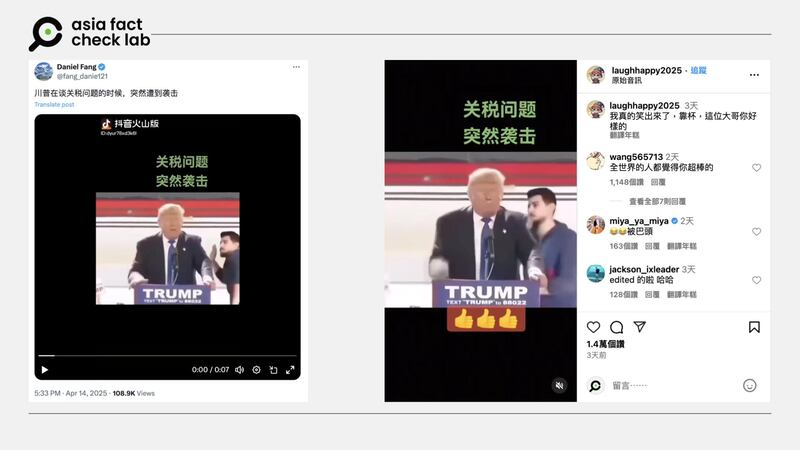
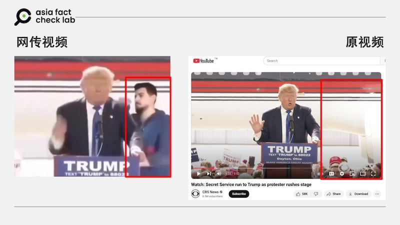

# 事實查覈｜因關稅爭議，特朗普後腦勺遭襲擊？

作者：艾倫

2025.04.17 20:58 EDT

## 查覈結果：錯誤

## 一分鐘完讀

美國總統特朗普近期對全世界大多數國家增加關稅，股市及產業都受影響。中文社媒傳出他在一場演講時，因有民衆不滿其關稅政策，衝上臺襲擊他的後腦勺。

但亞洲事實查覈實驗室（Asia Fact Check Lab，AFCL）查證後發現，該視頻早在2016年就已出現，和近期時事無關，且原視頻並沒有這名抗議者，極可能是後製而成的假視頻。

## 深度分析

四月中，社羣平臺如[Instagram](https://www.instagram.com/reel/DIWY7HnvyA_/?igsh=dXozZGp6ZXpjamJn)及X（[1](https://x.com/ZhanS59192/status/1911734696951640179)，[2](https://x.com/fang_danie121/status/1911714478208725369)）出現一則視頻，內容爲特朗普在一場羣衆集會上發表演說，半途有一名男子上臺走到他身後，趁特朗普專注演說時打他的後腦勺，引起現場騷動。

有文案稱，這是因爲特朗普談及近期的關稅政策，有民衆不滿而出手攻擊。不過，評論區也出現了不少質疑該視頻真實性的帖子。

- 近期社媒出現一則視頻，畫面爲特朗普演說時被民衆襲擊後腦勺，文案稱是因爲關稅議題引起。 (圖取自X、Instagram。)

AFCL以圖反搜，找到原視頻發佈的時間是2016年3月，和近期無關。美國主流媒體[CBS News](https://www.youtube.com/watch?v=5Xu5lz4fS-Yhttps://www.youtube.com/watch?v=5Xu5lz4fS-Yhttps://www.youtube.com/watch?v=5Xu5lz4fS-Y)及[紐約時報](https://www.nytimes.com/video/us/politics/100000004268217/trump-reacts-to-security-scare-at-rally.html)皆發佈完整視頻指出，3月12日時，特朗普在一場俄亥俄州的造勢活動中演講，途中有示威者試圖登上舞臺抗議，但被維安人員攔截下來，才因此有了這個畫面。

從畫面來看，沒有任何抗議者出現在鏡頭前，唯一和特朗普同時站在臺上的只有特勤人員。且網傳視頻中攻擊特朗普後腦勺的藍衣男子，也不曾出現在原視頻中，極可能是透後製而成的假視頻。

- 比對主流媒體發佈的原視頻會發現，網傳畫面中多了一位身穿藍色連帽衫男子，爲後製而成。 (圖取自X、YouTube)

這場造勢引起騷動的視頻已經不是第一次被變造成假信息傳播。 AFCL在搜尋時發現，有[YouTube視頻](https://www.youtube.com/watch?v=DEWrAiiIy68)聲稱現場觀衆曾有阿拉伯語高喊“真主至大”（Allahu Akbar），引發安全恐慌。

但比對上述原報道發佈的視頻，會發現這句話的出現一樣是後製剪輯造假，法新社也曾發佈[查覈報告](https://factcheck.afp.com/allahu-akbar-shouted-trump-rally-no-its-doctored-video)，可得知這則視頻常被拿來作爲假消息散播，影響力不容小覷。

自特朗普發佈關稅措施以來，網上出現了不少相關假消息，以下是AFCL曾發佈的報告：

[事實查覈｜網傳影像是美國“對等關稅”所引發的“囤貨潮”？](2025-04-11_事實查覈｜網傳影像是美國「對等關稅」所引發的「囤貨潮」？.md)

[事實查覈｜特朗普曾說“道指跌千點總統就該塞大炮射飛”？](2025-04-08_事實查覈｜特朗普曾說「道指跌千點總統就該塞大炮射飛」？.md)

*亞洲事實查覈實驗室（Asia Fact Check Lab）針對當今複雜媒體環境以及新興傳播生態而成立。我們本於新聞專業主義，提供專業查覈報告及與信息環境相關的傳播觀察、深度報導，幫助讀者對公共議題獲得多元而全面的認識。讀者若對任何媒體及社交平臺傳播的信息有疑問，歡迎以電郵*[*afcl@rfa.org*](mailto:afcl@rfa.org)*寄給亞洲事實查覈實驗室，由我們爲您查證覈實。*

*亞洲事實查覈實驗室更詳細的介紹請參考*[*本文*](2024-10-09_關於亞洲事實查覈實驗室｜About AFCL.md)*。我們另有X、臉書、IG頻道，歡迎讀者追蹤、分享、轉發。 X這邊請進：中文*[*@asiafactcheckcn*](https://twitter.com/asiafactcheckcn)*;英語：*[*@AFCL\_eng*](https://twitter.com/AFCL_eng)*、*[*FB在這裏*](https://www.facebook.com/asiafactchecklabcn)*、*[*IG也別忘了*](https://www.instagram.com/asiafactchecklab/)*。*

[Original Source](https://www.rfa.org/mandarin/shishi-hecha/2025/04/18/fact-check-trump-tariff-attacker/)