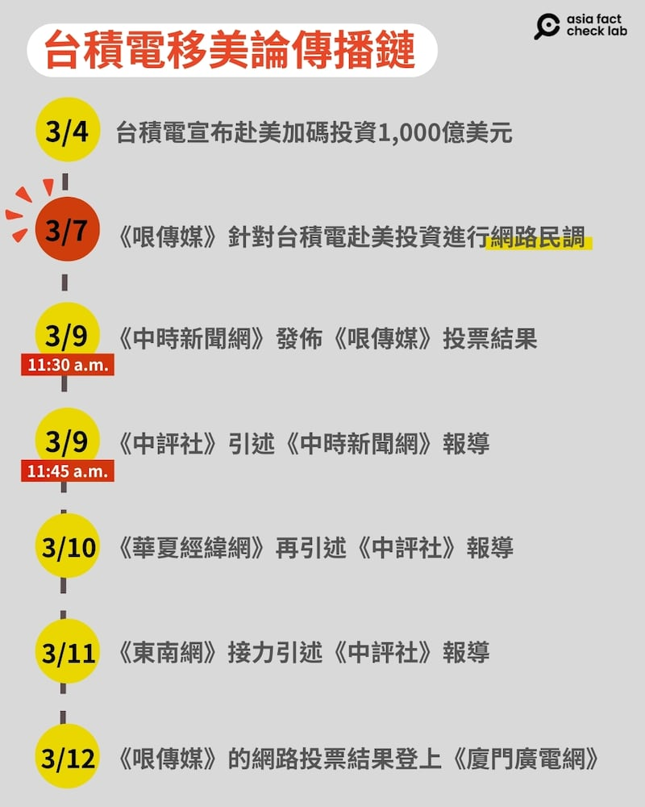
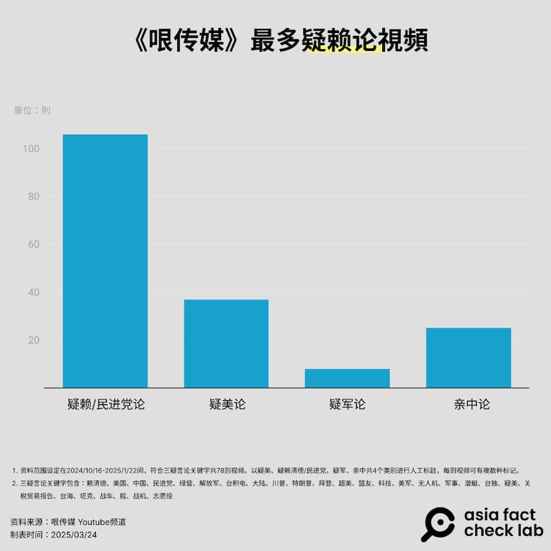
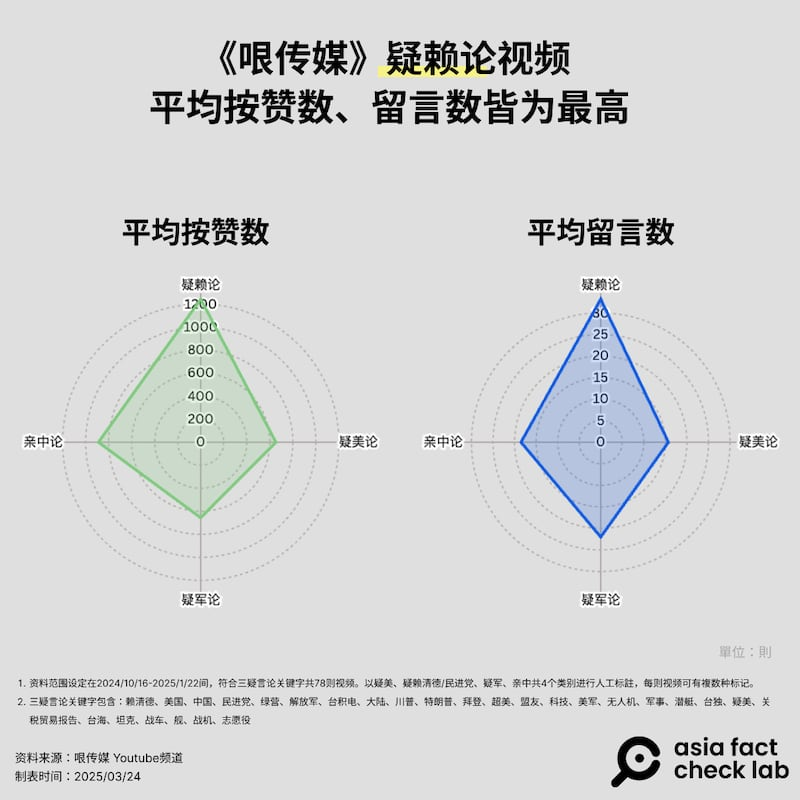

# 深度報道｜中共外宣在臺灣之九：內容農場轉型影音網紅

作者：莊敬、董喆、艾倫

2025.04.20 20:38 EDT

“臺積電對美投資1650億美元，95%臺灣網友認爲『臺灣全盤皆輸』”。

中共中央臺辦所屬的[《中國臺灣網》](http://www.taiwan.cn/taiwan/jsxw/202503/t20250310_12689112.htm)在2025年3月10日，發出這則報道，內容引用一項在YouTube評論區舉行的網路投票：“臺積電1650億前進美國，你認爲實際狀況是？ ”從3月7日到9日上午7點30分，累計1.4萬人次投票，95%的人選擇：“美國整碗拿去，臺灣全盤皆輸”。

亞洲事實查覈實驗室（Asia Fact Check Lab, AFCL）曾在一個相似議題的查覈[報告](2023-02-21_事實查覈│85%的臺灣人都反對麥卡錫訪臺嗎?.md)中提到，網路投票樣本不具代表性。中正大學政治系教授莊文忠也曾發表[專文](https://www.ccu.edu.tw/p/406-1000-52098,r982.php?Lang=zh-tw)指出，網路調查無論參與者在臺灣或海外都可參與，樣本的選擇性與偏誤性頗大，調查結果不宜推論到整體選民。

## 臺積電“移美論”怎麼傳播？

這樣一項存在嚴重偏誤的網路投票，最早由臺灣一家網路媒體《哏傳媒》刊出，之後接連獲得《中國臺灣網》和多家媒體刊出。AFCL整理出如下的傳播路徑：

[《中時新聞網》](https://www.chinatimes.com/cn/realtimenews/20250309000739-260407?chdtv)在3月9日上午11:30報道，原標題是“臺積電1650億美元前進美國 1.4萬人網路投票太驚人”；

當天11:45，[《中評社》](http://www.crntt.tw/doc/docDetailCreate.jsp?coluid=46&kindid=0&docid=107050018)引述《中時新聞網》，刊發相同報道。

3月10日，[《華夏經緯網》](https://www.huaxia.com/c/2025/03/10/2009750.shtml)再引述《中評社》報道。

3月11日，[《東南網》](http://taihai.fjsen.com/2025-03/11/content_31859060.htm)也引述《中評社》報道。

3月12日，《哏傳媒》的網路投票結果登上[《廈門廣電網》](https://www.xmtv.cn/xmtv/2025-03-12/e80aef8eabe3ed0e.html)。

除了網路投票，3月10日[《中國臺灣網》微博視頻號](https://m.weibo.cn/detail/5142735134131073%23&video)、[臉書專頁](https://www.facebook.com/watch/?v=1225318378960741)也發佈一則短視頻，內容是民進黨前立委、名嘴郭正亮稱“臺積電去美國，是臺灣的災難”。經比對，畫面出自《哏傳媒》3月6日播出的YouTube直播[節目](https://www.youtube.com/watch?v=F1FEzo3YwJc)。

2025年3月初，臺積電宣佈擴大對美投資以來，《哏傳媒》節目經常談論“臺積電移美論”，但相關議題在中國平臺廣傳之餘，在臺灣主流媒體卻只有《中時新聞網》報道了《哏傳媒》的網路投票。

- - (AFCL製圖)

中時的報道經[“Yahoo！新聞”](https://ynews.page.link/xohie)，再轉載上[「批踢踢實業坊」（PTT）](https://www.ptt.cc/bbs/HatePolitics/M.1741491959.A.89F.html)，但並沒有引起廣泛討論。PTT的發文者顯然對於《哏傳媒》充滿疑問：「一開始還以爲是yahoo，這個又是什麼新自媒體？重點是中時還把他寫成新聞發出來，爲何不自己辦網路投票呢？ 」

## 哏傳媒與密訊

PTT的發文者問得好。《哏傳媒》是新的自媒體嗎？就頻道成立的年份而言，算新，但背後操盤手絕非新手。

《哏傳媒》是[“方正傳媒科技有限公司”](https://portaly.cc/funseeco)擁有，公司旗下品牌頻道還包括「[觸極者](https://www.facebook.com/TheReacherTW/?locale=zh_TW)」、「[鄉民TV](https://www.youtube.com/@TWnetizen-TV)」等新媒體。這間公司由林正國創立、經營，林正國的名字，曾經和知名的內容農場「密訊」連在一起。

《報導者》在2019年發表“打不死的內容農場－揭開密訊背後操盤手和中國因素”[調查報道](https://www.twreporter.org/a/information-warfare-business-content-farm-mission)，就曾起底藏在「密訊」網頁原始碼之中的「方行商務整合行銷有限公司」顧問林正國，以及該公司代表人劉芳妤。兩人爲夫妻，也曾是新黨青年委員會委員。並且曝光一張林正國、新黨前發言人王炳忠2018年出席《海峽導報》多媒體中心落成儀式的合照，王炳忠[受訪](https://tw.news.yahoo.com/%E7%8E%8B%E7%82%B3%E5%BF%A0-%E6%88%91%E5%8F%AA%E6%80%95%E8%BA%AB%E9%82%8A%E7%9A%84-%E5%80%8B%E4%BA%BA-090000023.html)時表示，林正國是最早幫他創粉絲團並擔任網管的人。照片中還出現了《指傳媒》假民調案要角，也是對臺統戰「福建網絡」的核心人物 --《海峽導報》記者林靖東。

《報導者》描寫林正國是善用“數位行銷”、“電腦專業”專長的操盤手，讓和他有關的“密訊”、“觸極者”等平臺，得以用“鏈輪法”提升在搜尋引擎中的排序，並與中國媒體互相拉抬。不過， AFCL在2024年中查詢“密訊”時，網域已無效，有關的“方行商務整合行銷有限公司”則已解散。AFCL使用Whois查詢，發現pplomo網域曾在2023年8月停用一段時間，2025年又被重新註冊，但網頁[www.pplomo.com](http://www.pplomo.com/)仍失效。

## 影音當道

“密訊”雖然停止營運，但林正國成立的“方正傳媒”仍然高度關注政治議題。除了持續經營常以圖畫諷刺時事的“觸極者”，還將重心轉向經營政治網紅、自制節目的影音頻道《哏傳媒》，在圖像當道的時代，以更生動、鮮明的方式傳播特定政治立場。

翻閱林正國的碩士在職專班論文《自媒體發展對兩岸輿論交流之影響》，可以發現他看好“短視頻”的影響力與潛力。論文提到，越來越多的兩岸自媒體人運用短影音將資訊快速傳播到海峽兩岸和全球各地。論文中他也反覆提及中國短視頻平臺的影響力與重要性，肯認短視頻是自媒體重要的傳播形式。

《哏傳媒》的內容主要在YouTube平臺發表，和政治相關的內容業務包括“合作名人”和“節目製作”兩類。與《哏傳媒》合作的政治名嘴包括郭正亮、侯漢廷、蔡正元、謝寒冰、鄭村棋等。

“合作名人”和《哏傳媒》有兩種關係，一種是直營或者“代運營”的節目，例如謝寒冰的 《新聞祕辛》、郭正亮的 《亮子立學》和 《郭正亮頻道》等。 結盟則例如它名列“中天朋友圈”，部分節目得以也在中天頻道播放。

相較以文字爲主，需要借社媒平臺才能廣傳的“密訊”，《哏傳媒》主打影音，靠着直營和結盟在多個發送平臺間調度。開節目的名嘴如郭正亮、蔡正元、謝寒冰等都能自帶流量，在《哏傳媒》這個平臺上引爆新聞話題，帶動兩岸媒體跟進。

“曹興誠私照”風波是近期最知名的例子。2025年2月，謝寒冰在《哏傳媒》[節目](https://www.youtube.com/watch?v=XIzoFosleAA)上爆料聯電創辦人曹興誠的私照，大量臺灣媒體跟進報道，中國官媒[《海峽導報》](https://m.weibo.cn/detail/5135113807989791)、[微博大V](https://m.weibo.cn/detail/5135037886365933)也紛紛搬運節目畫面，話題延燒多日。而就在謝寒冰爆料當天，和《哏傳媒》同公司的臉書粉專「觸極者」也發佈多張[圖片](https://www.facebook.com/photo.php?fbid=1050585893763182&set=pb.100064353442470.-2207520000&type=3&locale=zh_TW)諷刺曹興誠。

2025年3月，一名來臺依親的中國配偶、劉姓女網紅“亞亞在臺灣”因涉武統言論遭[限期離境](https://www.moi.gov.tw/News_Content.aspx?n=4&s=326430)，事件引起軒然大波，「亞亞」在謝寒冰主持的《哏傳媒》[直播節目](https://www.youtube.com/watch?v=yOtSauY0fvU)上喊冤，表示自己從未主張「武統臺灣」。

方正傳媒旗下另一個頻道“鄉民電視”在2024年初開播，主持人包括曾經痛批“108課綱”是“無恥課綱”的北一女國文老師區桂芝。

## 影音行銷術，政治是產品

AFCL進一步查詢林正國，發現他以“數位行銷講師”的專業在兩岸開展生意版圖。一則2020年度的[公開資訊](https://www.accupass.com/event/2004240325111075596376)裏介紹林正國爲「臺灣：方行商務整合行銷有限公司行銷總監，中國：上海天氫文化傳媒有限公司負責人」。林正國在課程短片中自我介紹：本身從事網路行銷，做網路流量及媒體的操作。

臺灣的“方行商務整合行銷有限公司”2019年1月成立，已於2022年[解散](https://www.twincn.com/50907438)。至於在中國的「上海天氫文化傳媒有限公司」2019年12月成立，以從事文化藝術業爲主（2025年查詢已註銷），其法定代表人爲林正國，主要人員包括陳罕仲、楊白全等人。我們找到一位與林正國同爲網路行銷講師的[楊白全](https://cimta.org.tw/%25E6%259C%25AC%25E5%25B1%2586%25E5%25B9%25B9%25E9%2583%25A8/)，他教的課程包括使用[中國應用程式](https://www.accupass.com/event/2206140450041912267093)。

另外還有一間在2019年12月成立的“上海喜麟樂文化傳媒有限公司”（2025年查詢已註銷）也與林正國有關，主要人員除了林正國，還有其妻劉芳妤，以及已故海峽兩岸青年交流協會執行長[鄭博宇](https://ynews.page.link/egDG1)。

林正國在[BNI商會](https://bni.com.tw/zh-TW/memberdetails?encryptedMemberId=fBw6qSRtEGxG9yUw89bGyA==&name=%25E6%259E%2597+%25E6%25AD%25A3%25E5%259C%258B)介紹，其公司有三大產品線：商品內容置入、職人經紀、客製化影音內容，而他所解決過的最大難題，就是“協助客戶名人郭正亮先生成功轉型爲自媒體人（網紅），並把自營YouTube頻道的『流量變現』轉換爲每月最大的收入”。

綜觀林正國​​的生意版圖，可以看出他擅長網路行銷，可能對網路影音平臺和app行銷別有心得。但他又熱中政治，勇於[表態](https://www.facebook.com/npyoung.np/posts/1041593875979814)，因此被貼上“親中”標籤。在他的生意版圖裏，政治也可以以商業行銷術來行銷，旗下的《哏傳媒》或《鄉民電視》就是這樣的產品。但《哏傳媒》最大的問題並非政治立場，而是在於傳播誤導信息，以及政治網紅在節目上“帶中國貨”可能踩到法律紅線。

## 傳播“三疑言論”

AFCL曾在2024年發佈查覈報告：《[菲律賓上空爆發中美電子大戰？](2024-07-18_事實查覈｜菲律賓上空爆發中美電子大戰？.md)》以及[《”疑美“熱點解析：美國對談軍售”又爛又貴“](2024-07-02_傳播觀察｜"疑美"熱點解析：美國對臺軍售"又爛又貴"？.md)兩篇專文中都點名《哏傳媒》傳播缺乏證據或誤導的信息。

爲了更全面瞭解《哏傳媒》的言論特色，我們在2024年11月至2025年1月密集觀看《哏傳媒》，初步的印象是郭正亮、謝寒冰等人主持的政治性質節目聚焦被形容爲“三疑言論” —“疑美”、“疑賴（蔡）”、“疑軍”— 的立場上，也經常宣揚中國政策和中國商業產品。

我們抓取了監測期間內與三疑言論有關(注)的Shorts——YouTube平臺長度上限3分鐘的直向視頻——進行分析，共抓取270則，排除了109則無關內容，針對剩餘的161則視頻進行分析，逐一手動標記是“疑美”、“疑賴”、“疑軍”還是“親中”言論，每則影片可以有多種屬性分類。

首先，我們發現“疑賴論”是《哏傳媒》的經營核心，不僅是視頻數量最多的分類，亦在代表觀衆互動的按贊、留言數遙遙領先。

- - (AFCL製圖)

在分析樣本中，“疑賴論”影片共有106部，佔整體比例最高，累積總按贊數超過13萬次，平均每部影片可獲得約1243次按贊與33則留言，無論在總量或單部視頻表現上皆領先其他分類。

- - (AFCL製圖)

按贊數最高的前五名影片，全部屬於“疑賴論”，郭正亮的〈活在自己世界民主成賴皇玩物？ 〉獲得 7064 次按贊與191則留言；其他熱門視頻如〈賴皇2028慘了！陳其邁準備奪權？ 〉、〈民進黨完了！ 2700元動員學生？ 〉等，也均圍繞賴清德或民進黨，以“賴皇”一詞諷刺賴清德。

“疑美論”則以37部影片居次，平均按贊數約653次、留言16則。內容大多批判美國在國際事務中角色、對臺政策是爲利己，或強調美國社會與政治動盪，如〈洛杉磯大火 “川普”搞政治鬥爭〉。並經常談論俄烏戰爭中美方角色，意圖引發觀衆對“親美政策是否值得”的質疑。

值得注意的是“疑軍論”雖僅8部影片，但平均按贊與留言分別達到656次與22則，表現優於“疑美論”，顯示軍事相關議題具備一定吸引力。深入分析“疑軍論”影片可發現，議題集中於軍事訓練、兵役改革、中共軍演等話題。例如〈兵役改革是假進步真敷衍？ 〉、〈共軍環臺軍演，臺灣準備好了嗎？ 〉多采用問句與危機措辭。

“親中論”影片共計25部，平均每部影片獲得約888次按贊與18則留言，互動率高於“疑美論”與“疑軍論”，這類影片多以兩岸融合、和平發展、交流必要性爲主題，表現最好的是郭正亮赴中國的“尋根之旅”以及〈全球工業佈局 中國異軍突起〉。這些視頻一方面重申“兩岸同根同源”的大外宣號召，也提及中國在軍工科技上的崛起與對美反制，與中國對外宣傳相當雷同。

## 法律紅線

2024年底，郭正亮中國福建漳州“尋根”，這趟行程在中國媒體上獲得相當篇幅的報道。而牽線安排郭正亮這次“認祖歸宗”之旅的，就是曾經爲《東南衛視》派駐臺灣，但因爲在臺參與錄製政論節目而被政府禁止入臺的記者艾珂竹。

郭正亮此行引起部分綠營人士質疑他“配合中共統戰”。郭正亮在《哏傳媒》節目中[回應](https://www.youtube.com/watch?v=x98oUxrR4B4)爭議時稱「我是臺灣人也是中國人！兩岸如果沒有這樣的連結，將是大悲劇！」而這段話，很快傳回[中國媒體](https://m.weibo.cn/detail/5113407288117583)。[中國國臺辦發言人陳斌華](http://big5.taiwan.cn/xwzx/xwfbh/gtbxwfbh/tuwen/202412/t20241225_12673771.htm)在記者會上爲郭正亮發聲，表示「島內有人出於『臺獨』本性作祟，對此說三道四，數典忘祖，令人不齒」。

郭正亮另一次在《哏傳媒》“出外景”是2024年中到[深圳旅遊](https://www.youtube.com/watch?v=eNE5oXG5hKs)，在名爲「亮哥行腳」的節目裏，同行的還有新西蘭中文國際頻道（BNE TV）華裔主持人「三妹」，被網友質疑「中國辣妹伴遊」，郭正亮在節目上[澄清](https://ynews.page.link/P5V4X)，並痛罵民進黨支持者。

而郭正亮結束深圳遊後，在《哏傳媒》發佈參訪中國電動車大廠比亞迪、無人攝影機品牌大疆的[影片](https://www.youtube.com/watch?v=hH3gFdhjUTo)，並在一集[節目](https://www.youtube.com/watch?v=Q0FPB0LAFek)中大談中國的電動車發展，直說：“中國大陸的電動車真的是橫空出世，目前看不到對手”、“中國的電動車必然是最大贏家”。

另一集[節目](https://www.youtube.com/live/RLOzuGKX6x4?t=249s)主題是批綠營被害妄想，郭正亮卻在開場時拿起粉絲送他的貴州茅臺以表達感謝，之後並未將茅臺收起，而是把完整盒裝、可清楚辨識品牌的茅臺放在手邊，陪他錄了一整集節目，觀衆也看了一集的茅臺。如果是受國家通訊傳播委員會（NCC）規範的廣電節目，對於酒類廣告是有嚴格限制，但《哏傳媒》是網路節目，不屬NCC監管對象，不過是否踩到[《菸酒管理法》](https://law.moj.gov.tw/LawClass/LawAll.aspx?pcode=G0330011)紅線，是個問號。

除此之外，郭正亮也曾在節目中拿着他的[華爲新手機](https://www.youtube.com/watch?v=hiWkyHyyGrE)，不只講出完整型號，還分享使用心得，大大稱讚手機的照相功能效果，並稱華爲是“中國的脊樑”。名嘴賴嶽謙與其妻中天主播周玉琴也曾在中天節目上“開箱”華爲新手機，內容並登上[中天新聞](https://www.youtube.com/watch?v=ciP_BQJfZCE)。

華爲手機、比亞迪電動車，都是屬於高政治性的商品，而在網路節目上宣傳這些產品，是否涉及《兩岸人民關係條例》第34條的“爲中共從事具有任何政治性目的之宣傳”，也是個問號。

AFCL對此詢問了陸委會，陸委會表示，“哏傳媒”是臺灣方正傳媒科技公司旗下網路節目，倘未經許可與陸方黨政軍機構爲合作行爲或屬政治性內容，而有涉及違反兩岸條例第33條之1規定之具體違法事證，主管機關會依法處理。但陸委會表示，目前並未獲相關檢舉，也“未聞有相關主管機關接獲具體違法事證”。

對於商品廣告，陸委會表示，該節目疑似爲陸方特定產品或企業宣傳部分，依據兩岸條例第34條規定，大陸地區廣告活動系由各有關機關認定處理，爰該節目刊登內容倘有疑似涉及爲中國大陸物品、勞務服務或其他事項促銷推廣行爲，是否違反兩岸條例第34條規定，應交由主管機關審認處理。

還有一個問題，是我們在上一篇所提到，福建廣播影視集團轄下《海峽衛視》與臺灣團隊合制的節目《寶島，報到！ 》，在2025年初似乎換了場景，其中一集由新黨籍臺北市議員侯漢廷主持的節目，背景與《哏傳媒》節目風格高度相似，彼此之間是否有關聯？

對於這個問題，我們發信詢問了方正傳媒公司，但至截稿時爲止，並沒有收到回應。

## 以網路平臺行銷政治

以《哏傳媒》爲代表的影音產品，樹立了“以網路平臺的影音產品行銷政治”的典型。尤其和前篇中天電視臺相比，中天是傳統電視臺爲求生存而轉戰網路；《哏傳媒》和《鄉民TV》是原生網路內容，更進一步。“影音比文字有更好的傳播效果。”臺灣大學新聞研究所教授林照真接受AFCL訪問時也指出，現在YouTube上有許多“不負責任的名嘴”錄製的低成本談話性節目，其實受衆多是中國人，這些節目的出現，不只是政治動機，也有經濟動機，畢竟“臺灣的市場很小，華人的市場很大”。

網路媒體跳脫NCC管制，給予中共與臺灣政治網紅很大的操作空間，某種程度也助長錯假信息和誤導內容的傳播。在“密訊”的案例中，臉書曾針對傳播不實信息的內容農場開鍘，但隨着影音當道，內容農場轉型、轉移宣傳戰場，YouTube、TikTok（抖音），管不管？

林照真說，思維都是廣告的時候，會助長假新聞，對此平臺有相當的責任。臺大新聞所教授林麗雲也說，當今的傳播環境，向平臺業者問責的《數位中介法》變得很重要，特別是如何處理不實信息、違法信息，但很可惜，平臺的影響力變得愈來愈大，法律卻沒跟上。

## 從臉書、YouTube、抖音，到Instagram、小紅書，社羣平臺愈來愈多元，也提升資訊流動速度。網上盛行的“內容搬運”，如何成爲中共對臺宣傳的利器？這是我們下一篇深度報道的主題。

*注：此處所謂“和三疑言論有關”，意指含有“三疑言論關鍵字”。包括：賴清德、美國、中國、民進黨、綠營、解放軍、臺積電、大陸、川普、特朗普、拜登、超美、盟友、科技、美軍、無人機、軍事、潛艇、臺獨、疑美、關稅貿易報告、臺海、坦克、戰車、艦、戰機、志願役。*

“中共外宣在臺灣”系列前八篇報道如下：

之一：[臺檢以《反滲透法》訴大選假民調當事人，一審因何失利？](2024-12-12_深度報道｜中共外宣在臺灣之一： 臺檢以《反滲透法》訴大選假民調當事人，一審因何失利？.md)

之二：[林靖東和林獻元背後的大外宣架構](2024-12-12_深度報道｜中共外宣在臺灣之二：林靖東和林獻元背後的大外宣架構.md)

之三：[老牌本土報紙如何被澆灌出親中敘事？](2024-12-20_深度報道｜中共外宣在臺灣之三：老牌本土報紙如何被澆灌出親中敘事？.md)

之四：[海峽兩岸的兩家《導報》](2024-12-25_深度報道｜中共外宣在臺灣之四：海峽兩岸的兩家《導報》.md)

之五：[對臺統戰的操盤手“福建網絡”](2024-12-31_深度報道｜中共外宣在臺灣之五：對臺統戰的操盤手“福建網絡”.md)

之六：[管不管網路？那是個問題](2025-01-03_深度報道｜中共外宣在臺灣之六：管不管網路？那是個問題.md)

之七：[福建網絡對臺統戰節目，Made In Taiwan？](2025-04-15_深度報道｜中共外宣在臺灣之七：福建網絡對臺統戰節目，Made In Taiwan？.md)

之八：[主流媒體的親中之路，以及網路上“大解放”](2025-04-17_深度報道｜中共外宣在臺灣之八：主流媒體的親中之路，以及網路上“大解放”.md)

[Original Source](https://www.rfa.org/mandarin/shishi-hecha/2025/04/21/fact-check-ccp-propaganda-funseetv/)