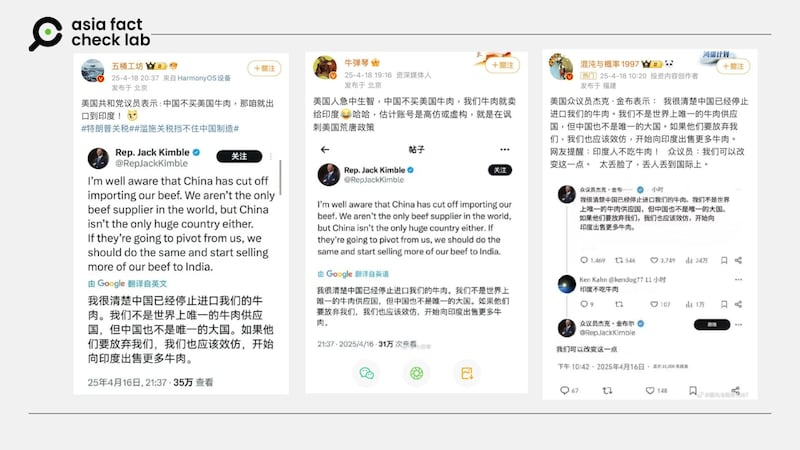
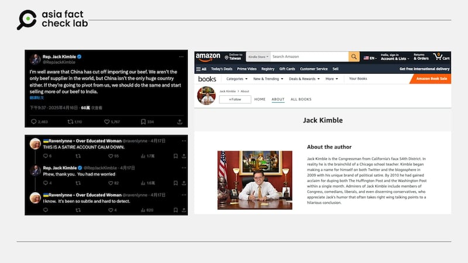

# 事實查覈｜美國衆議員建議「中國不買美牛，全都賣給印度」？

作者：董喆

2025.04.21 22:08 EDT

## 查覈結果：錯誤

## 一分鐘完讀：

臺媒TVBS政論節目《新聞大白話》節目中，退役中將帥化民引用網易資料，稱美國共和黨衆議員「金寶」建議，若中國不買美牛，那就把牛肉通通賣去印度。經查，並未有稱作「金寶」的衆議員，新聞大白話與網易引用的X帳號實際上是一個政治諷刺帳戶，過去已有多個查覈組織對此帳號的貼文發佈查覈報告。

## 深度分析：

臺媒TVBS政論節目《新聞大白話》19日的節目談到美中關稅戰，標題提到「美國要印度買牛肉大豆？」節目中引述中國平臺網易的消息，稱美國衆議員提議若中國不買美牛，那就把牛肉通通賣到印度。

節目[3時41分46秒處](https://www.youtube.com/live/IPSkr_2vIDU?si=E4gMuLBDT40Czv9v&t=13306)，來賓、臺灣退役中將帥化民說：「美國參議員（此處應爲「衆議員」口誤）不知道誰講的話，叫沒有常識，要把牛賣到印度」，他稱印度人不喫牛肉，「美國這叫做無知啊」！

- TVBS來賓、臺灣退役中將帥化民稱美國衆議員提議若中國不買美牛，那就把牛肉通通賣到印度。 (截圖自TVBS YouTube網站)

亞洲事實查覈實驗室查證發現，X確實有一帳戶署名「Rep. Jack Kimble」（Rep. 爲”衆議員”縮寫）於4月16日[發文](https://archive.ph/H6wyC)，建議若中國停止進口美國牛肉，那就開始把牛肉賣給印度。

此一消息被翻譯成中文，從17日起廣泛的在中國社羣平臺微博及抖音上轉傳，就連官媒《華商報》亦製作短視頻[報道](https://www.bilibili.com/video/BV14c5BzTEXe/?share_source=copy_web)此事。在網易網站中，確實亦有多篇文章（[1](https://archive.ph/hXGpL)，[2](https://archive.ph/tJGBK)）提及此事。帥化民於19日《新聞大白話》節目中引用網易文章談論此事，又再被中國抖音帳號剪輯成短視頻轉傳。

- - (-)

- 跟進「衆議員建議美國將牛肉賣給印度」的各新媒體及社媒平臺。 (各相關網路截圖)

但根據[美國衆議員官網](https://www.house.gov/representatives)，並未有名爲「Jack Kimble」的衆議員，在Jack Kimble的原貼文下，亦有人留言提醒這是一個諷刺帳號，Jack Kimble亦回覆：「謝謝你，剛剛真的讓我有點緊張。」

另外，在Jack Kimble的X帳號簡介中，他提到自己是加州第54選區的共和黨代表，事實上，根據2024年[大選結果](https://apnews.com/projects/election-results-2024/california/?r=6478)，加州僅有52個選區。

點進Jack Kimble在自我介紹欄位中提供的[Amazon連結](https://www.amazon.com/stores/author/B00A557Z1C/about?ingress=0&visitId=441361db-3c23-4fb1-8506-62287bb53082&ref_=ap_rdr)，當中提到「Jack Kimble 是虛構的加州第 54 選區國會議員，事實上這個角色是由一位芝加哥的老師創造的。他自 2009 年起開始在 Twitter 和部落格嶄露頭角，以獨特的政治諷刺風格吸引關注」。

- Jack Kimble是一個政治諷刺帳號。 (截圖自Amazon網站)

上述資料顯示，Jack Kimble是一個政治諷刺帳號，中國社羣平臺以及TVBS政論節目《新聞大白話》皆未查證，將此資訊當真。

「Jack Kimble」撰寫的諷刺貼文經常被當真並轉發，過去曾有多個國際查覈組織包含[路透社](https://www.reuters.com/fact-check/fictional-congressmans-x-post-about-trump-verdict-taken-seriously-2024-06-06/)、[USA Today](https://www.usatoday.com/story/news/factcheck/2024/10/04/kimble-gop-walz-debate-satire-fact-check/75484634007/)、[PolicitFact](https://www.politifact.com/factchecks/2024/oct/09/viral-image/no-this-isnt-a-real-republican-representative-prem/)，都曾針對這他撰寫的貼文提出查覈報告。

（AFCL記者莊敬、艾倫對本題亦有貢獻）

*亞洲事實查覈實驗室（Asia Fact Check Lab）針對當今複雜媒體環境以及新興傳播生態而成立。我們本於新聞專業主義，提供專業查覈報告及與信息環境相關的傳播觀察、深度報導，幫助讀者對公共議題獲得多元而全面的認識。讀者若對任何媒體及社交平臺傳播的信息有疑問，歡迎以電郵afcl@rfa.org寄給亞洲事實查覈實驗室，由我們爲您查證覈實。*

*亞洲事實查覈實驗室更詳細的介紹請參考*[*本文*](2024-10-09_關於亞洲事實查覈實驗室｜About AFCL.md)*。我們另有X、臉書、IG頻道，歡迎讀者追蹤、分享、轉發。 X這邊請進：中文*[*@asiafactcheckcn*](https://twitter.com/asiafactcheckcn)*;英語：*[*@AFCL\_eng*](https://twitter.com/AFCL_eng)*、*[*FB在這裏*](https://www.facebook.com/asiafactchecklabcn)*、*[*IG也別忘了*](https://www.instagram.com/asiafactchecklab/)*。*

[Original Source](https://www.rfa.org/mandarin/shishi-hecha/2025/04/22/fact-check-beef-india/)