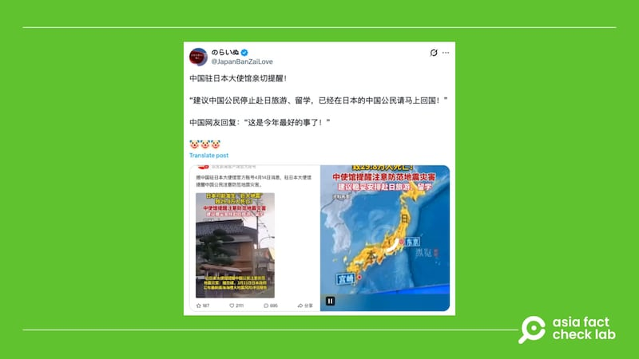

# 事實查覈｜未來可能發生「九級地震」，中國要求公民立即撤離日本？

作者：艾倫

2025.04.22 21:07 EDT

## 查覈結果：錯誤

## 一分鐘完讀：

四月中，X平臺中文帳號間出現傳言，稱因應日本未來可能發生的「南海海槽大地震」，中國政府要求其公民立即撤出日本。消息一出隨即廣傳，一週內已超過千萬次閱讀。

亞洲事實查覈實驗室（Asia Fact Check Lab，AFCL）查證後發現，中國駐日使館確實曾發文要中國民衆謹慎考慮赴日旅遊、留學及置產，但並未強制要求其公民回國。

## 深度分析：

4月14日，X上發佈中文內容的日文認證帳號“のらいぬ”[指出](https://archive.ph/hEevS)，中國駐日使館提醒，建議“中國公民停止赴日旅遊、留學，已經在日本的中國公民請馬上回國”。

文章發佈一週，閱讀量已超過1400萬，有人質疑該消息的真實性，也有中國網民回覆：“這是今年最好的事了！”

- 四月中，中文社媒出現傳言，稱因應日本可能發生的「南海海槽大地震」，中國政府要求其公民立即撤出日本。 (圖取自X)

AFCL以關鍵字反搜，找到中國駐日使館4月14日曾在官網發佈[消息](http://jp.china-embassy.gov.cn/zytz_0/202504/t20250414_11594046.htm)，曾日本最近發佈“南海海槽大地震風險評估報告”，將未來30年日本發生大地震的機率調高至80%，表示地震可能波及西起沖繩、東至福島的廣大區域，導致將近30萬人死亡。

中國大使館並提供了五點注意事項，提醒旅日民衆關注地震動態、加強防災意識等，其中第五點建議：“穩妥安排赴日旅遊、留學，慎重選擇購置房產等”，但通篇未提要求在日中國人回國，或停止赴日旅遊、留學，網傳消息爲誇大誤導的信息。

## ‘南海海槽大地震風險評估‘報告

日本政府中央防災會議確實近期發佈[報告](https://www.bousai.go.jp/jishin/nankai/taisaku_wg_02/pdf/nankai_hokoku.pdf)，爲可能發生的南海海槽地震進行災損預估。內容指出，若發生規模9的南海海槽特大地震，罹難者預估可達29萬8000人，並試算間接死於災難者最多將達5萬2000人。經濟損失則估計約292兆日圓（約美金2兆500億元）。

另外，中國大使館提到的南海海槽30年內發生規模8至9級地震的機率，從70%提高至約80%，其實來自日本內閣府防災資訊網站“南海海槽地震臨時情報”[頁面](https://www.bousai.go.jp/jishin/nankai/rinji/index1.html)，文中提到，此數據是根據日本政府“地震調查委員會”的評估、截至2025年1月1日的結果，而這類地震約每100至150年就會發生一次。

*亞洲事實查覈實驗室（Asia Fact Check Lab）針對當今複雜媒體環境以及新興傳播生態而成立。我們本於新聞專業主義，提供專業查覈報告及與信息環境相關的傳播觀察、深度報導，幫助讀者對公共議題獲得多元而全面的認識。讀者若對任何媒體及社交平臺傳播的信息有疑問，歡迎以電郵*[*afcl@rfa.org*](mailto:afcl@rfa.org)*寄給亞洲事實查覈實驗室，由我們爲您查證覈實。*

*亞洲事實查覈實驗室更詳細的介紹請參考*[*本文*](2024-10-09_關於亞洲事實查覈實驗室｜About AFCL.md)*。我們另有X、臉書、IG頻道，歡迎讀者追蹤、分享、轉發。 X這邊請進：中文*[*@asiafactcheckcn*](https://twitter.com/asiafactcheckcn)*;英語：*[*@AFCL\_eng*](https://twitter.com/AFCL_eng)*、*[*FB在這裏*](https://www.facebook.com/asiafactchecklabcn)*、*[*IG也別忘了*](https://www.instagram.com/asiafactchecklab/)*。*

[Original Source](https://www.rfa.org/mandarin/shishi-hecha/2025/04/23/fact-check-japan-earthquake-chinese-diaspora/)