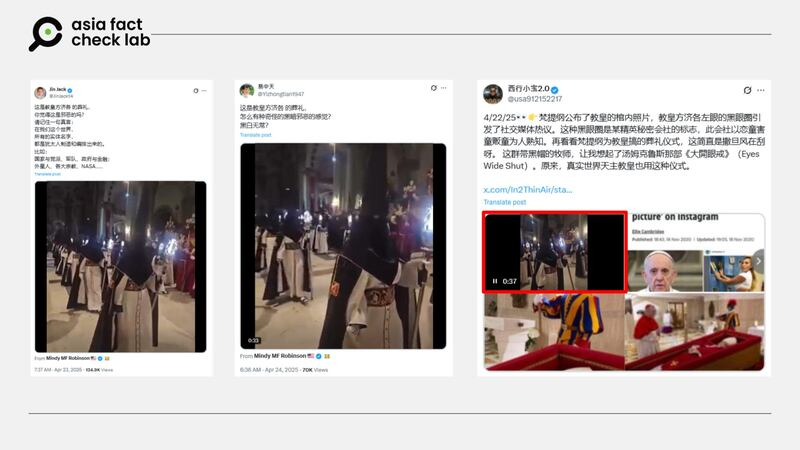
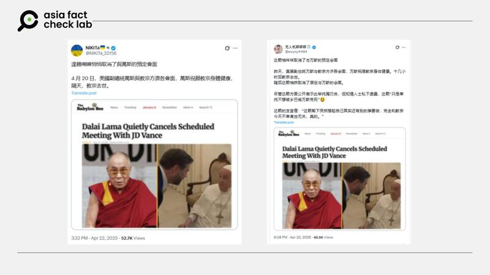

# 事實查覈｜網傳視頻爲已故教宗方濟各葬禮？

作者：莊敬

2025.04.24 03:28 EDT

## 查覈結果：錯誤

## 一分鐘完讀：

天主教教宗方濟各4月21日辭世，網上隨即流傳宣稱是方濟各喪禮的視頻，畫面中舉行儀式的人們身穿白色長袍、黑色斗篷，戴着尖頂高帽，並遮住臉部。但根據官方消息，方濟各喪禮於4月26日舉行，部分社媒用戶在喪禮前，挪用無關事件的影像散佈不實信息。

## 深度分析：

天主教教宗方濟各（Pope Francis）於2025年4月21日辭世，享壽88歲。亞洲事實查覈實驗室（Asia Fact Check Lab, AFCL）注意到，X上藍勾[中文](https://x.com/JinJack14/status/1914825889751183433)、[英文](https://x.com/iheartmindy/status/1914718196931981577)用戶在4月22日至24日間發佈一段宣稱是方濟各葬禮的視頻，畫面中多人身穿白色長袍、黑色斗篷，戴着尖頂高帽，並遮住臉部，僅露出眼睛，排列整齊行走；社媒用戶的發文暗示，視頻中的儀式是「邪惡的」。

- 天主教教宗方濟各4月21日辭世，網上隨即流傳宣稱是方濟各喪禮的視頻，但根據官方公佈的信息，方濟各的葬禮於4月26日舉行。 (X截圖)

但網傳說法是錯誤的，因爲根據梵蒂岡[公佈](https://www.vaticannews.va/en/pope/news/2025-04/pope-francis-funeral-saturday-novemdiales-lie-in-state.html)，方濟各的葬禮彌撒將於2025年4月26日，在聖伯多祿大殿舉行，包括美國、英國、法國等多國領袖都將出席。部分社媒用戶在方濟各喪禮之前，挪用其他事件的影像，宣稱是方濟各喪禮的畫面。

AFCL以圖反搜網傳視頻，未能找到完全相符的影像，但搜尋結果大多導向西班牙宗教節慶「聖周」（復活節周）。另找到與網傳畫面中人物裝扮相似的[照片](https://www.flickr.com/photos/jarm_at/5685412962/in/photostream/)，其說明表示是在「聖周」拍攝。事實查覈機構《主要故事》亦針對此視頻發佈[查覈報告](https://leadstories.com/hoax-alert/2025/04/fact-check-video-does-not-show-pope-francis-funeral.html)。

## 其他不實訊息

另有X藍勾中文用戶發文稱，在方濟各辭世後，西藏精神領袖達賴喇嘛悄然取消了原定與美國副總統萬斯（JD Vance）的會面，知情人士私下透露，達賴是因爲不想被萬斯「克（克）死」；傳播者並附上一則文章截圖，顯示消息來自諷刺新聞網站「巴比倫蜜蜂」（The Babylon Bee）。

- 中文社媒用戶發文稱，在天主教教宗方濟各辭世後，西藏精神領袖達賴喇嘛悄然取消了原定與美國副總統萬斯的會面，其附上的截圖顯示消息來源爲諷刺新聞網站。 (X截圖)

以關鍵字查詢，並無主流媒體報道有關達賴與萬斯預定會面的消息，而「巴比倫蜜蜂」的自我介紹註明「你可信賴的假新聞」，不應作爲可信新聞報道。 AFCL曾發表[專文](2025-03-03_傳播觀察｜刊發“民主黨支持者集體自宮”的諷刺網站緣何成了 “新聞信源”？.md)，探討諷刺新聞網站的傳播現象。

網上還有流傳宣稱是方濟各[遺容照片](https://factcheck.afp.com/doc.afp.com.432T9WD)、[葬禮影像](https://factcheck.afp.com/doc.afp.com.436W7ZP)的可疑信息，《法新社》（AFP）等機構已發佈查覈報告。

*亞洲事實查覈實驗室（Asia Fact Check Lab）針對當今複雜媒體環境以及新興傳播生態而成立。我們本於新聞專業主義，提供專業查覈報告及與信息環境相關的傳播觀察、深度報導，幫助讀者對公共議題獲得多元而全面的認識。*

*讀者若對任何媒體及社交平臺傳播的信息有疑問，歡迎以電郵*[*afcl@rfa.org*](mailto:afcl@rfa.org)*寄給亞洲事實查覈實驗室，由我們爲您查證覈實。*

[Original Source](https://www.rfa.org/mandarin/shishi-hecha/2025/04/24/fact-check-pope-francis-funeral/)