# 深度報道｜中共外宣在臺灣之十：福建網絡的空戰三部曲

作者：董喆、艾倫、莊敬

2025.04.24 21:52 EDT

亞洲事實查覈實驗室（AFCL）曾在報道中揭露“福建網絡“媒體集團如何透過駐臺記者搭建人際網絡，滲透臺灣輿論場。如果將記者駐點、媒體行業互訪、交流等活動，視爲統戰工作的“陸戰“。那麼利用網絡平臺及社交媒體app，傳送中共希望“入島、入戶、入腦、入心“的信息，應該就屬於“空戰“了。

本篇報道將揭露福建網絡的空戰手法。我們以三月初，臺積電公司宣佈赴美投資所引發的連串討論爲例子，透過採訪、資料整理、數據統計等方法，爬梳出福建網絡發送宣傳訊的三大步驟：

• 自制，或者收集臺灣特定媒體內容，選輯、製作成各種長短規格的影音產品。

• 以福建網絡控制、擁有的至少八個抖音帳號，向中國國內受衆發送內容。

• 將抖音內容搬運到TikTok平臺，向臺灣及全球華人發送。

在臺積電赴美投資的例子裏，福建網絡傳播的政治宣傳內容大部分取自臺灣政治評論員，俗稱名嘴的評論內容，重製成短視頻後搬運回流至TikTok，建立起一套“臺灣出口、中國洗產地再傾銷回臺灣輿論場“的產業鏈。

## 臺積電赴美投資觸發“疑美論”

在臺灣，持「疑美論」的政治人物和評論者始終認定臺積電是美國用來「綁架」臺灣的籌碼，AFCL過去就曾多次查覈有關「美國毀滅臺積電」計畫的錯假資訊。例如2023年年3月底，前白宮國安顧問歐布萊恩（Robert O’Brien）訪臺，有媒體報道歐布萊恩主張一旦兩岸發生戰爭，必須迅速摧毀臺積電。臺灣國民黨前立委蔡正元在[臉書發文](https://www.facebook.com/share/p/16AJFAmAZs/)，稱「摧毀臺灣是美國兩黨的共識」，頓時讓這則消息在臺傳開，部分臺媒（[1](https://www.ettoday.net/news/20230315/2459932.htm)，[2](https://tw.news.yahoo.com/%25E6%258B%259C%25E7%2599%25BB%25E6%25AF%2580%25E5%258F%25B0%25E8%25AB%2596%25E6%2598%25AF%25E7%259C%259F%25E7%259A%2584-%25E8%2594%25A1%25E6%25AD%25A3%25E5%2585%2583%25E9%259C%2587%25E9%25A9%259A-%25E7%25BE%258E%25E5%2589%258D%25E5%259C%258B%25E5%25AE%2589%25E9%25A1%25A7%25E5%2595%258F%25E7%25AB%259F%25E5%2596%258A%25E9%2580%2599%25E5%258F%25A5-105738719.html)）將蔡正元作爲消息來源報道。

事實上，經過影片[進行查證](2023-04-07_事實查覈｜白宮前高官鼓吹“毀臺積電”計劃嗎？他的原話是什麼？.md)並親自問歐布萊恩本人，確定這是他稍早前在一場公開論壇上的發言，他提到若中國武力犯臺，臺灣的半導體產業恐難以全身而退，但這段發言卻被部分媒體錯誤轉述爲美國將主動摧毀臺灣半導體產業。

類似「戰時摧毀臺積電」的言論，美國聯邦衆議員塞斯·莫頓（Seth Moulton）的發言也曾被中國官媒《環球時報》透過抖音短視頻與X平臺帳號，宣稱「美國真有摧毀臺灣的計劃」。但AFCL[查覈](2023-05-11_事實查覈│ 美國政客又在倡議"炸燬臺積電"嗎？.md)後，確認莫頓的原意遭到扭曲。

## 福建網絡如何佈署短視頻戰場？

臺積電董事長魏哲家於臺灣時間3月4日[凌晨3時半左右](https://x.com/WhiteHouse/status/1896646502396604843)，於白宮宣佈赴美投資一千億美元，臺灣各大媒體同日清晨發出快訊。

“臺積電變美積電”的操作由“臺海網“開第一槍。當日上午10時30分，該帳號剪輯發佈前國民黨籍立委鄭麗文的片段，這段發言來自她2024年11月9日於臺灣中國電視（簡稱中視）節目《庶民大頭家》所說：“對美國唯命是從，是最蠢的“。

接下來，福建網絡旗下八個抖音帳號開始全力搬運臺媒內容，衝高臺積電赴美投資的負面聲量。

抖音平臺上，AFCL可以確認由“福建廣播影視集團“和”福建日報報業集團“擁有、控制的帳號有八個：

福建日報報業集團旗下的《海峽導報》掌握其同名帳號以及“臺海網“。福建廣播影視集團旗下東南衛視的主打節目《今日海峽》掌握“臺海時刻“；《海峽新幹線》則掌握同名帳號。

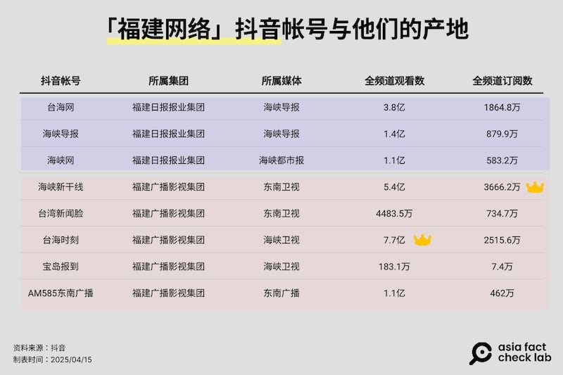

- - (-)

“臺海網”、“臺海時刻“、“海峽新幹線“、“海峽導報“四個抖音號可說是福建網絡在短視頻戰場中，劍指臺灣意圖最明確的四個帳號，影響力亦不容小覷，截至4月14日，八個頻道總訂閱數破1.1億，總瀏覽量逼近22億，而這四個帳號佔所有訂閱總數的76%，佔總瀏覽數超過八成。

這些帳號每日有半數以上視頻，大量搬運臺灣藍營政治人物、親藍甚至是親中名嘴的發言，主軸皆在批評民進黨政府與賴清德總統。

爲了分析福建網絡抖音帳號如何操作輿論，AFCL收集3月4日至10日，也就是臺積電宣佈赴美投資當日後一週內，八個抖音帳號中臺積電赴美相關的視頻，排除僅報道特朗普發言的短視頻，分析其剪輯來源及發佈時間。

3月4日至3月10日一週內，福建網絡旗下八個抖音帳號發佈共99則與臺積電赴美投資相關的短視頻，當中九成視頻來源爲中天集團及TVBS公司，少數雖取自官媒自制節目，但主角仍是臺灣名嘴。

99則視頻中，綠營政治人物僅有5則，包括總統賴清德、行政院長卓榮泰、經濟部長郭智輝以及民進黨立委吳思瑤。另外，引用中國名嘴僅1則，其餘93則全爲藍營政治人物或是臺灣名嘴。

隸屬“福建廣播影視集團“的”海峽新幹線“操作力道最大，總計搬運35則臺灣名嘴、政治人物視頻，同屬“福建日報報業集團“的”海峽導報“與”臺海網“各自操作20則與14則視頻，以總計來看，二大媒體集團搬運量不相上下。

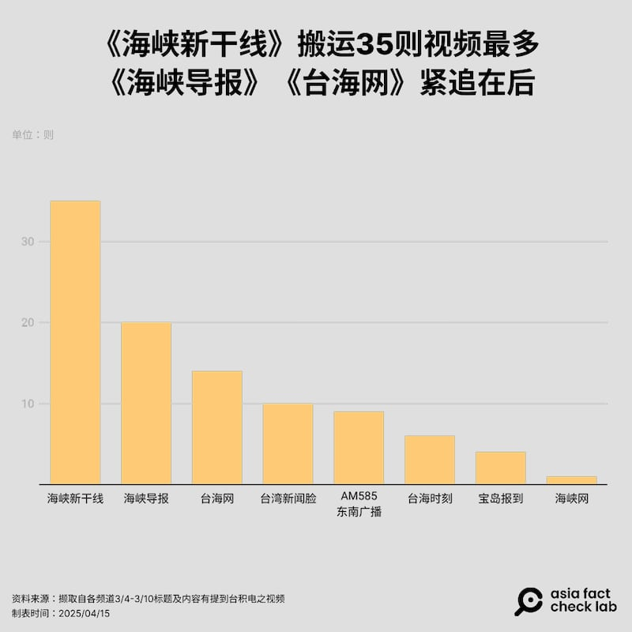

- - (-)

觀察99則視頻的發佈時間，可以發現福建網絡對“臺積電赴美投資“的反應非常快速，多數帳號在3月4日當天就啓動打擊，前三天這八個頻道每天都有超過20部搬運影片，尤其“海峽新幹線》“每日穩定輸出8至11則視頻。這些帳號不只完全搬運臺灣政論節目內容，多數視頻更是在這些節目播出的24小時內完成剪輯、後製字卡、上傳等工作。

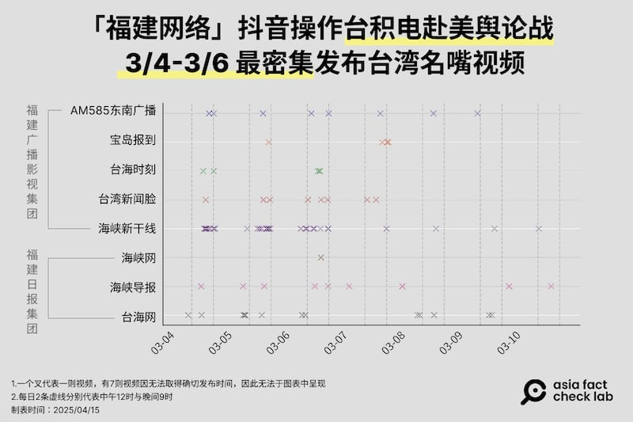

- - (-)

## 旺中成爲福建網絡的短視頻的資料庫

AFCL以人工逐一比對99則視頻的來源，當中除了16則來源不明或者可能是採訪單位的共同訊號（pool）外，其餘來源可歸納爲四種：

一、臺灣旺旺中時媒體集團，47則

二、臺灣TVBS，9則

三、政治評論員的個人頻道，7則

四、中國官媒自制內容，20則

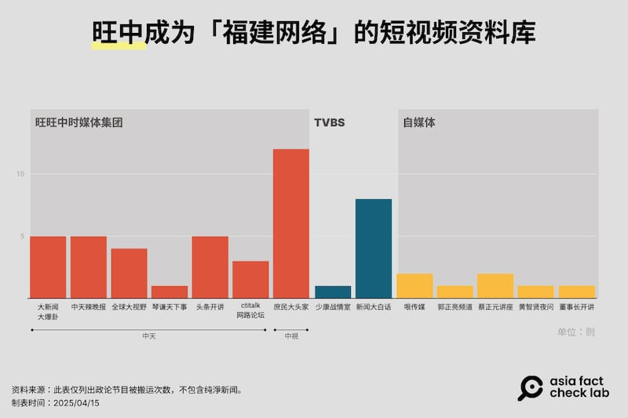

- - (-)

根據AFCL統計，旺中集團旗下共六個政治評論類型節目成爲八個官媒抖音的素材，共99則視頻中，有47則出自旺中集團，超過總數一半。其中，中視的《庶民大頭家》是大宗來源，共被搬運了12次，中天《大新聞大爆卦》、《中天辣晚報》以及《頭條開講》則各自被搬運了五次。

除了旺中集團，TVBS旗下二大政論節目《少康戰情室》與《新聞大白話》也共被搬運九次。

其餘少數來自政論名嘴的個人頻道，但當中有部分頻道亦與旺中集團有合作關係。方正傳媒科技有限公司旗下品牌《哏傳媒》與中天電視YouTube頻道，以“中天朋友圈“互稱；郭正亮頻道亦由《哏傳媒》所操作。另外，《蔡正元講座》與旺中集團的合作關係可從其節目內容發掘，蔡正元在每集節目開頭，皆會朗讀同步播出頻道，當中即包含中天電視、《哏傳媒》。

但這99則視頻並不全取自外部，也包含福建網絡自產自銷的內容，佔比近兩成，最大宗剪輯自《今日海峽》節目。 《今日海峽》製播內容爲新聞穿插政治評論，雖然是自制連線或預錄，但相當一部分來賓仍然是臺灣人，以臺灣人的嘴評論涉臺事件。

由上述顯示，八個福建出身的官媒抖音帳號對臺灣議題的宣傳，有百分之七十取材自臺灣媒體，或者獨立評論人的自媒體節目。由此可見，臺灣政治言論的多元光譜，提供了福建網絡可以從某些特定，甚至極化立場的內容裏，取得“以臺製臺“的評論內容。

## 福建網絡敘事及內容的套路

AFCL也對99則抖音視頻做了內容分析。首先，其標題組成可以拆解爲：“臺積電宣佈赴美投資+名嘴+金句”進一步將這99個標題進行分類，整理出中共官媒操作檯積電赴美議題的三大主軸：

## 一、民進黨賣臺

“民進黨賣臺、臺積電被掏空”是最頻繁出現的敘事型態，官媒搬運的視頻反覆提及民進黨拱手將臺積電奉送給美國，將導致臺灣的技術與人才全面外流，常見說法有“臺積電變美積電“、“喫裏扒外“、“賣臺集團“，更多次剪輯名嘴以“賣身契“、“賣子求榮“、“賠了夫人又折兵“、“女兒養大送人還倒貼嫁妝“等貶抑女性或傳統婚嫁關係比喻臺美投資的論述內容。

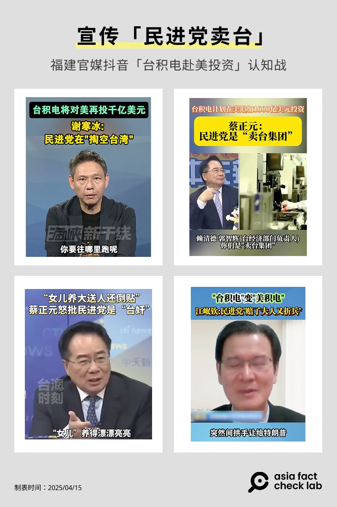

- - (-)

## 二、責難個人

在“責難個人“的敘事類型中，臺灣總統賴清德與行政院長卓榮泰成爲箭靶，二人被批評掏空了臺灣，是“跪族“、“臺奸“、“賣臺騎手“。中國官媒尤其青睞臺灣名嘴將賴清德比喻爲烏克蘭總統澤連斯基——臺積電宣佈赴美投資前二日，特朗普與澤連斯基於白宮爭執，特朗普批烏克蘭不知感恩——臺灣名嘴以澤連斯基的遭遇作爲對照，渲染另一種“今日烏克蘭，明日臺灣“的悲情敘事，塑造臺灣領導人不值得信任的印象。

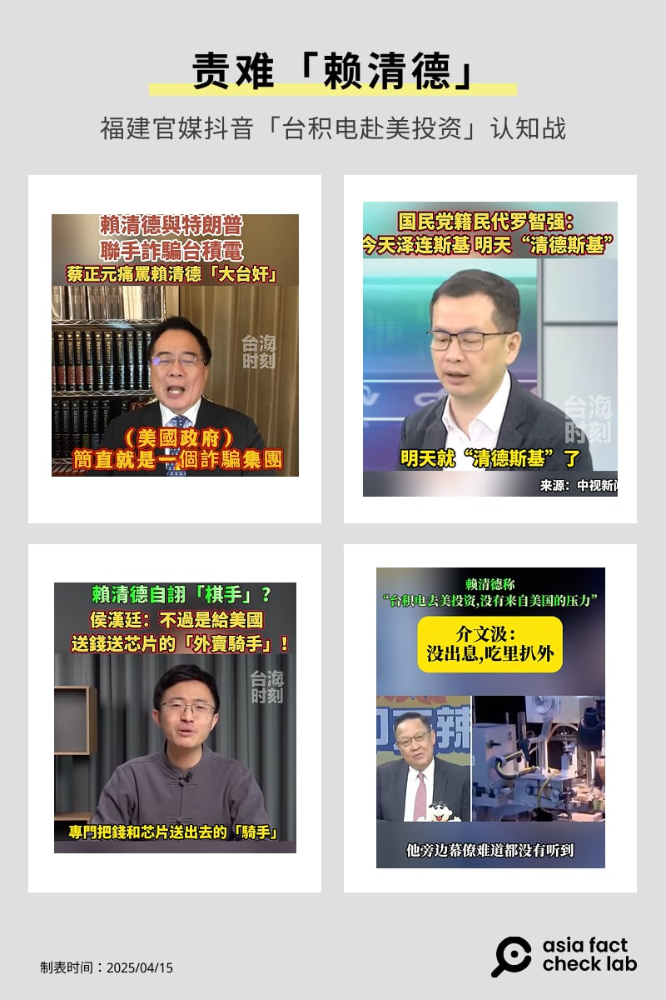

- - (-)

## 三、臺美關係不可信

臺美關係不可靠的論述則強調美國僅在意自身經濟利益，奪取臺積電並不會因此保衛臺灣。常見說法有“美國予取予求“、“臺灣被剝兩次皮“、“特朗普不會管臺灣死活“，是典型的疑美論述，意指美國對臺策略並不對等，暗示臺灣終將被美國拋棄。

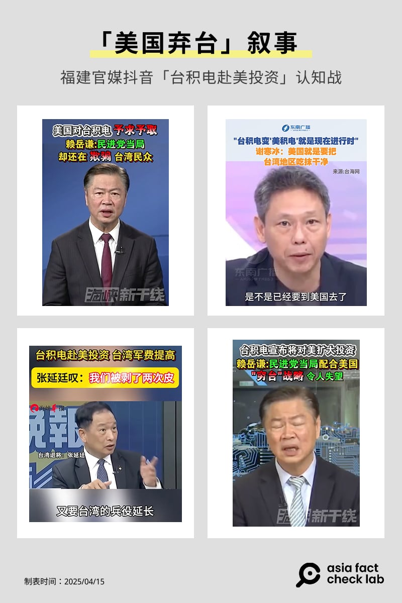

- - (-)

## 福建網絡最愛借誰的嘴？

AFCL同時發現，福建網絡放大了特定臺灣名嘴的聲量。99則視頻中，蔡正元出現了16次，尤其是“海峽新幹線“抖音帳號最常搬運蔡正元的言論。謝寒冰與郭正亮則居二、三名，謝寒冰在各頻道出現頻率較平均，最常獲得“海峽新幹線“搬運，郭正亮則最常出現在“臺海網“。

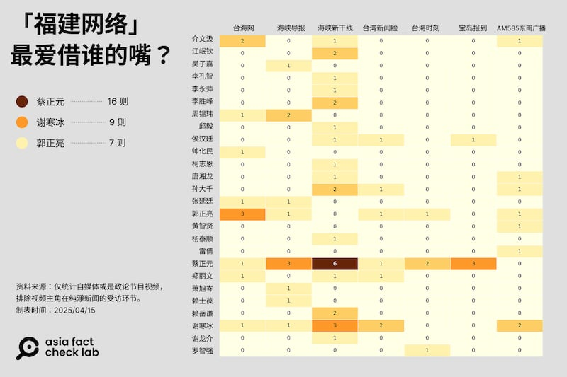

- - (-)

蔡正元評論臺積電赴美設廠議題的相關發言中，有三組不同來源的視頻素材，同時被多個福建網絡官媒帳號包裝重製。

3月4日的中天《頭條開講》直播節目中，蔡正元於節目中直指“民進黨政府出賣臺灣“。這段發言被“海峽新幹線“於隔日下午15:20剪輯爲影片上傳，晚間18:04″海峽導報“亦剪輯了同一段落。

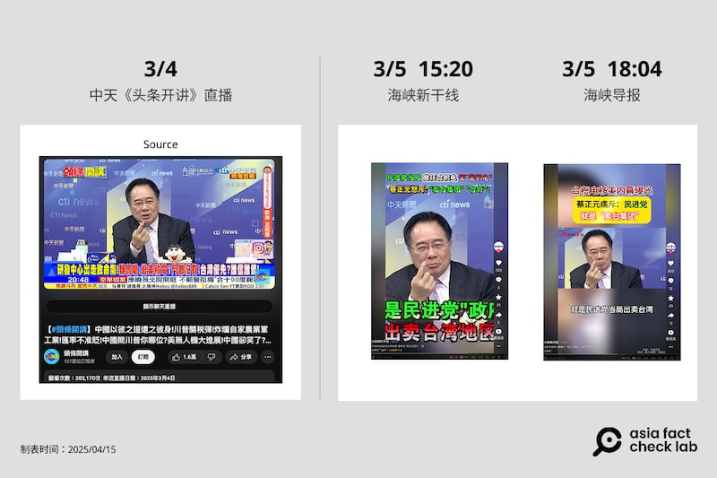

- - (-)

3月5日《蔡正元講座》直播，其中一段約20分鐘處的發言內容批評民進黨“出賣臺積電、討好美國“，被“海峽新幹線“與”臺灣新聞臉“分別於當日下午 17:02 與 17:47 上傳抖音，兩者都剪輯了“免費大拍賣討好美國“這一段落並下進視頻標題中。

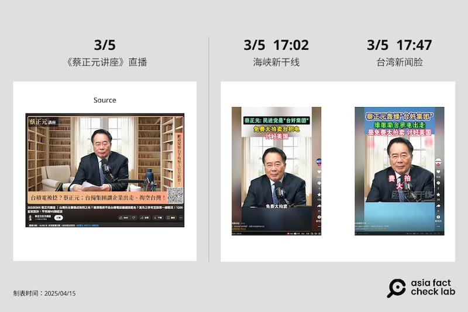

- - (-)

同樣在5日下午2時，蔡正元登上中天《大新聞大爆卦》直播節目，這一次曝光成爲官媒的操作熱點。蔡正元在約六至九分鐘間的發言片段，被分割爲至少四段影片。內容涵蓋“投資千億美元＝勒索“、“大陸站着、民進黨跪族“、“女兒送人還倒貼嫁妝“、“特朗普說不補助臺積電“等句。這些內容於隔日分別由“海峽新幹線“、“海峽導報“與”臺海時刻“在上午11時、下午三時、五時等三個時段陸續發佈，呈現單一素材多段、多帳號發佈的操作樣態。

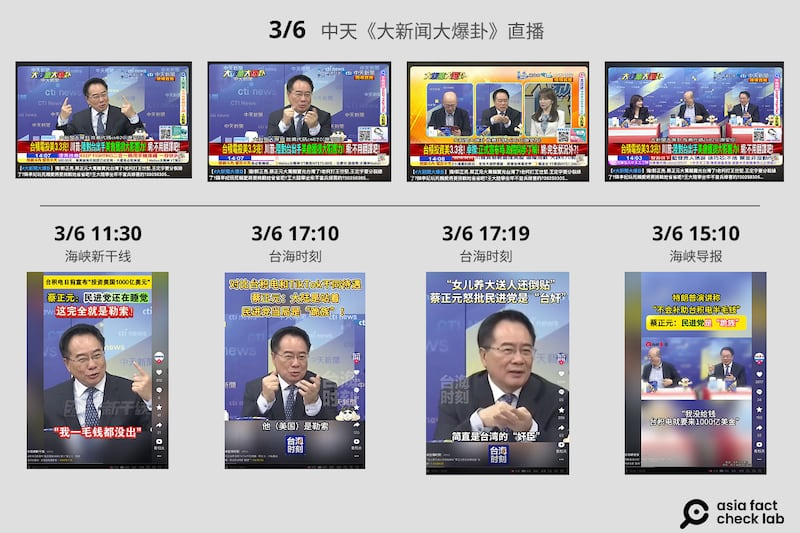

- - (-)

中國官媒抖音帳號亦針對名嘴謝寒冰的發言進行多次剪輯與重製。

3月4天TVBS《新聞大白話》直播中，謝寒冰評論臺積電赴美設廠時表示“這根本不是賣，是直接送給美國“，此段發言對應直播影片2小時7分處。AFCL觀察，該發言至少被兩個中國官媒帳號引用。 “臺灣新聞臉”於3月5日晚上20:30首先發布該段內容，標題直述“直接送給美國！“3天后，“臺海網“於3月8日上午10:49再次上傳相同段落。

- - (-)

3月6日晚間八時的中天新聞《頭條開講》。謝寒冰再次針對臺積電赴美一事發表評論，批評賴清德政府“把臺積電送給美國，丟人現眼“，此段位於直播約第23分18秒。該素材於隔日3月7日由“臺灣新聞臉“發佈，並於3月8日凌晨03:33由“海峽導報“再次上架。兩支視頻皆以“丟人現眼“爲標題，內容聚焦在“臺灣裏子面子全輸“。

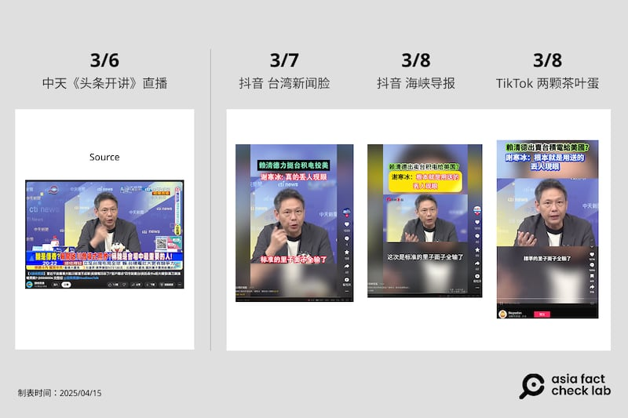

- - (-)

且從上述共五條傳播鏈可發現，福建二大媒體集團所屬的抖音帳號，皆針對同樣段落進行操作，誰都沒缺席。AFCL無法證明這之間有系統化的搬運策略，但以資料顯示，蔡正元以及謝寒冰的發言在官媒抖音帳號間有高度重疊、重製發佈時間接近的情形。

## 官媒爲什麼要搬運臺灣內容給中國人看？

抖音與TikTok不同，受衆僅瞄準中國牆內的使用者，福建網絡官媒大量搬運臺灣媒體政論節目，可能的目是什麼？

一名字節前員工何平（化名）受訪時告訴我們，抖音產品本身着重在娛樂性高的內容，因爲這些內容能帶來高流量。一般情況下並不會特別推播政治性內容，視頻分類也沒有特別獨立出“涉臺“的欄位，而是包含在新聞資訊。

他認爲，儘管不主打兩岸關係，但涉臺議題仍然是政治新聞的一部分。官媒依舊需要進行大內宣，告訴人民“臺灣人都認同我們是強大的祖國“。但受訪者也強調，“對他們來說，這（涉臺政治宣傳）不是那麼的重要，我自己覺得這更像是網上交差。“而不同媒體之間看似也有分工，“雖然有官媒會搬運中天的這些東西，但新華社、人民日報並沒有。"

這些內容爲何集中在抖音？他直言抖音的受衆知識水平與收入相對低，“收入水平跟知識比較高都集中在小紅書嘛，這些人根本就不喫像賴嶽謙那一套。“這位前員工認爲，搬運這些視頻的目的“大概就是穩住『臺灣就是我們的一部分』的既有盤。"

但AFCL也發現，當這些臺媒產出、中國官媒重製的內容再次流回TikTok，可能就無法再用“交差“來解釋。

## 取自臺灣的內容，加工後倒進華文世界

臺灣國安局4月8日[發佈國安報告](https://ppg.ly.gov.tw/ppg/SittingAttachment/download/2025040112/10834825000010021002.pdf)指出，2025年起已掌握3600餘組異常帳號，主要集中在臉書與TikTok，“臺積電赴美投資“正是被鎖定的議題之一。國安局提到，中共運用官媒、自媒體、網軍集團及公關公司，搭配異常帳號帶風向、網駭僞冒發文及操作代理人帳號等手段對臺灣進行認知作戰。

AFCL也觀察到，我們所爬梳的99則抖音搬運視頻，部分也出現在TikTok上。且時間順序幾乎是臺灣政論播出後，官媒抖音於一至二日內重製爲簡體短視頻，TikTok帳號再接力於同天或隔天再重製繁體版本。

TikTok帳號“兩顆茶葉蛋“就是一個非常值得觀察的帳號。它3月10日發短視頻："[臺積電千億投資美國，周錫瑋：將任美國政府擺佈](https://www.tiktok.com/@lkcyedan/video/7480170954774170885?is_from_webapp=1&sender_device=pc&web_id=7205785657578538497)“，這與抖音帳號”臺海網“3月9日發佈的”臺積電千億投資美國 周錫瑋斥： 將任美國政府擺佈，死路一條！ “剪輯片段高度一致，來源爲3月8日中天ctitalk網路論壇。兩者在視頻上疊壓的字幕除了繁簡各異，內容更是幾乎相同。

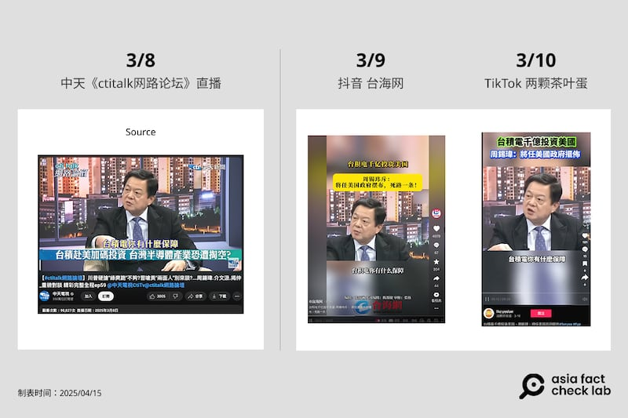

- - (-)

先前我們提到蔡正元3月5日現身中天《大新聞大爆卦》直播節目，事後共被官媒剪成四段影片，其中“海峽新幹線“所重置的“民進黨還在睡覺 這完全就是勒索“亦出現在“兩顆茶葉蛋“的帳號中，同樣除了繁簡差異，兩者均使用了同一段落與類似標題，AFCL還注意到，兩者使用的特效字爲同一款式。

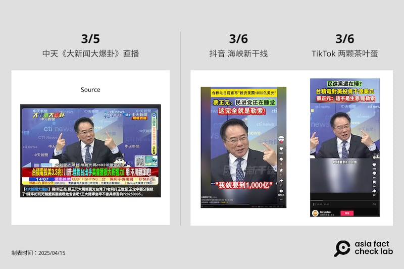

- - (-)

謝寒冰3月6日在中天頭條開講發表的“丟人現眼論“，除了3月7日、8日在抖音“臺灣新聞眼“以及“海峽導報“出現，3月8日亦有繁體重置版本出現在“兩顆茶葉蛋“的帳號中。

- - (-)

“兩顆茶葉蛋”搬運的影片與多個官媒重疊，另一帳號"[大咖開麥拉](https://www.tiktok.com/@politicalcamera)“則高度重疊抖音帳號”臺海時刻“。

值得關注的是，“大咖開麥拉“所搬運的視頻，其標題與抖音“臺海時刻“完全相同，僅改變字體並將簡體轉換爲繁體，發佈時間兩者皆在同一天。

我們發現，TikTok上早已有臺海時刻的[官方帳號](https://www.tiktok.com/@straitsplus)，且有被標註是“中國國家控管的媒體“，而大咖開麥拉正好是臺海時刻YouTube頻道下的一個[節目欄位](https://www.youtube.com/watch?v=PrFM93vzH3w&ab_channel=%25E5%258F%25B0%25E6%25B5%25B7%25E6%2599%2582%25E5%2588%25BB%25E5%25AE%2598%25E6%2596%25B9%25E9%25A0%25BB%25E9%2581%2593)，這令人高度懷疑“大咖開麥拉“應同樣是由臺海時刻營運，儘管它尚未被標爲官媒。

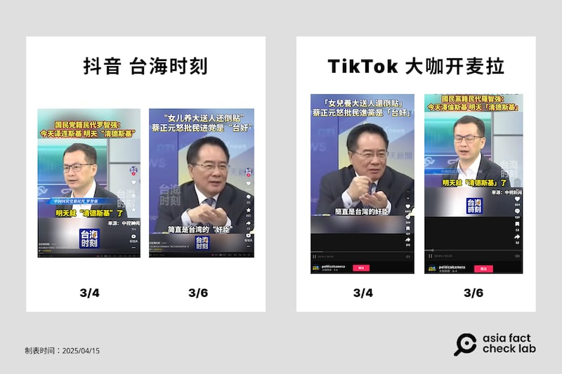

- - (-)

## 這些TikTok帳號屬於誰？

臺灣民主實驗室的兩位資深分析師接受AFCL訪問時，分析了這些帳號的經營策略，“你可以看到不管是抖音還是TikTok，都可以看到這種“中字輩“（按，指來自中天或中視）的短影片，因爲如果是一箇中國人來講，包含是疑美論或者是批評臺灣的社會，那個說服力不高，所以說他們很聰明的知道要讓臺灣人說臺灣不好，這是涉臺言論很主流的傳播方式。 "

這些TikTok帳號有可能是官媒包裝而成的嗎？分析師表示沒有證據下判斷，但他分析了兩種可能：

第一是這些帳號知道官媒的標籤可能不利傳播，因此用第三方帳號洗產地。另一種可能是這些帳號的政治傾向本身就偏紅或偏藍，當發現這些言論視頻流量可以變現實，就會持續搬運。

臺灣資訊環境研究中心IORG2024年[發表報告](https://iorg.tw/da/99)，分析該年7月至11月中共官媒在抖音平臺上的宣傳活動，並追蹤超過兩萬個 TikTok 帳號，發現有147個帳號使用與中共官媒抖音影片相似的素材，並將其傳播給國際受衆。當中“兩顆茶葉蛋“就曾被疑似爲中共官媒代理人帳號。

臺灣資訊環境研究中心共同主持人遊知澔認爲，這些短視頻的傳播路徑，並不全然是“臺產、出口、內銷“單線傳播，更接近“臺灣產製、中共認證、協同製成、分頭髮布“的狀態。這些帳號也可能藉由傳播相同內容或其他協同行爲，影響平臺推薦機制也就是演算法的效果，進而提升這些帳號以及相關主題的觸及。

遊知澔指出，“TikTok 代理人帳號的目標合理推論是任何使用 TikTok 的華語觀衆，包括臺灣人及全球各地的華人社羣，形塑華語觀衆的臺、美、中印象，亦即針對華語觀衆強化對中國有利的『世界觀』，這也是這些帳號造成的傷害“。（完）

“中共外宣在臺灣”系列前九篇報道如下：

之一：[臺檢以《反滲透法》訴大選假民調當事人，一審因何失利？](2024-12-12_深度報道｜中共外宣在臺灣之一： 臺檢以《反滲透法》訴大選假民調當事人，一審因何失利？.md)

之二：[林靖東和林獻元背後的大外宣架構](2024-12-12_深度報道｜中共外宣在臺灣之二：林靖東和林獻元背後的大外宣架構.md)

之三：[老牌本土報紙如何被澆灌出親中敘事？](2024-12-20_深度報道｜中共外宣在臺灣之三：老牌本土報紙如何被澆灌出親中敘事？.md)

之四：[海峽兩岸的兩家《導報》](2024-12-25_深度報道｜中共外宣在臺灣之四：海峽兩岸的兩家《導報》.md)

之五：[對臺統戰的操盤手“福建網絡”](2024-12-31_深度報道｜中共外宣在臺灣之五：對臺統戰的操盤手“福建網絡”.md)

之六：[管不管網路？那是個問題](2025-01-03_深度報道｜中共外宣在臺灣之六：管不管網路？那是個問題.md)

之七：[福建網絡對臺統戰節目，Made In Taiwan？](2025-04-15_深度報道｜中共外宣在臺灣之七：福建網絡對臺統戰節目，Made In Taiwan？.md)

之八：[主流媒體的親中之路，以及網路上“大解放”](2025-04-17_深度報道｜中共外宣在臺灣之八：主流媒體的親中之路，以及網路上“大解放”.md)

之九：[內容農場轉型影音網紅](2025-04-21_深度報道｜中共外宣在臺灣之九：內容農場轉型影音網紅.md)

[Original Source](https://www.rfa.org/mandarin/shishi-hecha/2025/04/25/act-check-ccp-propaganda-tsmc-fujian-group/)