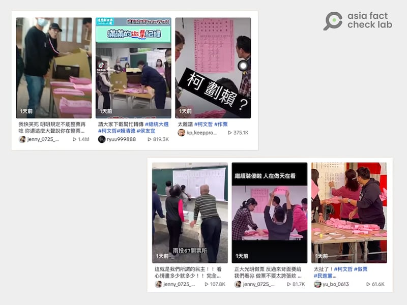
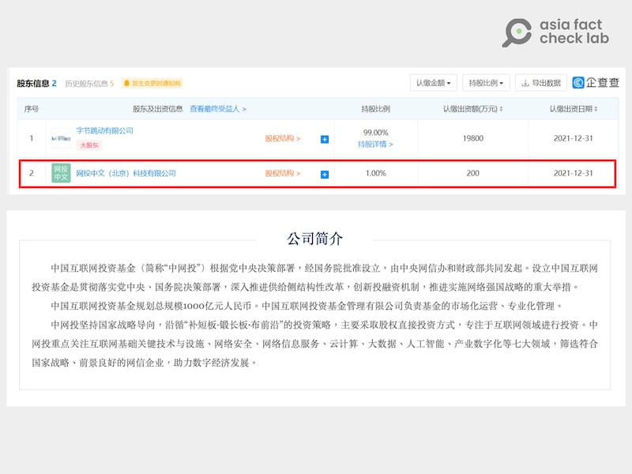
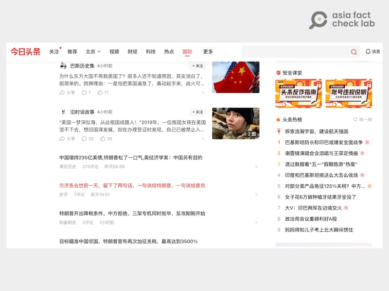
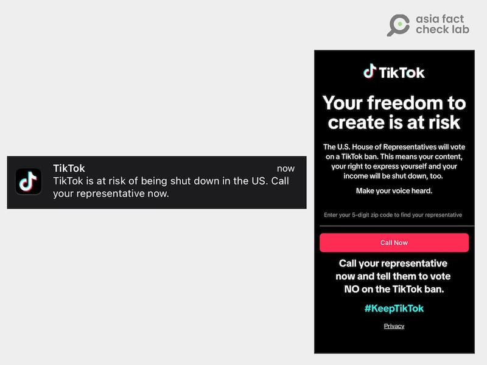
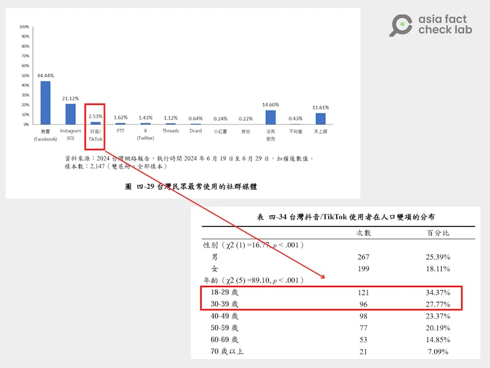

# 深度報道｜中共外宣在臺灣（完結篇）：入島、入戶，入TikTok

作者：艾倫、董喆、莊敬

2025.04.27 23:09 EDT

2024年1月，臺灣網紅“愛莉莎莎”等人在總統大選開票後，在社交平臺發文指控中選會以不正當手段，爲特定候選人增加得票數，中選會隨後提告“愛莉莎莎”等21人涉嫌加重誹謗。同年10月，臺北地檢署認爲罪嫌不足，不起訴處分。

指控“選舉不公”的不實訊息，常見於各民主國家。臺灣數位素養實驗室共同創辦人陳慧敏在選後曾向亞洲事實查覈實驗室（Asia Fact Check Lab, AFCL ）[分析](https://www.rfa.org/cantonese/news/factcheck/twfake-01182024140958.html)，選務事實查覈議題中，有一大類屬於“選務瑕疵”，也就是選務人員經民衆指證後修正，“但影片就停在這邊”，選務人員事後的更正或調整並未被放進視頻、照片中，讓選務疏失事件成爲假消息的素材，甚至被誇大成作票。但事實上，這類疏失經常當下就已經修正。

這是發生在臺灣內部、且爲選後出現的爭議，但“作票陰謀論”其實在投票前就開始醞釀、傳播，而主要傳播平臺就是TikTok。

一個由臺灣民主實驗室揭露的“協同操作行爲”是兩名網紅在選前就各自在TikTok上發表短視頻，暗指即將到來的總統、立委選舉將出現作票舞弊。值得注意的有兩點：

第一，這兩名網紅過去的發文各自主打“美妝”和“時尚穿搭”，與政治毫無關係。

第二，比較兩名網紅的影片，拍攝的方式、角度、鏡位都極相似，甚至臺詞都相差無幾。民主實驗室研究員受訪時解釋，從大量講出相同臺詞的視頻內容可以得知，這是個協同操作，且背後應有特定組織統一供稿。

- 選舉結束隔日，抖音上出現大量質疑選務人員作票的短影音。 (圖截自抖音)

在本系列的[前一篇報道](2025-04-25_深度報道｜中共外宣在臺灣之十：福建網絡的空戰三部曲.md)中，AFCL分析了「福建網絡」媒體集團如何在網際網路或手機等移動平臺上搬運、放送針對臺灣的政治宣傳，再加上2024大選前廣傳的“預告作票”影音，可以看出每三個臺灣人就有一人使用的TikTok，是這些不實信息和政治宣傳最終、也可能是最重要的集散地。

TikTok爲什麼吸引人？它與系出同門的”抖音”是否真能切割？衆多放送對臺文宣，看似普通的TikTok帳號是否由中共官媒操縱？而任令TikTok擴張，對臺灣長遠的影響是什麼？

## TikTok**與抖音，真的能分開？

抖音隸屬於中國“字節跳動”集團，同一集團也是TikTok主要股東。字節跳動由中國企業家張一鳴創辦，初期他掌握絕大部分的控制權，但2021年，中國政府負責監管網路傳播及新聞業務的網信辦連同其它機構成立了“中國互聯網投資基金管理有限公司”（以下稱中網投），[買下](https://www.bbc.com/zhongwen/simp/chinese-news-58268021)了字節跳動1%的股份，字節公司設有三名董事，這家持股僅1%的公司，卻有任命一位董事的權力。

根據中國企業機構“企查查”的搜尋結果，中網投爲北京字節跳動科技有限公司的第二大股東，持股比例1%。而根據中網投的官方介紹，該公司根據中共黨中央決策部署，經國務院批准設立，由網信辦和財政部共同發起，設立宗旨爲推動“網路強國戰略”的重大措施。

- 公開信息顯示，字節跳動的第二大股東是中國官方設立的機構、擁有1%股份的“中網投”。 (圖截取自企查查搜尋結果、中網投官網)

至於有”國際版抖音”之稱的TikTok又歸屬於誰呢？曾在字節工作的何平（化名）受訪時指出，表面上TikTok由新加坡人周受資掌握，但實權仍在中國的字節跳動公司手上。“（抖音）這龐大的機器屬於張一鳴，但如果你要再往後看，當然我覺得共產黨也是（主人）。因爲中共在裏面雖然只佔1%的股份，但是它有一票否決權。”

2023年6月，前字節跳動高管餘英濤（Yintao Yu）在向美國法庭提交的[文件](https://business.cch.com/ipld/YuByteDanceFAC20230521.pdf)中[指出](https://www.cna.com.tw/news/aopl/202305140044.aspx)，中共在字節內設有一個委員會，能取得“超級用戶”認證，可以檢視字節內部蒐集的所有數據，他也指控一些中國官員甚至能夠蒐集美國用戶在TikTok上的數據。

何況依照中國的政治體制，大型企業配合政府運作常被視爲天經地義，特別是國家安全事項。例如《國家情報法》也規定任何公司或個人，都有配合國家情報工作的義務。“TikTok的很多資源、團隊也是在北京，所以說其實TikTok的高管團隊說穿了還是抖音，那中國要調資料的時候我我怎麼可能不給你？”何平對AFCL說，字節跳動所有的資料，包括TikTok的信息，中國政府若想任意調動都做得到。“在中國裏面，你說有什麼防火牆都是假的”

## 爲什麼**TikTok**吸引人？

爲什麼TikTok風行全世界？

何平表示，這可以從張一鳴經營的前一項產品“今日頭條”入手觀察。“今日頭條”的演算法，是基於“資料探勘推薦引擎”向使用者推薦文章，初期創立時爲了吸引流量，充斥未經審覈的劣質內容，推送假新聞、黃色暴力等文章，當時甚至遭到網信辦約談，並責令整改。後來字節跳動創立抖音、TikTok、仍然複製了類似的演算法推薦，進而導致“亂七八糟的內容”都被推送。

- AFCL於4月25日下午4:30查看“今日頭條”，其國際新聞欄目充斥標題吸睛、但荒誕無稽的內容，其中一則稱特朗普將對中國鄰國徵收“3500%”關稅。 (圖截取自“今日頭條”網站)

何平認爲，抖音及TikTok的創立並不是爲了產出有品質的內容，而是盡力推送用戶喜歡、會成癮的影音，事實證明這個策略很成功，因爲大部分的用戶不在乎平臺上視頻的質量如何，只關注自己有興趣的主題。“一般的假消息什麼其實他們也不太管嘛，就是說對平臺本身沒有什麼影響，還能帶來流量，你就放着嘛，反正又不是我發的，是人家自己發的。”

“我們在（字節）的時候，其實每天在活躍的用戶有將近有七億人。那七億人你不斷的去打磨，那你的算法（演算法）一定是越來越精準”，何平說。

臺灣民主實驗室的兩位分析師向AFCL分析了TikTok和抖音運作的“基本原理”：一開始的設定會基於不同地區、年齡及性別的使用者，訂出“基本套餐”，例如男性會在帳號創建後收到較多遊戲實況、迷因等影音內容，女性用戶則較高機率滑到可愛動物、小短劇、舞蹈等視頻。

民主實驗室的分析師說，比起傳統社媒上的hashtag、關鍵字等流量算法，抖音這類短視頻平臺更在乎的是，個別用戶在單一主題上停留的時間及互動率，進而強化後續推播內容。

**但民主實驗室實測發現，政治信息會在這個過程中慢慢滲入，到第三天及一週期間，TikTok及抖音開始會漸漸推播政治內容，並算出用戶在這些視頻上的停留程度，來決定之後演算法是否持續跟進。** “TikTok都很精準的辨識他們的喜好，所以他們不需要特別去尋找自己喜歡什麼”。

而再來的關鍵便是，當用戶的黏着度養成後，不具明確立場的政治宣傳內容便會開始推送，這些內容通常是在傳達中國社會不像傳言所說的一樣可怕，潛在的策略是透過鋪墊相關內容，讓臺灣人民相信，即便兩岸統一之後，臺灣老百姓的生活也不會有太大改變。

## TikTok可能發動什麼議題，甚至行動？

無論是“臺積電移美”，或者“作票”的謠言，TikTok平臺扮演什麼樣的角色？

何平透露，抖音上關於中共的政治宣傳，大多由中共中央宣傳部直接下達命令，字節跳動公司有一個特定的窗口對接受命。

但何平也指出，做爲一個商業平臺，抖音經營看重的是流量，而相較影劇、娛樂、生活類信息，政治內容的流量是微不足道的。因此，何平認爲除了特定內容如習近平的重要談話會被置頂外，抖音在政策上並不會主動加強推送政治內容。更常見的作法都是透過外部組織影響流量，例如經紀公司聘請大量網紅同時推播一則消息。

何平推測，TikTok上對臺的宣傳，發動者應該也是官方，或者官方委由民間公司操作。“我的理解是統戰部、中宣部或國臺辦，肯定會花很多錢去推波助瀾，但是抖音、TikTok本身會不會去加強這些流量的算法，其實我還是我還是抱持懷疑的態度，因爲這個我後來去看，大概率都是由作者去驅動。”

而具體的做法，“就是給錢嘛，如果說是統戰部去開（價）的話，他們一定是看哪些人在臺灣有流量，然後就會說我們有單子，找可能接單的人。他們會個別分析某個網紅的後臺數據，然後即使主要大衆是在臺灣，相關數據也一定都拿得到。”

民主實驗室的判斷與何平相去不遠，研究員舉出了另一個例子：2024年11月時，印度十萬移工來臺的議題，也有中共操作的痕跡。當時上，有些原本討論經濟或投資議題的網紅，例如突然使用一模一樣的臺詞來講討論印度移工政議題，顯見使用同套劇本。

- 以關鍵字反搜，TikTok（左圖、非官媒）及抖音（中圖、右圖、官媒）上皆出現帳號操弄印度移工議題。 (圖截取自TikTok及抖音)

民主實驗室研究員說：“他平常應該是不會接收到這樣的指令。通常都是事件來的時候纔會給你指令，比如說像印度移工議題，然後請你做這個影片。”

“而他的獲利方式就是可能觀看次數多少，那我可能就發不同價給你，然後他的這個獲利可能是從下達指令的那個公關公司裏面來獲取的。”

至於“行動倡議”，TikTok於2024年3月曾經在美國發起一次”[威力展示](https://www.taisounds.com/news/content/84/113096)”。當時美國衆議院正在審查法案，要求中國字節跳動公司在165天內出售TikTok，否則就會柀禁。爲了反制，TikTok公司在app上發起行動，鼓動用戶“現在就發聲”。當時程式裏跳出對話框，用戶輸入郵遞區號就能取得該選區國會議員的電話號碼。TikTok鼓勵用戶致電，讓議員“明白TikTok對你們的意義，要求他們投下反對票”。

- TikTok曾透過應用程序向行動裝置發送信息，鼓勵其用戶致電至國會議員辦公室施壓，反對被強制出售的法案。 (圖下載自美媒Axios（左）、CBS News（右）)

這項行動倡議，造成大量議員辦公室電話被癱瘓，共和黨籍中共問題特設委員會的主席蓋拉格（Mike Gallagher）痛批TikTok發動的是“大規模政治宣傳運動”。類似的行動可不可能在臺灣重演？何平表示，這就和抖音、TikTok平臺上一般的商業性促銷活動完相同，操作技術上不是問題。

## TikTok該不該額外管理？怎麼管？

臺灣在2022年12月已禁止政府裝置上使用TikTok，在此之後，曾有聲音討論要全面禁止TikTok，但最後都礙於“言論自由”的爭議而不了了之。

民主實驗室分析師認爲，直接封禁社交媒體很難取得多數臺灣人支持，理由除了牽涉言論自由的辯論外，還包含不同立場的人看待TikTok的視角差異過大。

“我覺得現在主張要禁TikTok的人，其實跟TikTok使用者之間對於這件事情的想法是沒有在同一頁上，反對TikTok在臺營運的人會認爲，平臺有很多政治或是負面的內容，但絕大多數的使用者都認爲，它就只是一個娛樂平臺。”

分析師們認爲，其中一個方法是“落地監管”，如同臉書在臺一樣，若設有公司，便得依照臺灣的法規監管。目前TikTok的app雖可在臺使用，卻沒有設立辦公室。

此外，把TikTok的議題從政治面拉高到社會、文化的維度也是個好方法。民主實驗室分析師指出，TikTok上經常會出現“擦邊視頻”，也就是疑似兒少不宜、性暴力、疑似鼓吹非法行爲的視頻在平臺上流竄，若能以這些爲例，集結關注不同議題的公民團體，向臺灣民衆解釋TikTok缺少監管的嚴重性，會比只着重在“國安”議題上來得更有效。

民主實驗室分析師和何平都認爲，儘管TikTok有祕密限流的可能性，對抗大外宣的聲音仍不該忽視這個平臺。比起被動防守如事實查覈、立法禁止，臺派、反共的機構人士更應該主動進攻，將自己的理念輸入到平臺上。

“我的假設是那些（抵抗外宣的）帳號應該是不夠數量，比起就是親中的帳號來講。所以你在數量不夠的情況下，又被審查，那當然在平臺上是很難看到臺派的言論。”何平說。

若借鏡世界各國的處置方式，歐盟有《數位服務法案》，要求大型平臺披露推薦系統的核心參數，並提供非個性化瀏覽的選項，也就是演算法不能依用戶喜好推播內容。荷蘭萊頓亞洲中心（Leiden Asia Centre）也建議在推薦系統中加入非個性化流量的選項，以防止信息繭房。

## 抖音統戰臺灣的長遠影響是什麼？

當TikTok大量推送親中視頻，會如何影響臺灣？臺灣網路資訊研究中心曾釋出[《2024年臺灣網路報告》](https://report.twnic.tw/2024/assets/download/TWNIC_TaiwanInternetReport_2024_CH_all.pdf)，發佈臺灣人使用TikTok及抖音的性別分佈、年齡分佈及其他相關數據。其中發現，18至29歲的人口占比最高，達34.37%，第二高的使用率則分佈在30到39歲之間，有27.77%，兩者加起來超過使用人口的一半。就使用數據排名，TikTok（及抖音）只排在臉書及Instagram之後，爲第三大社羣平臺。

- 臺灣網路資訊研究中心指出，TikTok及抖音爲臺灣第三流行的社媒軟件，使用者中超過五成爲18至39歲之間的年輕人口。 (統計圖表截取自報告內容)

大量年輕人使用TikTok，何平認爲TikTok產品的厲害之處，就是潛移默化使用者，使其“不排斥中國”。“你只要不排斥我，那其實我就贏了嘛，對吧？我沒有叫你說馬上你要認同中華人民共和國或一箇中國，但只要你對我們的東西，你都覺得很有意思欸，那其實我就成功一半。”

何平表示，抖音、TikTok已經具有一定影響力。列如臺灣KTV的當紅歌曲幾乎都來自抖音，年輕人潛移默化的受影響卻不自知。“很矛盾的就是說，這些從小看TikTok長大，包括很多中南部、可能家裏甚至都是臺獨的人，你如果去看他們唱的歌、看的劇，或者甚至聽他們現在的一些用詞，其實都‘很大陸‘。”

美國羅格斯大學（Rutgers University）網路傳染研究所（NCRI）今年1月發佈[報告](https://www.frontiersin.org/journals/social-psychology/articles/10.3389/frsps.2024.1497434/full)，題爲《TikTok上的信息操控及其如何影響美國用戶對中國觀感》，研究發現，在TikTok上，反對中共的內容點贊及評論數是親中共內容的四倍，但親中共的視頻數量卻是反對的三倍。NCRI於2024年8月的[報告](https://networkcontagion.us/wp-content/uploads/NCRI-Report_-The-CCPs-Digital-Charm-Offensive.pdf)則證明TikTok上反中的視頻比例，遠遠低於YouTube及 Instagram等其他一樣提供影音服務的平臺。

臺灣資訊環境研究中心2025年1月發佈的[報告](https://iorg.tw/a/survey-2024-tiktok)指出，臺灣使用TikTok的人對中國好感度更高、認爲親美更可能引發戰爭、以及更具臺灣經濟失敗傾向。

“如果我推播的訊息是讓你對於民主不信任，讓你對於你的執政黨感到不信任，那相較的你就比較有可能去接受中國的的這個體制，因爲你很討厭自己的執政黨，你可能覺得說他（共產黨）的管理方式可能還有更好的機會”，民主實驗室的研究員說。

“特別是他們很強烈的著重在讓年輕人或是一些民衆去認爲臺灣的未來是非常負面的，那既然已經那麼爛了，被統好像也不會爛到哪裏去。”

研究員強調，青年是中國用短視頻進行統戰的一個重要對象，中國利用青年普遍對政治敏感度較低的狀況，善用臺灣的國內議題來操作，就如同搬運臺灣名嘴的言論，用臺灣人來反對臺灣政權，說服力較高，由此凸顯民主政治其實在臺灣是失敗的，民主也不再爲臺灣帶來優勢，進而讓臺灣的受衆認爲統一“其實沒有太大的差別”。

“其實我們有訪問一些青少年，他們確實明確的提到，2024年的選舉期間，會有很多體感上連他們都知道這是政治的內容出現。這些東西不外乎就是剪接一些臺灣立法院裏面的一些衝突，然後透過斷章取義或聳動性的字眼來去貶低特定政黨。”

“也有一些是宣揚兩岸一家親，或是是透過剪接在中東的戰爭、俄烏戰爭的一些情景來強化一個意向：選錯人就有可能會發生這種情況。”

民主實驗室研究員強調，大部分的臺灣青少年都同意中國政府獨裁、且對臺灣懷有敵意，但當問到對中國民衆及中國社會時，他們會把中國社會和政府切的很開，認爲中國民衆或者中國整體社會對於臺灣而言，也只是普通的老百姓，彼此生活沒有差太多。

“對於統一這件事情的想法，絕大多數的受訪者其實是認爲維持現狀不變是最好的選項。

但問到如果真的發生戰爭的話，他們會選擇就是不抵抗。”多方的研究及訪談可得知，中國儼然已將TikTok及抖音作爲對臺統戰的重要工具。不需要立即、直接改變一個人的國族認同，只要能弱化臺灣人對於中國威脅的敏感度以及抵抗意志，便能達到不戰而屈人之兵。

對照臺灣人使用TikTok的態度，臺灣做好準備了嗎？（完）

*“中共外宣在臺灣”系列前十篇報道如下：*

*之一：*[*臺檢以《反滲透法》訴大選假民調當事人，一審因何失利？*](2024-12-12_深度報道｜中共外宣在臺灣之一： 臺檢以《反滲透法》訴大選假民調當事人，一審因何失利？.md)

*之二：*[*林靖東和林獻元背後的大外宣架構*](2024-12-12_深度報道｜中共外宣在臺灣之二：林靖東和林獻元背後的大外宣架構.md)

*之三：*[*老牌本土報紙如何被澆灌出親中敘事？*](2024-12-20_深度報道｜中共外宣在臺灣之三：老牌本土報紙如何被澆灌出親中敘事？.md)

*之四：*[*海峽兩岸的兩家《導報》*](2024-12-25_深度報道｜中共外宣在臺灣之四：海峽兩岸的兩家《導報》.md)

*之五：*[*對臺統戰的操盤手“福建網絡”*](2024-12-31_深度報道｜中共外宣在臺灣之五：對臺統戰的操盤手“福建網絡”.md)

*之六：*[*管不管網路？那是個問題*](2025-01-03_深度報道｜中共外宣在臺灣之六：管不管網路？那是個問題.md)

*之七：*[*福建網絡對臺統戰節目，Made In Taiwan？*](2025-04-15_深度報道｜中共外宣在臺灣之七：福建網絡對臺統戰節目，Made In Taiwan？.md)

*之八：*[*主流媒體的親中之路，以及網路上“大解放”*](2025-04-17_深度報道｜中共外宣在臺灣之八：主流媒體的親中之路，以及網路上“大解放”.md)

*之九：*[*內容農場轉型影音網紅*](2025-04-21_深度報道｜中共外宣在臺灣之九：內容農場轉型影音網紅.md)

*之十：*[*福建網絡的空戰三部曲*](2025-04-25_深度報道｜中共外宣在臺灣之十：福建網絡的空戰三部曲.md)

[Original Source](https://www.rfa.org/mandarin/shishi-hecha/2025/04/28/factcheck-ccp-propaganda-tiktok/)