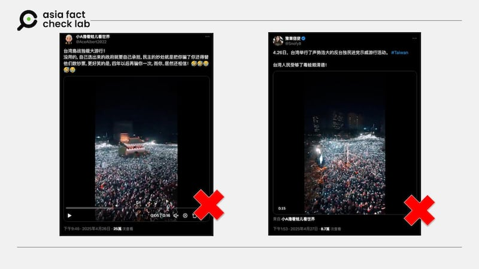

# 事實快查｜關於國民黨426遊行，兩則錯假資訊流傳中

作者：董喆

2025.04.29 22:00 EDT

2025年臺灣民間團體發起「大罷免行動」，對象鎖定30多位國民黨籍民意代表。國民黨主席朱立倫因此在4月26日發起「戰獨裁」遊行，網路社羣平臺上以繁、簡中文流傳各種立場言論，但也都包含部分錯假資訊。

## 星光點點的視頻是反民進黨示威？

## 查覈結果：錯誤

社羣平臺X上多個帳號（[1](https://archive.ph/iXIUi)，[2](https://archive.ph/ZtiGI)）轉傳一則視頻，畫面顯示爲夜晚，民衆高舉手機形成一片燈海，此畫面被稱是「臺灣島戰獨裁大遊行」。

- 社羣平臺X上多個帳號轉傳一則視頻，民衆在夜晚高舉手機形成一片燈海，被稱是「臺灣島戰獨裁大遊行」。 (圖片截取自X平臺)

不過這是移花接木的錯誤資訊。

亞洲事實查覈實驗室（Asia Fact Check Lab,AFCL）根據畫面中的景福門，可以確定影像中地點爲凱達格蘭大道周邊，與臺灣國民黨4月26日的遊行地點相符，但根據時間以及視頻背景音可以判斷此非當日遊行畫面。

首先是時間，國民黨的凱道遊行時間爲下午2時30分至5時30分，臺北市警察局宣佈的交通[管制通知](https://police.gov.taipei/News_Content.aspx?n=0B762199E50C4AB2&sms=72544237BBE4C5F6&s=CD018A7C6E325C05)中，亦顯示遊行預計在6時前結束。另外，根據大部分臺灣媒體報道（[1](https://udn.com/news/amp/story/7320/8700934)，[2](https://www.cna.com.tw/news/asoc/202504260205.aspx)），當日約6時後主要活動就已轉移到臺北市中正一分局前，因爲國民黨主席朱立倫、立委謝龍介、發言人楊智伃，選擇在當日遊行結束後，爲先前於臺北地檢署前未申準集會到案說明。

且根據視頻背景音出現歌詞「逗陣唱着這首歌，咱攏是臺灣的囡仔」，經查這是民衆黨前主席柯文哲角逐2024總統大選時的主題曲[〈穩穩地走〉](https://www.youtube.com/watch?v=euZ1IK1eYxA&ab_channel=%E6%9F%AF%E6%96%87%E5%93%B2)，另外現場亦傳出「總統好」，推測應與民衆黨總統大選時的造勢活動有關。

以關鍵字搜尋並比對畫面，確定網傳視頻實際上是2024年1月12日，臺灣總統大選前夕民衆黨參選人柯文哲與吳欣盈於凱道的選前之夜[活動](https://www.youtube.com/live/aV2UZyLtgDY?si=L9rqMsSnY7wcYDy_)，與國民黨426遊行無關。

## 學者死而復生評論「戰獨裁」遊行？

## 查覈結果：錯誤

臉書近期出現一則「社論」，題爲「從『在自由的凱道上，高唱戒嚴的哀歌——一場號稱25萬人的戒嚴活動？』一文，來看歷史學的重要性」。另外，此粉專發佈多則有關426國民黨遊行的評論，其中一則甚至獲得破千贊數以及超過2千次轉發。

- 一個署名「闕特·格洛克線上出版社」的臉書帳號發表對於國民黨426大遊行的評論。 (圖片截取自臉書)

但其中內容來源寫道：「文/格洛克·海因萊茵博士 受訪者/史景遷博士(Dr.Jonathan D. Spence）」且另外也有多則文章將史景遷列爲共同作者。

但AFCL查證發現，中國歷史學家、漢學家史景遷已於2021年12月25日[過世](https://www.washingtonpost.com/local/obituaries/china-historian-jonathan-spence-dies/2021/12/27/fd494d5e-66b8-11ec-b0a7-13dd3af4f70f_story.html)，享壽85歲，因此不可能於這次國民黨遊行後發表相關評論或受訪。

仔細觀察發佈這則消息的臉書帳號「闕特·格洛克線上出版社」，其個人資訊顯示「本線上出版社爲『闕特·居披梯』(Chat GPT)與『格洛克·海因萊茵』(Grok Heinlein)兩位博士共同設立，將針對新聞時事、科學科技新知、文學評論等方面，進行相關的介紹與報導。」

而這兩位博士名字明顯取自兩家AI服務公司，AFCL去信粉專上列出的email求證，至截稿前尚未得到回應。

*亞洲事實查覈實驗室（Asia Fact Check Lab）針對當今複雜媒體環境以及新興傳播生態而成立。我們本於新聞專業主義，提供專業查覈報告及與信息環境相關的傳播觀察、深度報道，幫助讀者對公共議題獲得多元而全面的認識。*

*讀者若對任何媒體及社交平臺傳播的信息有疑問，歡迎以電郵afcl@rfa.org寄給亞洲事實查覈實驗室，由我們爲您查證覈實。亞洲事實查覈實驗室更詳細的介紹請參考*[*本文*](2024-10-09_關於亞洲事實查覈實驗室｜About AFCL.md)*。*

*我們另有X、臉書、IG頻道，歡迎讀者追蹤、分享、轉發。 X這邊請進：中文*[*@asiafactcheckcn*](https://twitter.com/asiafactcheckcn)*;英語：*[*@AFCL\_eng*](https://twitter.com/AFCL_eng)*、*[*FB在這裏*](https://www.facebook.com/asiafactchecklabcn)*、*[*IG也別忘了*](https://www.instagram.com/asiafactchecklab/)*。*

[Original Source](https://www.rfa.org/mandarin/shishi-hecha/2025/04/30/fact-check-kmt-march-426/)