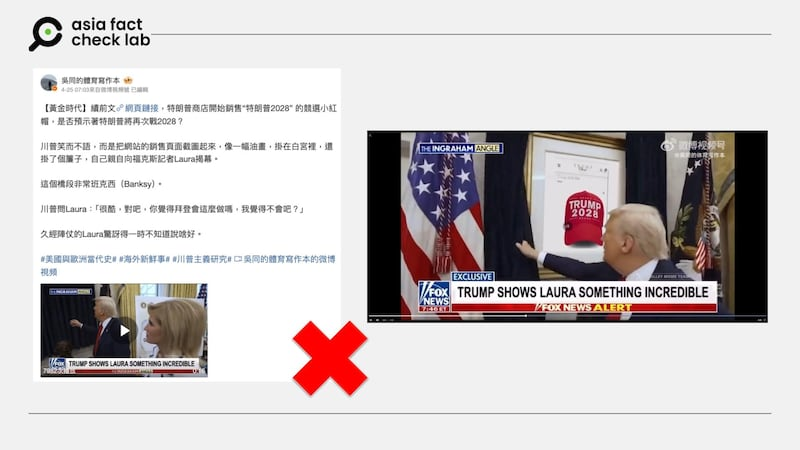
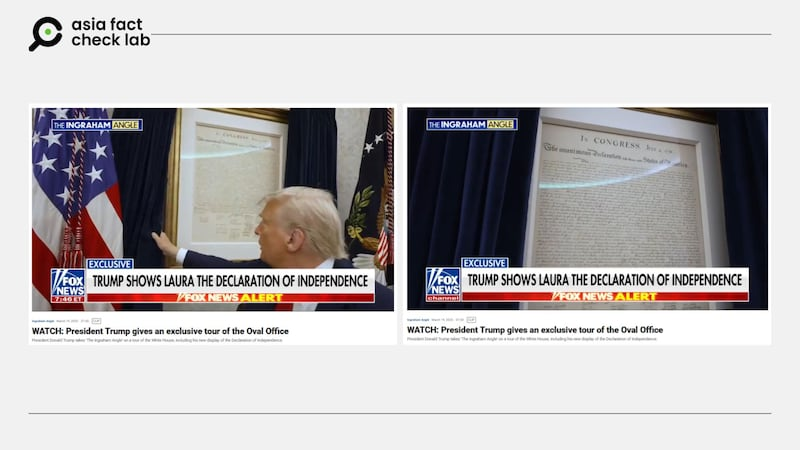

# 事實查覈｜網傳視頻顯示，白宮牆上掛着「2028競選紅帽」銷售圖？

作者：莊敬

2025.04.30 20:37 EDT

## 查覈結果：錯誤

## 一分鐘完讀：

近日在微博、X等平臺上流傳一則短視頻，畫面是美國總統特朗普向福克斯新聞記者展示白宮牆上掛着的「2028競選紅帽」銷售頁面截圖，特朗普還問記者，「很酷，對吧？」

但經查，福克斯新聞播出的原始影像中，掛在白宮牆上的是《獨立宣言》文件，社媒用戶傳播的短視頻顯然經過修改。

## 深度分析：

[微博大V](https://m.weibo.cn/detail/5159213467436042)、[X藍勾用戶](https://x.com/tankman2002/status/1915683081023086765)在4月25日發佈一則16秒的短視頻，畫面是美國總統特朗普（Donald Trump, 又譯川普）向福克斯新聞 （Fox News）主持人勞拉‧殷格拉漢（Laura Ingraham）介紹白宮橢圓形辦公室，並且揭開掛在牆上的簾子，裏面的相框展示寫着「TRUMP 2028」紅色帽子的圖像。

在短視頻中，特朗普向殷格拉漢說，「這很酷，對吧？昨天才掛上的。妳認爲拜登會這麼做嗎？我不認爲。」字幕寫着「特朗普向勞拉展示驚人的東西」。

轉傳這則短視頻的社媒用戶宣稱，特朗普「把（2028競選帽子）網站的銷售頁面截圖起來，像一幅油畫，掛在白宮裏，還掛了個簾子，自己親自向福克斯記者Laura揭幕」。

- 社媒流傳一則短視頻，美國總統特朗普在白宮辦公室牆上掛着競選紅帽的圖像。 (微博截圖)

亞洲事實查覈實驗室（Asia Fact Check Lab, AFCL）以關鍵字查詢，找到福克斯新聞網站上的相符影像，播出時間爲2025年3月中。在[福克斯新聞的原始影像](https://www.foxnews.com/video/6370254748112)3分28秒處，出現了和網傳短視頻高度相似的畫面，特朗普向殷格拉漢展示掛在白宮辦公室牆上的相框，但不同的是，特朗普拉開簾子後，相框裏放的是《獨立宣言》文件，字幕也寫着「特朗普向勞拉展示獨立宣言」。網傳短視頻的畫面顯然經過修改。

- 福克斯新聞的原始影片顯示，美國總統特朗普展示掛在白宮牆上的是獨立宣言。 (福克斯新聞截圖)

AFCL注意到，網傳短視頻右下角有「Dilley Meme Team」的浮水印，據《英國廣播電臺》（BBC）[新聞報道](https://www.bbc.com/news/articles/c7228wlpe0ko)，這是一個製作支持特朗普影片和圖像的團體，提供許多諷刺政治內容；但沒有跡象表明，該團體是由特朗普競選團隊所資助。

根據《美國廣播公司》（ABC）等多家媒體近期[新聞報道](https://abcnews.go.com/Politics/trump-store-offers-trump-2028-hat-amid-tease/story?id=121137005)，特朗普的網路商店開始販售印有「Trump 2028」字樣的紅色帽子，此前特朗普曾暗示有意競選第三任期。美國憲法第22條修正案規定，「無論何人，當選擔任總統，職務不得超過兩次」。

*亞洲事實查覈實驗室（Asia Fact Check Lab）針對當今複雜媒體環境以及新興傳播生態而成立。我們本於新聞專業主義，提供專業查覈報告及與信息環境相關的傳播觀察、深度報導，幫助讀者對公共議題獲得多元而全面的認識。讀者若對任何媒體及社交平臺傳播的信息有疑問，歡迎以電郵*[*afcl@rfa.org*](mailto:afcl@rfa.org)*寄給亞洲事實查覈實驗室，由我們爲您查證覈實。*

*亞洲事實查覈實驗室更詳細的介紹請參考*[*本文*](2024-10-09_關於亞洲事實查覈實驗室｜About AFCL.md)*。我們另有X、臉書、IG頻道，歡迎讀者追蹤、分享、轉發。 X這邊請進：中文*[*@asiafactcheckcn*](https://twitter.com/asiafactcheckcn)*;英語：*[*@AFCL\_eng*](https://twitter.com/AFCL_eng)*、*[*FB在這裏*](https://www.facebook.com/asiafactchecklabcn)*、*[*IG也別忘了*](https://www.instagram.com/asiafactchecklab/)*。*

[Original Source](https://www.rfa.org/mandarin/shishi-hecha/2025/05/01/fact-check-trump2028-cap/)