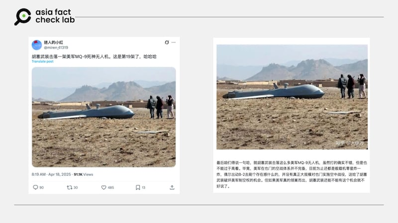

# 事實查覈｜照片顯示，胡塞武裝又擊落一架美軍MQ9無人機？

作者：董喆

2025.05.01 20:57 EDT

## 查覈結果：錯誤

## 一分鐘完讀：

近期，X平臺與中國論壇上廣傳一張照片，稱是胡塞武裝又擊落一架美軍MQ-9無人機。經查，這是早在2012年就曾出現的照片，阿富汗媒體「Pajhwok Afghan News」曾用這張新聞照報道國際安全援助部隊（ISAF）偵察機在阿富汗加茲尼省墜毀，不過並未有其他媒體針對此事進行報道，正確性存疑。但單以照片出現的時序，可以確定這張照片並非近期胡塞武裝擊落美軍無人機的證據。

## 深度分析：

X帳號「迷人的小紅」近期[貼出一張照片](https://archive.ph/Cb887)，稱是胡塞武裝擊落的第19架美軍MQ-9死神無人機，畫面中確實有與MQ-9外觀一致的飛行器，一旁站了3位民衆，同樣的照片也在中國論壇上廣傳（[貼文1](https://zhuanlan.zhihu.com/p/1895455977047843047)，[貼文2](https://www.6parknews.com/newspark/view.php?app=news&act=view&nid=720332)）。

- X平臺上多個帳號和中國論壇上廣傳這張照片，稱是胡塞武裝擊落的第19架美軍MQ-9死神無人機。 (截圖自X平臺及論壇網站)

亞洲事實查覈實驗室（Asia Fact Cehck Lab, AFCL）以圖反搜，發現這張照片曾被用在多種不同的戰鬥機空難報道中，最早可以追溯至2012年1月。阿富汗媒體「Pajhwok Afghan News」[新聞報道](https://pajhwok.com/2012/01/28/isaf-spy-plane-crashes-ghazni/)，國際安全援助部隊（ISAF）偵察機於2012年1月28日在阿富汗加茲尼省附近墜毀。當地官員證實此事，並表示這架飛機是因爲技術故障而墜落，並非遭到敵對勢力擊落。塔利班則聲稱對該飛機墜毀負責，但ISAF否認這一說法，強調事故原因是機械問題。

不過AFCL並未找到其他國際主流媒體報道此事，亦未找到其他相同事件使用這一張照片作爲配圖。實際詢問國際安全援助部隊（ISAF）的北約公關部門，至截稿前未獲回應。

此外，這張配圖在這幾年間重複被中東媒體用在不同的新聞報道中。

「Pajhwok Afghan News」最早在2012年報道北約偵察機空難時用了此張照片，但在[同年6月](https://pajhwok.com/2012/06/17/isaf-drone-crashes-paktia/)以及[2013年1月](https://pajhwok.com/2013/01/23/isafs-pilotless-aircraft-crashes-paktika/)報道其他架北約偵察機在帕克蒂亞省墜毀時，皆使用了同一張照片。

2019年[伊朗塔斯尼姆通訊社（Tasnim News）](https://www.tasnimnews.com/en/news/2019/02/19/1950765/us-drone-shot-down-by-taliban-in-afghanistan-s-farah-province-video)報道美軍無人機在阿富汗法拉省遭塔利班擊落時，也使用了同一張照片。

AFCL無法確認此張照片的最原始出處以及事件背景，但可以確認此照早在2012年就存在，並非近期胡塞武裝擊落美軍機無人機的畫面。

美國中央司令部（CENTCOM）有關胡塞武裝的最新消息於1月8日發佈，內容指出，美國中央司令部部隊於1月8日對葉門境內胡塞武裝控制區的兩個地下先進常規武器（ACW）儲存設施進行了多次精確打擊。這兩個武器儲存設施由伊朗支持，胡塞武裝利用這些設施襲擊了在紅海南部和亞丁灣的美國海軍艦和商船。此次行動中，美方人員與裝備均未受損或受傷。

AFCL過去曾發佈多則查覈報告，社羣平臺上有關胡塞武裝攻擊行動的畫面，內容多半爲舊照移花接木，或是AI生成。

[事實查覈｜網傳影片顯示胡塞武裝擊沉美軍梅森號驅逐艦？](https://www.rfa.org/cantonese/news/factcheck/ym-mason-05302024130228.html)

[事實查覈｜胡塞武裝擊沉美國艾森豪威爾航母？這些影像移花接木](https://www.rfa.org/cantonese/news/factcheck/us-navy-06132024175009.html)

[事實查覈｜美軍海豹部隊遭胡塞武裝俘虜，麻袋套頭遊街？](https://www.rfa.org/mandarin/shishi-hecha/2025/03/30/fact-check-seals-houthi/?fbclid=IwY2xjawJ2i9xleHRuA2FlbQIxMABicmlkETFnWUFYZ1ByeEs3U1dSU05QAR53gmkQy2YaJeIcyjz30pf4t8ACa3qpMNGxOpMDI9_rjBQwKQnoThmax5Rnsw_aem_Ak6UAAXFCTVmPj2sDKRO4g)

*亞洲事實查覈實驗室（Asia Fact Check Lab）針對當今複雜媒體環境以及新興傳播生態而成立。我們本於新聞專業主義，提供專業查覈報告及與信息環境相關的傳播觀察、深度報導，幫助讀者對公共議題獲得多元而全面的認識。讀者若對任何媒體及社交平臺傳播的信息有疑問，歡迎以電郵*[*afcl@rfa.org*](mailto:afcl@rfa.org)*寄給亞洲事實查覈實驗室，由我們爲您查證覈實。*

*亞洲事實查覈實驗室更詳細的介紹請參考*[*本文*](2024-10-09_關於亞洲事實查覈實驗室｜About AFCL.md)*。我們另有X、臉書、IG頻道，歡迎讀者追蹤、分享、轉發。 X這邊請進：中文*[*@asiafactcheckcn*](https://twitter.com/asiafactcheckcn)*;英語：*[*@AFCL\_eng*](https://twitter.com/AFCL_eng)*、*[*FB在這裏*](https://www.facebook.com/asiafactchecklabcn)*、*[*IG也別忘了*](https://www.instagram.com/asiafactchecklab/)*。*

[Original Source](https://www.rfa.org/mandarin/shishi-hecha/2025/05/02/fact-check-thehouthis-drone-crash/)