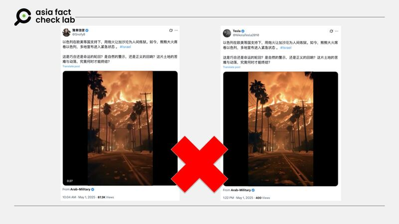

# 事實查覈｜網傳視頻是以色列大火畫面？

作者：莊敬

2025.05.04 23:06 EDT

## 查覈結果：錯誤

## 一分鐘完讀：

近日在X平臺上，有「藍勾」認證帳號發佈一段山林、街區燃燒的短視頻，宣稱是「熊熊大火席捲以色列」。經查，這段視頻在今年一月被當作「洛杉磯野火實況」流傳，經多家機構查覈、檢測，判定爲人工智能（AI）生成。

## 深度分析：

4月30日，以色列耶路撒冷山區[發生野火](https://www.theguardian.com/world/2025/may/01/israel-fires-wildfires-jerusalem)，火勢迅速蔓延，總理內塔尼亞胡（本傑明·內塔尼亞胡）宣佈全國進入緊急狀態。

亞洲事實查覈實驗室（Asia Fact Check Lab, AFCL）注意到，X上的「藍勾」認證帳號[「豫章信使」](https://x.com/Snofy8/status/1917762033560478129)5月1日發佈一則31秒的短視頻，看起來是山林、街區正在燃燒的畫面，配文寫着「熊熊大火席捲以色列，多地宣佈進入緊急狀態」，並標註「#Israel」。另一個藍勾帳號[「特斯拉」](https://x.com/NikolaTesla2010/status/1917811880082780549)也發佈了同樣的視頻與文字。

- X藍勾帳號傳播短視頻，宣稱是以色列大火畫面，但這段視頻已經過多家組織查覈，判定爲AI生成。 (X截圖)

其視頻來源是藍勾帳號[《阿拉伯軍事》](https://x.com/ashrafnsier/status/1877774414634217602)，他在今年1月就發佈了這段短視頻，其配文爲阿拉伯語，經Google翻譯爲英文，意思大致是「洛杉磯大火持續」；顯然與4月底的以色列大火無關。

而在今年初洛杉磯發生野火災情時，AFCL已針對這段視頻發佈[查覈報告](2025-01-14_事實快查｜AI生成“末日”火災視頻？美國消防飛機救火時墜毀？.md)，經專家檢視、工具檢測，判定視頻爲AI生成。其它查覈組織[《新聞計》](https://newsmeter.in/fact-check/fact-check-wildfires-in-los-angeles-no-this-video-is-ai-generated-742060)、[《臺灣事實查覈中心》](https://tfc-taiwan.org.tw/fact-check-reports/california-wildfire-video-not-real-ai-generated/)亦曾發佈報告。

亞洲事實查覈實驗室（Asia Fact Check Lab）針對當今複雜媒體環境以及新興傳播生態而成立。我們本於新聞專業主義，提供專業查覈報告及與信息環境相關的傳播觀察、深度報導，幫助讀者對公共議題獲得多元而全面的認識。讀者若對任何媒體及社交平臺傳播的信息有疑問，歡迎以電郵[afcl@rfa.org](mailto:afcl@rfa.org)寄給亞洲事實查覈實驗室，由我們爲您查證覈實。

亞洲事實查覈實驗室更詳細的介紹請參考[本文](2024-10-09_關於亞洲事實查覈實驗室｜About AFCL.md)。我們另有X、臉書、IG頻道，歡迎讀者追蹤、分享、轉發。 X這邊請進：中文[@asiafactcheckcn](https://twitter.com/asiafactcheckcn);英語：[@AFCL\_eng](https://twitter.com/AFCL_eng)、[FB在這裏](https://www.facebook.com/asiafactchecklabcn)、[IG也別忘了](https://www.instagram.com/asiafactchecklab/)。

[Original Source](https://www.rfa.org/mandarin/shishi-hecha/2025/05/05/fact-check-israel-wildfire-ai-genegation/)