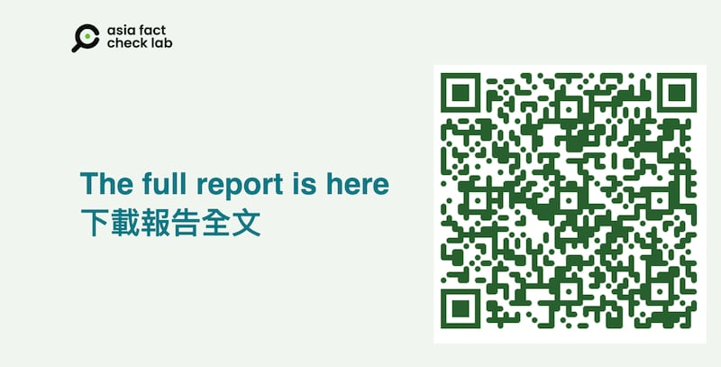

# 《中共外宣在臺灣》報告全文電子檔發佈

作者：亞洲事實查覈實驗室

2025.05.07 22:45 EDT

由亞洲事實查覈實驗室（Asia Fact Check Lab）記者採訪、撰寫的系列報道「中共外宣在臺灣」從2024年12月起陸續發表，到2025年4月，共刊出十一篇報道，獲得廣大回響。

爲了便利讀者收存和閱讀，AFCL將這十一篇報道重新編輯成電子書版本，全文共九章，包括：

1. 序篇：福建網絡

2. 在基層的中共外宣 | 一則假民調如何攻上政治要聞？

3. 地方媒體的中共外宣 | 老牌本土媒體如何澆灌出親中敘事？

4. 主流媒體的中共外宣（之一） | 中國市場的滋味

5. 主流媒體的中共外宣（之二） | 對臺統戰節目，Made In Taiwan？

6. 網路原生／轉生的中共外宣 | 政治網紅和他的朋友圈

7. 臺積電「移美論」 | 一則個案分析

8. 入島、入戶，入TikTok

9. 管不管網路，那是個問題

《中共外宣在臺灣》電子書版本爲PDF檔案，讀者可以由此 ( [下載點1](https://drive.google.com/drive/u/2/folders/1846wzc6BpXm3apwgkR0TIF6-XmgcC3Jd "https://drive.google.com/drive/u/2/folders/1846wzc6BpXm3apwgkR0TIF6-XmgcC3Jd")，[下載點2](https://drive.google.com/drive/u/1/folders/13keWTkr_ZMnURQaIvWMURPfeBxwba2JF))或者或掃瞄以下QR Code下載。

- - (-)

## 《中共外宣在臺灣》計劃的採訪和寫作，AFCL感謝外部專家黃維玲、獨立記者與研究員陳慧敏接受訪問，提供專業觀點。

## AFCL也要向臺灣民主實驗室分析師Jerry Yu、研究員Eric Hsu致謝，感謝兩位接受訪問及分享研究心得。

[Original Source](https://www.rfa.org/mandarin/shishi-hecha/2025/05/08/fact-check-ccp-propaganda-in-taiwan-ebook/)